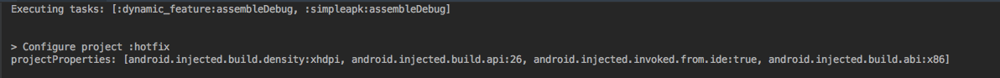
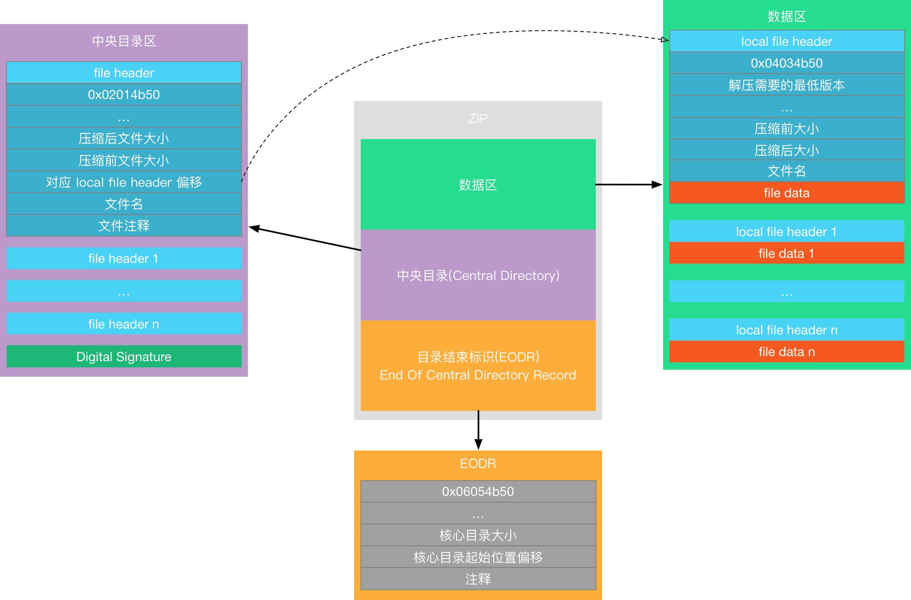
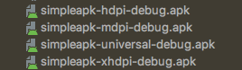
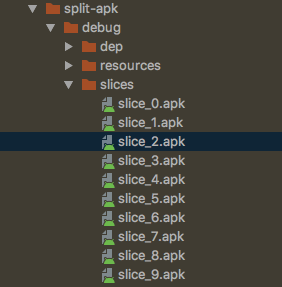
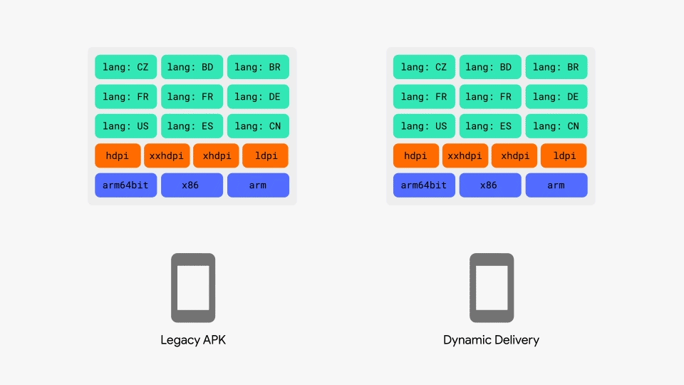
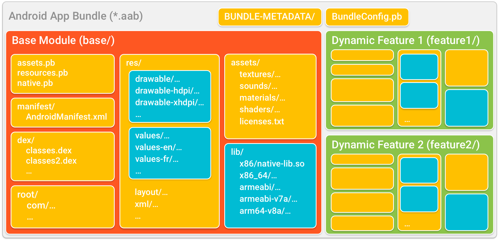
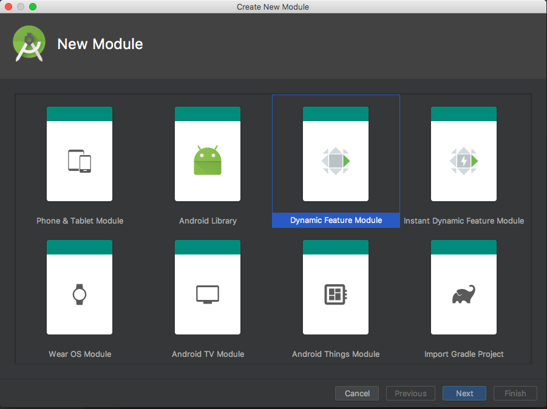
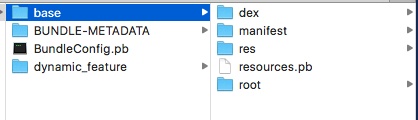
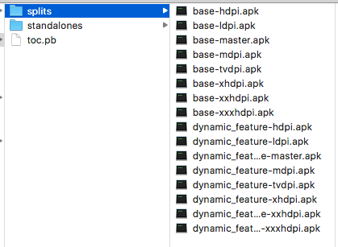
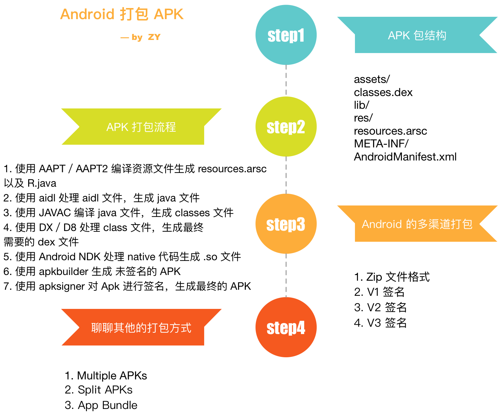

### 【Android 修炼手册】常用技术篇 -- 聊聊 Android 的打包
### 预备知识
1. 了解 android 基本开发

### 看完本文可以达到什么程度
1. 了解 Android APK 打包的关键过程
2. 了解多渠道打包的原理
3. 了解 Multiple APK，Split APKs，App Bundle 的衍生的打包方式

### 阅读前准备工作
1. clone [CommonTec](https://github.com/5A59/android-training/tree/master/common-tec/CommonTec) 项目，其中 simpleapk 是本文用到的示例。

### 文章概览


我们现在大部分开发都是基于 Android Studio 进行的，在 AS 中，我们只需要点击 Run 按钮，AS 自动会打包 Apk 安装至设备中并运行。对于我们来说，其中的打包过程就是一个黑盒，我们所知道的就是 Sources -> AS Compiler -> APK。这篇文章我们就分析一下中间的打包过程，以及打包相关的一些问题。

我们先了解一下 APK 内部的结构。
### 一、Android APK 包结构
接下来我们看看一个正常的 APK 的结构。     
一个 APK 打包完之后，通常有下面几个目录，用来存放不同的文件。    
**assets**     
原生资源文件，不会被压缩或者处理   
**classes.dex**    
java 代码通过 javac 转化成 class 文件，再通过 dx 文件转化成 dex 文件。如果有多个 dex 文件，其命名会是这样的：  
classes.dex classes2.dex classes3.dex ...   
在其中保存了类信息。   
**lib/**      
保存了 native 库 .so 文件，其中会根据 cpu 型号划分不同的目录，比如 ARM，x86 等等。   
**res/**     
保存了处理后的二进制资源文件。   
**resources.arsc**         
保存了资源 id 名称以及资源对应的值／路径的映射。    
**META-INF/**    
用来验证 APK 签名，其中有三个重要的文件 MANIFEST.MT，CERT.SF，CERT.RSA。    
**MANIFEST.MF** 保存了所有文件对应的摘要，部分内容如下：
```
Manifest-Version: 1.0
Built-By: Generated-by-ADT
Created-By: Android Gradle 3.4.0

Name: AndroidManifest.xml
SHA-256-Digest: QxJh66y6ssDSNFgZSlf5jIWXfRdWnqL1c3BSwSDUYLQ=

Name: META-INF/android.arch.core_runtime.version
SHA-256-Digest: zFL2eISLgUNzdXtGA4O/YZYOSUPCA3Na3eCjULPlCYk=
```

**CERT.SF** 保存了MANIFEST.MF 中每条信息的摘要，部分内容如下：    
``` 
Signature-Version: 1.0
Created-By: 1.0 (Android)
SHA-256-Digest-Manifest: j8YGFgHsujCHud09pT6Igh21XQKSnG+Gqy8VUE55u+g=
X-Android-APK-Signed: 2

Name: AndroidManifest.xml
SHA-256-Digest: qLofC3g32qJ5LmbjO/qeccx2Ie/PPpWSEPBIUPrlKlY=

Name: META-INF/android.arch.core_runtime.version
SHA-256-Digest: I65bgli5vdqHKel7MD74YlSuuyCR/5NDrXr2kf5FigA=
```

**CERT.RSA** 包含了对 CERT.SF 文件的签名以及签名用到的证书。    

**AndroidManifest.xml**    
这个文件大家都很熟悉了，全局配置文件，不过这里是编译处理过的二进制的文件。    

### 二、APK 打包流程
#### 2.1 原始打包流程
我们在上面看了一个完整 APK 的结构，APK 打包的过程其实就是生成上述文件的过程。这里放一张网上流传比较广的流程图。   


主要有下面几个步骤：   
1. 使用 AAPT／AAPT2 编译资源文件生成 resources.arsc 以及 R.java
2. 使用 aidl 处理 aidl 文件，生成 java 文件
3. 使用 JAVAC 编译 java 文件，生成 classes 文件
4. 使用 DX／D8 处理 class 文件，生成最终需要的 dex 文件
5. 使用 Android NDK 处理 native 代码生成 .so 文件
6. 使用 apkbuilder 生成 未签名的 APK
7. 使用 apksigner 对 Apk 进行签名，生成最终的 APK

#### 2.2 如何手动使用命令行打包
平时的开发都是使用 gradle 构建，下面我们不依赖 gradle，直接用官方提供的各个阶段的打包工具，手动用命令行打一个 APK，可以更好更详细的了解其中的过程。
这里直接用 [simpleapk](./CommonTec/simpleapk) 工程做示例。   
官方的打包工具在 android_sdk/build-tools/version/ 目录下。    

开始之前，我们先创建一个 tmp 目录用来存放中间产物。创建 tmp/final 存放最终产物。   
##### 1. AAPT2 compile 资源
使用 AAPT2 处理资源需要两步，compile 和 link，首先执行 compile 操作。执行下面的命令。   
``` 
/Users/zy/android-sdk-mac_x86/build-tools/28.0.2/aapt2 compile -o tmp/res --dir src/main/res/ 
```
使用 aapt2 对单个资源处理，会生成 xxx.flat 文件，是 aapt2 的中间产物，可以用于后面的资源增量编译。我们这里通过 --dir 直接指定了资源的目录，产物 res 是一个压缩包，里面包含了所有资源处理后的 xxx.flat。     
这里我们再把 res 这个压缩包解压一下。执行下面的命令。    
```
unzip -u tmp/res -d tmp/aapt2_res
```
这一步结束以后，目录是这个样子的。   
```
tmp/
├── aapt2_res
│   └── xxx.flat
├── final
└── res
```

##### 2. AAPT2 link 资源
AAPT2 link 是把上一步 compile 处理后的 xxx.flat 资源链接，生成一个完整的 resource.arsc，二进制资源和 R.java。执行下面的命令。
```
/Users/zy/android-sdk-mac_x86/build-tools/28.0.2/aapt2 link -o tmp/res.apk  -I /Users/zy/android-sdk-mac_x86/platforms/android-28/android.jar --manifest src/main/AndroidManifest.xml  --java tmp -R tmp/aapt2_res/drawable-hdpi_ic_launcher_foreground.xml.flat  -R tmp/aapt2_res/mipmap-anydpi-v26_ic_launcher_round.xml.flat   -R tmp/aapt2_res/mipmap-xhdpi_ic_launcher_round.png.flat  -R tmp/aapt2_res/values_colors.arsc.flat  -R tmp/aapt2_res/drawable-hdpi_ic_launcher_foreground1.xml.flat -R tmp/aapt2_res/mipmap-hdpi_ic_launcher.png.flat    -R tmp/aapt2_res/mipmap-xxhdpi_ic_launcher.png.flat  -R tmp/aapt2_res/values_strings.arsc.flat  -R tmp/aapt2_res/drawable-mdpi_ic_launcher_foreground.xml.flat  -R tmp/aapt2_res/mipmap-hdpi_ic_launcher_round.png.flat   -R tmp/aapt2_res/mipmap-xxhdpi_ic_launcher_round.png.flat  -R tmp/aapt2_res/values_styles.arsc.flat  -R tmp/aapt2_res/drawable_ic_launcher_background.xml.flat  -R tmp/aapt2_res/mipmap-mdpi_ic_launcher.png.flat    -R tmp/aapt2_res/mipmap-xxxhdpi_ic_launcher.png.flat  -R tmp/aapt2_res/layout_activity_main.xml.flat    -R tmp/aapt2_res/mipmap-mdpi_ic_launcher_round.png.flat   -R tmp/aapt2_res/mipmap-xxxhdpi_ic_launcher_round.png.flat  -R tmp/aapt2_res/mipmap-anydpi-v26_ic_launcher.xml.flat   -R tmp/aapt2_res/mipmap-xhdpi_ic_launcher.png.flat --auto-add-overlay
```
执行命令后，会生成 res.apk，里面就是 resource.arsc，处理后的 AndroidManifest.xml 以及 处理后的二进制资源。我们这里也把他解压出来，后面最终打包的时候使用。执行命令如下。  
```
unzip -u tmp/res.apk -d tmp/final
```
这一步结束以后，目录状态如下。
```
tmp/
├── aapt2_res
│   └── xxx.flat
├── com
│   └── zy
│       └── simpleapk
│           └── R.java
├── final
│   ├── AndroidManifest.xml
│   ├── res
│   │   ├── drawable
│   │   │   └── ic_launcher_background.xml
│   │   ├── xxx 资源目录
│   └── resources.arsc
├── res
└── res.apk
```

##### 3. javac 生成 class 文件
这一步我们需要处理 java 文件，生成 class 文件。要用到上一步生成的 R.java 文件。执行下面的命令。   
```
javac -d tmp src/main/java/com/zy/simpleapk/MainActivity.java  tmp/com/zy/simpleapk/R.java -cp /Users/zy/android-sdk-mac_x86/platforms/android-28/android.jar
```
这一步结束以后，目录状态如下。
```
tmp/
├── aapt2_res
│   └── xxx.flat
├── com
│   └── zy
│       └── simpleapk
│           ├── MainActivity.class
│           ├── R$color.class
│           ├── R$drawable.class
│           ├── R$layout.class
│           ├── R$mipmap.class
│           ├── R$string.class
│           ├── R$style.class
│           ├── R.class
│           └── R.java
├── final
│   ├── AndroidManifest.xml
│   ├── res
│   │   ├── drawable
│   │   │   └── ic_launcher_background.xml
│   │   ├── xxx 资源目录
│   └── resources.arsc
├── res
└── res.apk
```
##### 4. d8 编译 dex
这一步是把上一步生成的 class 文件编译为 dex 文件，需要用到 d8 或者 dx，这里用 d8。执行下面的命令。   
```
/Users/zy/android-sdk-mac_x86/build-tools/28.0.2/d8 tmp/com/zy/simpleapk/*.class --output tmp --lib /Users/zy/android-sdk-mac_x86/platforms/android-28/android.jar
```
命令执行完以后，会生成 classes.dex，这就是最终 apk 里需要的 dex 文件，我们把它拷贝到 final/ 目录下。执行如下命令。  
```
cp tmp/classes.dex tmp/final/classes.dex
```
这一步结束以后，目录状态如下。   
```
tmp/
├── aapt2_res
│   └── xxx.flat
├── classes.dex
├── com
│   └── zy
│       └── simpleapk
│           ├── MainActivity.class
│           ├── R$color.class
│           ├── R$drawable.class
│           ├── R$layout.class
│           ├── R$mipmap.class
│           ├── R$string.class
│           ├── R$style.class
│           ├── R.class
│           └── R.java
├── final
│   ├── AndroidManifest.xml
│   ├── classes.dex
│   ├── res
│   │   ├── drawable
│   │   │   └── ic_launcher_background.xml
│   │   ├── xxx 资源目录
│   └── resources.arsc
├── res
└── res.apk
```
##### 5. 打包 apk
执行完上述的命令，打包 APK 需要的材料就都准备好了，因为 APK 本身就是 zip 格式，这里我们直接用 zip 命令打包上述产物，生成 final.apk。执行下面的命令。
```
zip -r final.apk *
```
##### 6. apk 签名
上一步打包好的 APK 还不能直接安装，因为没有签名，我们这里用 debug.keystore 给 final.apk 签名。执行下面的命令。
```
/Users/zy/android-sdk-mac_x86/build-tools/28.0.2/apksigner sign --ks ~/.android/debug.keystore final.apk
```
这里需要输入 debug.keystore 的密码，是 android。   

这样，最后的 final.apk 就是我们手动生成的 apk 了。可以安装尝试一下了～

#### 2.3 AS 打包过程
正常开发中，我们大部分都是直接点击 AS 中的 Run 去编译一个 APK。     
我们先来看看在 AS 中点击 Run 做了些什么事情。我们点击 Run 运行，然后打开 Build tab 看下具体的输出，可以发现执行的是 Gradle Task *assembleDebug*。    


我们在 build.gradle 里添加一行输出，看看 AS 给 gradle task 添加的额外参数。
``` groogy
println "projectProperties: " + project.gradle.startParameter.projectProperties
```

输出如下：
```
projectProperties: [android.injected.build.density:xhdpi, android.injected.build.api:26, android.injected.invoked.from.ide:true, android.injected.build.abi:x86]
```

其中有一个参数 android.injected.invoked.from.ide=true 表明了是从 AS 调用的 Gradle 命令。后面就是执行 Gradle 的打包命令了。而 Gradle 的打包命令，就是执行各个 Task 生成打包需要的文件。如果对这方面不了解，可以看看之前写的 [Android Gradle Plugin 主要流程分析](../gradle/android_gradle_plugin-主要流程分析.md)。

### 三、多渠道打包
上面介绍了 Android APK 的打包流程，也通过手动打 APK 体验了整个流程。    
在实际的生产开发过程中，我们往往会把 APK 发往各个应用市场，很多时候要根据市场渠道进行一些统计，所以就需要对不同的市场渠道进行区分。关于多渠道打包的问题，有不少解决方式。    
最容易想到的就是使用 **Gradle 的 Flavor**，使用 Flavor 的特性，生成不同的渠道标识。不过这种方式每生成一个渠道包都需要执行一遍构建过程，非常耗时。    
另外一种方式就是使用 **apktool 反编译 APK**，修改其中的资源，添加渠道的标识，并进行重新打包签名，这种方式省去了构建过程，反编译，打包，签名这几个步骤也比较耗时。按照美团博客的数据，打包 900 个渠道包将近三个小时。   

所以需要再寻找其他的方法。在此之前，我们先看下 Android APK 签名的方式。了解了签名方式，才能更好的去了解方法实现。    

在了解 APK 签名之前，我们先看一下 Zip 的文件格式，因为 **APK 本质上是一个 Zip 文件**，而多渠道打包就涉及到 Zip 的文件格式。   
#### 3.1 Zip 文件格式
APK 的本质是一个 Zip 文件，我们可以用 file 命令看一下。是 V2.0 版本的 Zip 格式文件。   


一个 Zip 文件的格式基本如下：


主要可以分为三个大区域：   
数据区    
核心目录（central directory）   
目录结束标识（end of central directory record，EODR）   

##### 3.1.1 数据区
这个部分记录了文件压缩信息和文件原始数据，每一个文件信息用一个 [local file header + file data + data descriptor] 来描述
**local file header**     
记录了文件的压缩信息，主要内容如下：   

| description                 | length                | content                 |
| --------------------------- | --------------------- | ----------------------- |
| local file header signature | 4 bytes  (0x04034b50) | 文件头标识， 0x04034b50 |
| version needed to extract   | 2 bytes               | 解压所需要的最低版本    |
| general purpose bit flag    | 2 bytes               | 通用标志位              |
| compression method          | 2 bytes               | 压缩方式                |
| last mod file time          | 2 bytes               | 文件最后修改时间        |
| last mod file date          | 2 bytes               | 文件最后修改日期        |
| crc-32                      | 4 bytes               | CRC-32 校验码           |
| compressed size             | 4 bytes               | 压缩后文件大小          |
| uncompressed size           | 4 bytes               | 未压缩文件大小          |
| file name length            | 2 bytes               | 文件名长度              |
| extra field length          | 2 bytes               | 扩展区长度              |
| file name (variable size)   |                       | 文件名                  |
| extra field (variable size) |                       | 扩展数据                |

**file data**    
保存了文件的压缩数据

**data descriptor**    
| description       | length  | content          |
| ----------------- | ------- | ---------------- |
| crc-32            | 4 bytes | crc32 校验码     |
| compressed size   | 4 bytes | 压缩后文件的大小 |
| uncompressed size | 4 bytes | 未压缩文件的大小 |

表示文件的结束，只有在 local file header 中的 general purpose bit flag 第三 bit 位为 3 的时候才会出现。一般情况下没有

##### 3.1.2 核心目录
核心目录保存了对压缩文件更多的信息以及对 Zip64 的支持信息。
主要有两个部分
file header 和 digital signature      

**file header**     
是对文件更为具体的描述，每一个 file header 都对应一个 local file header。

| description                     | length                | content                         |
| ------------------------------- | --------------------- | ------------------------------- |
| central file header signature   | 4 bytes  (0x02014b50) | 核心文件头标志，魔数 0x02014b50 |
| version made by                 | 2 bytes               | 压缩使用的版本                  |
| version needed to extract       | 2 bytes               | 解压需要的版本                  |
| general purpose bit flag        | 2 bytes               | 通用位标志                      |
| compression method              | 2 bytes               | 压缩方法                        |
| last mod file time              | 2 bytes               | 文件最后修改时间                |
| last mod file date              | 2 bytes               | 文件最后修改日期                |
| crc-32                          | 4 bytes               | crc-32 校验码                   |
| compressed size                 | 4 bytes               | 压缩后的文件大小                |
| uncompressed size               | 4 bytes               | 压缩前的文件大小                |
| file name length                | 2 bytes               | 文件名长度                      |
| extra field length              | 2 bytes               | 扩展区长度                      |
| file comment length             | 2 bytes               | 文件注释长度                    |
| disk number start               | 2 bytes               | 文件在磁盘上的起始位置          |
| internal file attributes        | 2 bytes               | 内部文件属性                    |
| external file attributes        | 4 bytes               | 外部文件属性                    |
| relative offset of local header | 4 bytes               | 对应的 local file header 的偏移 |
| file name (variable size)       |                       | 文件名                          |
| extra field (variable size)     |                       | 扩展数据                        |
| file comment (variable size)    |                       | 文件注释                        |

**Digital signature**    
官方文档中没有对 Digital signature 有太具体的介绍，但是有提到 核心目录是可以压缩和加密的，盲猜是用来加密核心目录的。    

| description                    | length                | content |
| ------------------------------ | --------------------- | ------- |
| header signature               | 4 bytes  (0x05054b50) |
| size of data                   | 2 bytes               |         |
| signature data (variable size) |                       |         |

##### 3.1.3 核心目录结束标志
目录结束标志是在整个文件的结尾，用于标记压缩目录数据的结束。每个 Zip 文件有且只有一个结束标志记录。   

| description                                                                   | length                | content                       |
| ----------------------------------------------------------------------------- | --------------------- | ----------------------------- |
| end of central dir signature                                                  | 4 bytes  (0x06054b50) | 目录结束标记，魔数 0x06054b50 |
| number of this disk                                                           | 2 bytes               | 当前磁盘编号                  |
| number of the disk with the start of the central directory                    | 2 bytes               | 核心目录起始位置的磁盘编号    |
| total number of entries in the central directory on this disk                 | 2 bytes               | 磁盘上记录的核心目录数量      |
| total number of entries in the central directory                              | 2 bytes               | 核心目录结构数量              |
| size of the central directory                                                 | 4 bytes               | 核心目录大小                  |
| offset of start of central directory with respect to the starting disk number | 4 bytes               | 核心目录起始位置的偏移        |
| .ZIP file comment length                                                      | 2 bytes               | 注释长度                      |
| .ZIP file comment       (variable size)                                       |                       | 注释内容                      |

上面基本上就是一个通用的 Zip 包结构了。
下面就看看 Android 的签名机制。

#### 3.2 V1 签名
V1 签名的机制主要就在 META-INF 目录下的三个文件，MANIFEST.MF，CERT.SF，CERT.RSA，他们都是 V1 签名的产物。   
**MANIFEST.MF** 保存了所有文件对应的摘要，部分内容如下：
```
Manifest-Version: 1.0
Built-By: Generated-by-ADT
Created-By: Android Gradle 3.4.0

Name: AndroidManifest.xml
SHA-256-Digest: QxJh66y6ssDSNFgZSlf5jIWXfRdWnqL1c3BSwSDUYLQ=

Name: META-INF/android.arch.core_runtime.version
SHA-256-Digest: zFL2eISLgUNzdXtGA4O/YZYOSUPCA3Na3eCjULPlCYk=
```

**CERT.SF** 保存了MANIFEST.MF 中每条信息的摘要，部分内容如下：  
``` 
Signature-Version: 1.0
Created-By: 1.0 (Android)
SHA-256-Digest-Manifest: j8YGFgHsujCHud09pT6Igh21XQKSnG+Gqy8VUE55u+g=
X-Android-APK-Signed: 2

Name: AndroidManifest.xml
SHA-256-Digest: qLofC3g32qJ5LmbjO/qeccx2Ie/PPpWSEPBIUPrlKlY=

Name: META-INF/android.arch.core_runtime.version
SHA-256-Digest: I65bgli5vdqHKel7MD74YlSuuyCR/5NDrXr2kf5FigA=
```

**CERT.RSA** 包含了对 CERT.SF 文件的签名以及签名用到的证书。    

在 APK 签名时，主要流程如下：
```
计算 APK 中文件摘要，保存摘要的 base64 编码到 MANIFEST.MF 文件中 ->计算 MANIFEST.MF 文件的摘要，保存其 base64 编码到 CERT.SF 文件中 -> 计算 MANIFEST.MF 文件中每个数据块的摘要，保存其 base64 编码到 CERT.SF 文件中 -> 计算 CERT.SF 文件摘要，通过开发者私钥计算数字签名 -> 保存数字签名和开发者公钥到 CERT.RSA 文件中
```

在 APK 校验时，主要流程如下：   
```
通过CA 证书解密 CERT.RSA 中的数字证书和对 CERT.SF 的签名 -> 通过签名校验 CERT.SF 文件是否被修改 -> 通过 CERT.SF 验证 MANIFEST.MF 文件是否被修改 -> 通过 CERT.SF 验证 MANIFEST.MF 文件中数据项是否被修改 -> 通过 MANIFEST.MF 校验 APK 中的文件是否被修改    
```

我们在上面讲了 Zip 文件的结构，通过上面校验过程，我们可以发现，在 APK 校验过程中，只是校验了数据区的内容，剩余的两个部分没有做处理。    
所以如果修改剩余两个部分，签名校验过程中是不会发现的，要写入信息，EOCD 的注释字段是很好的选择。所以将渠道信息写入 EOCD 的注释字段，就可以达到打入渠道信息的目的。这就是腾讯 VasDolly 做的事情。   
除此之外，我们可以发现，APK 签名校验过程中，并没有对 META-INF 文件夹下的文件进行签名和校验，所以可以在 META-INF 文件夹下新增一个空文件，这样也可以携带渠道信息。这就是美团做的事情。    

#### 3.3 V2 签名
本来使用上述方案，一切都是很美好的，然而在 Android 7.0 的时候，引入新的签名方式，APK Signature Scheme v2，导致 V1 上的多渠道签名方案失效。我们先看看 V2 签名的原理。   
按照[官方文档](https://source.android.com/security/apksigning/v2.html)来看，V2 签名是在 数据区和核心目录区之间，新增了一个 APK Signing Block 区块，用来记录签名信息。   
签名前后的结构如下。    


APK Signing Block 格式如下：

| description   | length   | content                        |
| ------------- | -------- | ------------------------------ |
| size of block | 8 bytes  | 签名块的长度                   |
| ID-value      |          | 保存了一系列 ID-value          |
| size of block | 8 bytes  | 签名块的长度，和第一个字段一样 |
| magic         | 16 bytes | 签名块标记，魔数               |

APK Signing Block 中，会对其他三个模块都进行签名，签名信息保存在 ID-value 中 ID 为 0x7109871a 对应的 value 中。    
在校验签名时，会按照下面的逻辑进行。


首先检查是否包含 V2 签名块，如果包含 V2 签名块，就采用 V2 签名进行验证，如果没有包含 V2 签名块，就采用 V1 签名验证。   
因此，采用 V2 签名进行验证时，V1 方案中添加 EOCD 注释和 META-INF 空文件的方式就都失效了。    
看到这里，我们会发现，V2 签名验证了其他三个模块数据，但是没有对 APK Signing Block 本身进行验证，而其中的 ID-value 是一组数据，所以可以在这里添加包含渠道信息的 ID-value。这就是 V2 签名下生成多渠道包的原理。
上述原理具体的代码，可以看 https://github.com/Tencent/VasDolly 和 https://github.com/Meituan-Dianping/walle

#### 3.4 V3 签名
在 Android 9.0 中引入了新的签名方式 V3。为了解决签名签名过期的问题。V3 签名在 V2 的 APK Signing Block 中新增了一个签名块，保存了 supported SDK 版本以及密钥流转结构。由于对 V2 结构没有进行大的更改，所以不会对多渠道打包方案造成影响。关于 V3 签名更具体的信息，可以查看[官方文档](https://source.android.com/security/apksigning/v3)。

### 四、其他打包方式
### 4.1 Multiple APKs
上面说的 APK 结构和打包，都是完整包含了所有资源，包括适配不同的分辨率，适配不同的 API 等等，但其实在每一个用户设备上，只会用到其中的一种，其余的资源只会占用包大小。所以 Google 也提供了一些其他方法，可以根据不同分辨率，不同 ABI 等等来打包，从而减少包大小。    
在 Android L 之后，Android 支持了 Multiple APKs，简单来说就是可以通过不同分辨率，不同 CPU 架构，不同 API level 把同一个应用打包成对应不同设备的多个 APK，然后在不同的设备上安装不同的 APK，来减少体积。   
[文档](https://developer.android.com/google/play/publishing/multiple-apks)里提供的了详细的解释，我们这里看一下，通过配置不同分辨率，生成的 APK 是什么样的。   
我们先在 build.gradle 中添加下面的配置。
``` groovy
android {
  ...
  splits {

    // Configures multiple APKs based on screen density.
    density {

      // Configures multiple APKs based on screen density.
      enable true

      // Specifies a list of screen densities Gradle should not create multiple APKs for.
      exclude "ldpi", "xxhdpi", "xxxhdpi"

      // Specifies a list of compatible screen size settings for the manifest.
      compatibleScreens 'small', 'normal', 'large', 'xlarge'
    }
  }
}
```
含义很清楚了，就不多解释了。然后我们编译，可以看到，生成的 APK 不是一个，而是四个。  


其中 simpleapk-universal-debug.apk 是包含了所有资源的完整 APK。其他三个 apk 分别是根据不同分辨率生成的。其中只包含了对应分辨率需要的资源。从而减少了包大小。我们可以对比一下两个 APK 就看出区别了。   


#### 4.2 Split APKs
Android L 以后提供了 Split APKs 的多 APK 构建机制，可以将一个 APK 基于 CPU 架构，屏幕密度等纬度拆分成多个 APK，当下载应用时，会依据当前的设备配置选择对应的 APK 安装。      
Split APKs 打包以后，会生成一个 **Base APK** 和多个 **Split APK**。    
Base APK 包含了通用的资源，而 Split APK 就是用户设备特有的资源。用户安装时会安装 Base APK 以及其设备对应的 Split APK，从而减少了其他无用资源的包大小。      
我们正常开发中不会生成 Split APKs，不过我们可以打开 Instant Run 对应用进行编译，现在的 Instant Run 在 Android 5.0 设备上也是采用 Split APKs 的原理。      
使用 Instant Run 以后，在 build/intermediates/split-apk/debug/slices/ 下面，可以看到生成的 Split APKs，我们选择其中一个，在 manifest 文件中，定义了 split 标签，表示当前的 Split APK 编号。    


在 build/intermediates/instant-run-apk/debug/ 下面，是 Base APK，包含一些公共的资源。          

我们在安装 Split APKs，可以使用 adb install-multiple 以及 adb shell pm install-create，adb shell pm install-write，adb shell pm install-commit 等命令来进行。具体命令可以参考[这里](https://blog.csdn.net/ximsfei/article/details/50884862)。

#### 4.3 App Bundle
App Bundle 是 2018 年 Google I/O 大会上引入的新的 App 动态化框架，是借助 Split APKs 原理完成的动态加载。   
和传统安装方式对比如下。   


App Bundle 依赖于 .aab 文件。一个 aab 的结构如下。    


base/ 中是通用的资源，feature1/ feature2/ 中是根据特定屏幕密度，CPU 架构等区分的特定资源。    

我们以 simpleapk demo 为例看一下 App Bundle 的使用。要使用 App Bundle，需要创建一个 base module 和 feature module。   
我们的 simpleapk 是 base module，然后创建了一个 feature module。这里要注意的是 feature module 需要选择 Dynamic Feature Module。   


创建 feature module 以后我们看看其 build.gradle 文件，可以看到依赖了 base module。
``` groovy
dependencies {
    implementation fileTree(dir: 'libs', include: ['*.jar'])
    implementation project(':simpleapk')
}
```
然后在 base module 里配置了 dynamicFeatures。
``` groovy
android {
    bundle {
        // ...
    }
    dynamicFeatures = [":dynamic_feature"]
}
```

我们在项目中执行 bundleDebug 命令，就可以看到，在 build/outputs/bunudle/debug 目录下就生成了 xxx.aab 文件，Google Play 会根据 xxx.aab 生成用户安装所需要的 APK 了。  
.aab 本质也是一个 zip 文件，我们解压看看。包里的内容如下。   


我们可以通过 Google 提供的 [bundletool](https://github.com/google/bundletool/releases) 将 .aab 文件生成 APK。执行下面的命令。   
```
java -jar bundletool-all-0.10.2.jar build-apks --bundle=build/outputs/bundle/debug/simpleapk.aab --output=bundle.apks    
```
生成的 bundle.apks 也是一个 zip 文件，我们也解压看看。    


可以看到，bundle.apks 里包含了两个目录，一个是 splits/，下面放的是 Base APK 和 Split APK，另一个目录是 standalones/，下面放的是根据不同屏幕密度生成的完整的 APK，用来在不支持 App Bundle 的设备上进行安装。    

当然现在 App Bundle 的使用，完全依赖于 Google Play，所以国内还是无法使用的。不过对其原理的了解，我们也能知道 Google 是如何区减少包大小的。    

### 总结


### 参考资料
#### Zip 文件格式
https://pkware.cachefly.net/webdocs/APPNOTE/APPNOTE-6.2.0.txt
https://blog.csdn.net/a200710716/article/details/51644421

#### 签名
https://source.android.com/security/apksigning/v2
https://source.android.com/security/apksigning/v3
https://zhuanlan.zhihu.com/p/26674427

#### Android Build Tools
https://tech.meituan.com/2014/06/13/mt-apk-packaging.html
https://tech.meituan.com/2017/01/13/android-apk-v2-signature-scheme.html
https://developer.android.com/studio/command-line/apksigner

#### Multiple APKs
https://developer.android.com/studio/build/configure-apk-splits

#### Split APKs
https://www.infoq.cn/article/2MgEEtOwOGeZ8-JxbEDb
https://blog.csdn.net/ximsfei/article/details/50884862

#### App Bundle
https://developer.android.com/guide/app-bundle/
https://developer.android.com/studio/command-line/bundletool