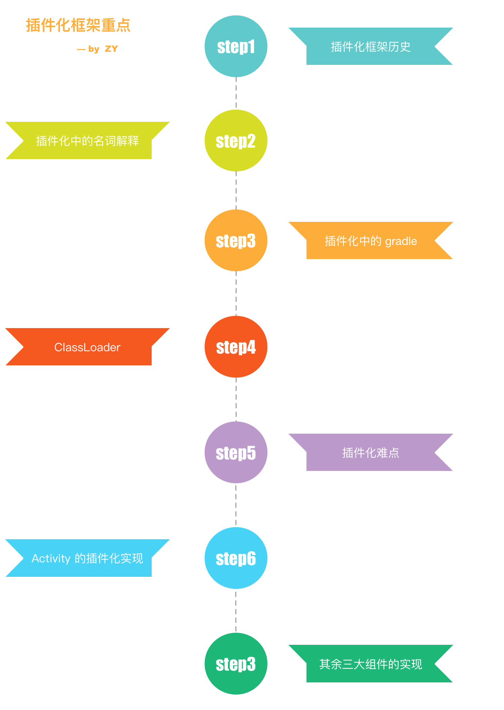
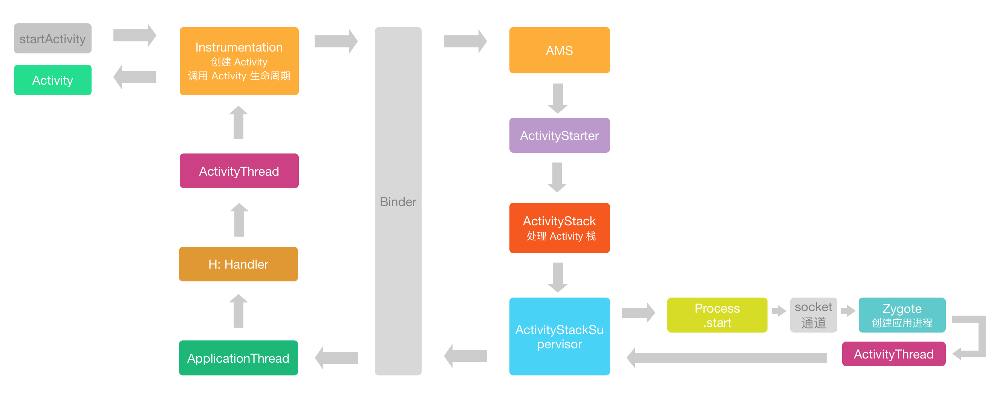
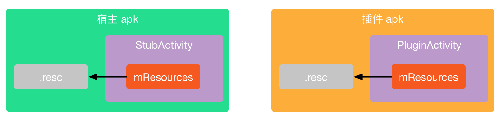
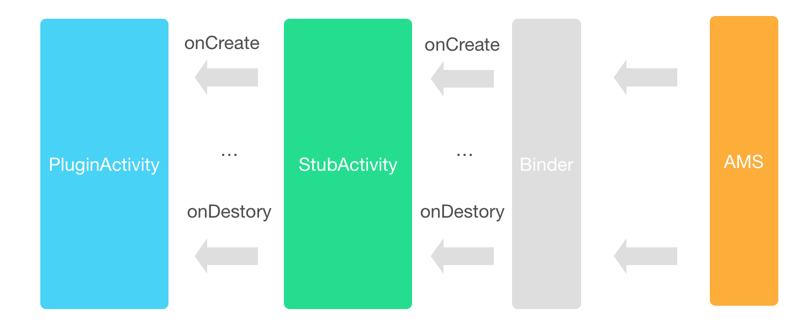
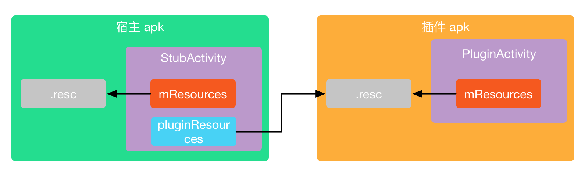
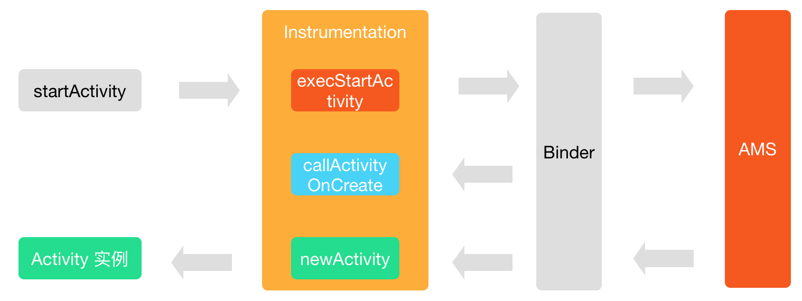
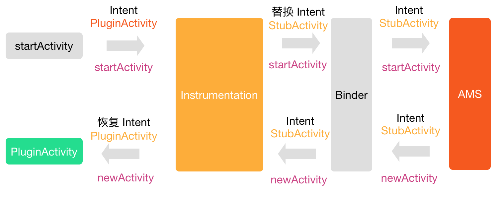
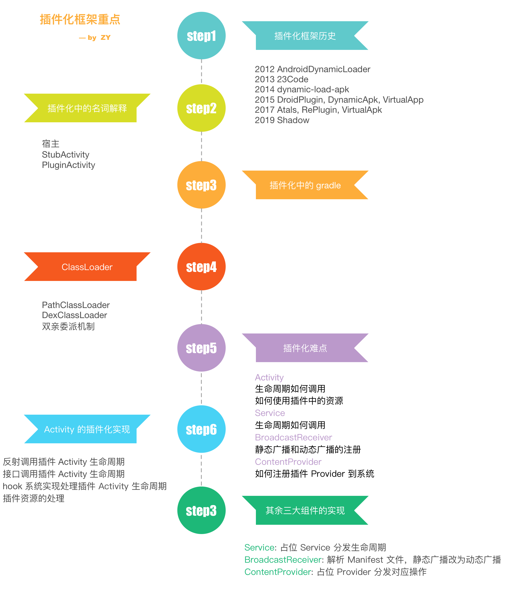

### 【Android 修炼手册】常用技术篇 -- Android 插件化解析

### 预备知识
1. 了解 android 基本开发
2. 了解 android 四大组件基本原理
3. 了解 ClassLoader 相关知识

### 看完本文可以达到什么程度
1. 了解插件化常见的实现原理

### 阅读前准备工作
1. clone [CommonTec](https://github.com/5A59/android-training/tree/master/common-tec/CommonTec) 项目

### 文章概览


### 一、插件化框架历史
整个插件化框架历史部分参考了[包建强在 2016GMTC 全球开发大会上的演讲](https://www.infoq.cn/article/android-plug-ins-from-entry-to-give-up/)    
2012 年 [AndroidDynamicLoader](https://github.com/mmin18/AndroidDynamicLoader) 给予 Fragment 实现了插件化框架，可以动态加载插件中的 Fragment 实现页面的切换。      
2013 年 23Code 提供了一个壳，可以在壳里动态化下载插件然后运行。    
2013 年 阿里技术沙龙上，伯奎做了 Atlas 插件化框架的分享，说明那时候阿里已经在做插件化的运用和开发了。    
2014 年 任玉刚开源了 [dynamic-load-apk](https://github.com/singwhatiwanna/dynamic-load-apk)，通过代理分发的方式实现了动态化，如果看过 Android 开发艺术探索这本书，应该会对这个方式有了解。   
2015 年 张勇 发布了 [DroidPlugin](https://github.com/DroidPluginTeam/DroidPlugin)，使用 hook 系统方式实现插件化。   
2015 年 携程发布 [DynamicApk](https://github.com/CtripMobile/DynamicAPK)     
2015 - 2016 之间（这块时间不太确定），Lody 发布了 [VirtualApp](https://github.com/asLody/VirtualApp)，可以直接运行未安装的 apk，基本上还是使用 hook 系统的方式实现的，不过里面的实现要精致很多，实现了自己的一套 AMS 来管理插件 Activity 等等。    
2017 年阿里推出 [Atlas](https://github.com/apache/atlas)    
2017 年 360 推出 [RePlugin](https://github.com/Qihoo360/RePlugin)    
2017 年滴滴推出 [VirtualApk](https://github.com/didi/VirtualAPK)     
2019 年腾讯推出了 [Shadow](https://github.com/Tencent/Shadow)，号称是零反射，并且框架自身也可实现动态化，看了代码以后发现，其实本质上还是使用了代理分发生命周期实现四大组件动态化，然后抽象接口来实现框架的动态化。后面有机会可以对其做一下分析。    

这基本上就是插件化框架的历史，从 2012 至今，可以说插件化技术基本成型了，主要就是代理和 hook 系统两种方式（这里没有统计热修复的发展，热修复其实和插件化还是有些想通的地方，后面的文章会对热修复进行介绍）。如果看未来的话，斗胆预测，插件化技术的原理，应该不会有太大的变动了。

### 二、名词解释
在插件化中有一些专有名词，如果是第一次接触可能不太了解，这里解释一下。   
**宿主**    
负责加载插件的 apk，一般来说就是已经安装的应用本身。     
**StubActivity**   
宿主中的占位 Activity，注册在宿主 Manifest 文件中，负责加载插件 Activity。    
**PluginActivity**   
插件 Activity，在插件 apk 中，没有注册在 Manifest 文件中，需要 StubActivity 来加载。    

### 三、使用 gradle 简化插件开发流程
在学习和开发插件化的时候，我们需要动态去加载插件 apk，所以开发过程中一般需要有两个 apk，一个是宿主 apk，一个是插件 apk，对应的就需要有宿主项目和插件项目。   
在 [CommonTec](https://github.com/5A59/android-training/tree/master/common-tec/CommonTec) 这里创建了 app 作为宿主项目，plugin 为插件项目。为了方便，我们直接把生成的插件 apk 放到宿主 apk 中的 assets 中，apk 启动时直接放到内部存储空间中方便加载。     
这样的项目结构，我们调试问题时的流程就是下面这样：   
修改插件项目 -> 编译生成插件 apk -> 拷贝插件 apk 到宿主 assets -> 修改宿主项目 -> 编译生成宿主 apk -> 安装宿主 apk -> 验证问题    
如果每次我们修改一个很小的问题，都经历这么长的流程，那么耐心很快就耗尽了。最好是可以**直接编译宿主 apk 的时候自动打包插件 apk 并拷贝到宿主 assets 目录下**，这样我们不管修改什么，都直接编译宿主项目就好了。如何实现呢？还记得我们之前讲解过的 gradle 系列么？现在就是学以致用的时候了。    
首先在 plugin 项目的 build.gradle 添加下面的代码：
``` groovy
project.afterEvaluate {
    project.tasks.each {
        if (it.name == "assembleDebug") {
            it.doLast {
                copy {
                    from new File(project.getBuildDir(), 'outputs/apk/debug/plugin-debug.apk').absolutePath
                    into new File(project.getRootProject().getProjectDir(), 'app/src/main/assets')
                    rename 'plugin-debug.apk', 'plugin.apk'
                }
            }
        }
    }
}
```
这段代码是在 afterEvaluate 的时候，遍历项目的 task，找到打包 task 也就是 assembleDebug，然后在打包之后，把生成的 apk 拷贝到宿主项目的 assets 目录下，并且重命名为 plugin.apk。

然后在 app 项目的 build.gradle 添加下面的代码：
``` groovy
project.afterEvaluate {
    project.tasks.each {
        if (it.name == 'mergeDebugAssets') {
            it.dependsOn ':plugin:assembleDebug'
        }
    }
}
```
找到宿主打包的 mergeDebugAssets 任务，依赖插件项目的打包，这样每次编译宿主项目的时候，会先编译插件项目，然后拷贝插件 apk 到宿主 apk 的 assets 目录下，以后每次修改，只要编译宿主项目就可以了。

### 四、ClassLoader
ClassLoader 是插件化中必须要掌握的，因为插件是未安装的 apk，系统不会处理其中的类，所以需要我们自己来处理。

#### 4.1 java 中的 ClassLoader
BootstrapClassLoader
负责加载 JVM 运行时的核心类，比如 JAVA_HOME/lib/rt.jar 等等

ExtensionClassLoader
负责加载 JVM 的扩展类，比如 JAVA_HOME/lib/ext 下面的 jar 包

AppClassLoader
负责加载 classpath 里的 jar 包和目录

#### 4.2 android 中的 ClassLoader
在这里，我们统称 dex 文件，包含 dex 的 apk 文件以及 jar 文件为 dex 文件
PathClassLoader
用来加载系统类和应用程序类，用来加载 dex 文件，但是 dex2oat 生成的 odex 文件只能放在系统的默认目录。

DexClassLoader
用来加载 dex 文件，可以从存储空间加载 dex 文件，可以指定 odex 文件的存放目录。

我们在插件化中一般使用的是 DexClassLoader。

#### 4.3 双亲委派机制
每一个 ClassLoader 中都有一个 parent 对象，代表的是父类加载器，在加载一个类的时候，会先使用父类加载器去加载，如果在父类加载器中没有找到，自己再进行加载，如果 parent 为空，那么就用系统类加载器来加载。通过这样的机制可以保证系统类都是由系统类加载器加载的。
下面是 ClassLoader 的 loadClass 方法的具体实现。
``` java
    protected Class<?> loadClass(String name, boolean resolve)
        throws ClassNotFoundException
    {
            // First, check if the class has already been loaded
            Class<?> c = findLoadedClass(name);
            if (c == null) {
                try {
                    if (parent != null) {
                        // 先从父类加载器中进行加载
                        c = parent.loadClass(name, false);
                    } else {
                        c = findBootstrapClassOrNull(name);
                    }
                } catch (ClassNotFoundException e) {
                    // ClassNotFoundException thrown if class not found
                    // from the non-null parent class loader
                }

                if (c == null) {
                    // 没有找到，再自己加载
                    c = findClass(name);
                }
            }
            return c;
    }
```

#### 4.4 如何加载插件中的类
要加载插件中的类，我们首先要创建一个 DexClassLoader，先看下 DexClassLoader 的构造函数需要那些参数。
``` java
public class DexClassLoader extends BaseDexClassLoader {
    public DexClassLoader(String dexPath, String optimizedDirectory, String librarySearchPath, ClassLoader parent) {
        // ...
    }
}
```
构造函数需要四个参数：    
**dexPath** 是需要加载的 dex / apk / jar 文件路径    
**optimizedDirectory** 是 dex 优化后存放的位置，在 ART 上，会执行 oat 对 dex 进行优化，生成机器码，这里就是存放优化后的 odex 文件的位置   
**librarySearchPath** 是 native 依赖的位置    
**parent** 就是父类加载器，默认会先从 parent 加载对应的类   

创建出 DexClassLaoder 实例以后，只要调用其 loadClass(className) 方法就可以加载插件中的类了。具体的实现在下面：
``` java
    // 从 assets 中拿出插件 apk 放到内部存储空间
    private fun extractPlugin() {
        var inputStream = assets.open("plugin.apk")
        File(filesDir.absolutePath, "plugin.apk").writeBytes(inputStream.readBytes())
    }

    private fun init() {
        extractPlugin()
        pluginPath = File(filesDir.absolutePath, "plugin.apk").absolutePath
        nativeLibDir = File(filesDir, "pluginlib").absolutePath
        dexOutPath = File(filesDir, "dexout").absolutePath
        // 生成 DexClassLoader 用来加载插件类
        pluginClassLoader = DexClassLoader(pluginPath, dexOutPath, nativeLibDir, this::class.java.classLoader)
    }
```

### 五、插件化需要解决的难点
插件化，就是从插件中加载我们想要的类并运行，如果这个类是一个普通类，那么使用上面说到的 DexClassLoader 就可以直接加载了，如果这个类是特殊的类，比如说 Activity 等四大组件，那么就需要一些特殊的处理，因为四大组件是需要和系统进行交互的。插件化中，四大组件需要解决的难点如下：

* **Activity**
1. 生命周期如何调用
2. 如何使用插件中的资源

* **Service**
1. 生命周期如何调用

* **BroadcastReceiver**
1. 静态广播和动态广播的注册

* **ContentProvider**
1. 如何注册插件 Provider 到系统

### 六、Activity 的插件化实现
#### 6.1 难点分析
我们之前说到 Activity 插件化的难点，我们先来理顺一下为什么会有这两个问题。   
因为插件是动态加载的，所以插件的四大组件不可能注册到宿主的 Manifest 文件中，而没有在 Manifest 中注册的四大组件是不能和系统直接进行交互的。    
可能有些同学会问，那为什么不能直接把插件的 Activity 注册到宿主 Manifest 里呢？这样是可以，不过就失去了插件化的动态特性，如果每次插件中新增 Activity 都要修改宿主 Manifest 并且重新打包，那就和直接写在宿主中没什么区别了。    
**我们再来说一下为什么没有注册的 Activity 不能和系统交互**    
这里的不能直接交互的含义有两个，
1. 系统会检测 Activity 是否注册 
如果我们启动一个没有在 Manifest 中注册的 Activity，会发现报如下 error：
``` java
android.content.ActivityNotFoundException: Unable to find explicit activity class {com.zy.commontec/com.zy.plugin.PluginActivity}; have you declared this activity in your AndroidManifest.xml?
```
这个 log 在 Instrumentation 的 checkStartActivityResult 方法中可以看到：
``` java
public class Instrumentation {
    public static void checkStartActivityResult(int res, Object intent) {
        if (!ActivityManager.isStartResultFatalError(res)) {
            return;
        }

        switch (res) {
            case ActivityManager.START_INTENT_NOT_RESOLVED:
            case ActivityManager.START_CLASS_NOT_FOUND:
                if (intent instanceof Intent && ((Intent)intent).getComponent() != null)
                    throw new ActivityNotFoundException(
                            "Unable to find explicit activity class "
                            + ((Intent)intent).getComponent().toShortString()
                            + "; have you declared this activity in your AndroidManifest.xml?");
                throw new ActivityNotFoundException(
                        "No Activity found to handle " + intent);
                ...
        }
    }
}
```
2. Activity 的生命周期无法被调用
其实一个 Activity 主要的工作，都是在其生命周期方法中调用了，既然上一步系统检测了 Manifest 注册文件，启动 Activity 被拒绝，那么其生命周期方法也肯定不会被调用了。从而插件 Activity 也就不能正常运行了。

其实上面两个问题，最终都指向同一个难点，那就是插件中的 Activity 的生命周期如何被调用。
解决问题之前我们先看一下正常系统是如何启动一个 Activity 的。    
这里对 Activity 的启动流程进行一些简单的介绍，具体的流程代码就不分析了，因为分析的话大概又能写一篇文章了，而且其实关于 Activity 的启动过程也有不少文章有分析了。这里放一张简图说明一下：

整个调用路径如下：
``` java
Activity.startActivity -> Instrumentation.execStartActivity -> Binder -> AMS.startActivity -> ActivityStarter.startActivityMayWait -> startActivityLocked -> startActivityUnChecked -> ActivityStackSupervisor.resumeFocusedStackTopActivityLocked -> ActivityStatk.resumeTopAcitivityUncheckLocked -> resumeTopActivityInnerLocked -> ActivityStackSupervisor.startSpecificActivityLocked -> realStartActivityLocked -> Binder -> ApplictionThread.scheduleLauchActivity -> H -> ActivityThread.scheduleLauchActivity -> handleLaunchActivity -> performLaunchActivity -> Instrumentation.newActivity 创建 Activity -> callActivityOnCreate 一系列生命周期
```

其实我们可以把 AMS 理解为一个公司的背后**大 Boss**，Activity 相当于**小职员**，没有权限直接和大 Boss 说话，想做什么事情都必须经过**秘书**向上汇报，然后秘书再把大 Boss AMS 的命令传达下来。而且大 Boss 那里有所有职员的名单，如果想要混入非法职员时不可能的。而我们想让没有在大 Boss 那里注册的编外人员执行任务，只有两种方法，一种是正式职员领取任务，再分发给编外人员，另一种就是欺骗 Boss，让 Boss 以为这个职员是已经注册的。

对应到实际的解决方法就是：    
1. 我们手动去调用插件 Activity 的生命周期 
2. 欺骗系统，让系统以为 Activity 是注册在 Manifest 中的

**说完生命周期的问题，再来看一下资源的问题**    
在 Activity 中，基本上都会展示界面，而展示界面基本上都要用到资源。   
在 Activity 中，有一个 mResources 变量，是 Resources 类型。这个变量可以理解为代表了整个 apk 的资源。    

在宿主中调用的 Activity，mResources 自然代表了宿主的资源，所以需要我们对插件的资源进行特殊的处理。    
**我们先看一下如何生成代表插件资源的 Resources 类**。    
首先要生成一个 AssetManager 实例，然后通过其 addAssetPath 方法添加插件的路径，这样 AssetManager 中就包含了插件的资源。然后通过 Resources 构造函数生成插件资源。具体代码如下：
``` kotlin
private fun handleResources() {
    try {
        // 首先通过反射生成 AssetManager 实例
        pluginAssetManager = AssetManager::class.java.newInstance()
        // 然后调用其 addAssetPath 把插件的路径添加进去。
        val addAssetPathMethod = pluginAssetManager?.javaClass?.getMethod("addAssetPath", String::class.java)
        addAssetPathMethod?.invoke(pluginAssetManager, pluginPath)
    } catch (e: Exception) {
    }
    // 调用 Resources 构造函数生成实例
    pluginResources = Resources(pluginAssetManager, super.getResources().displayMetrics, super.getResources().configuration)
}
```

前期准备的知识点差不多介绍完了，我们接着就看看具体的实现方法。

#### 6.2 手动调用 Activity 生命周期
手动调用生命周期原理如下图：

我们手动调用插件 Activity 生命周期时，需要在正确的时机去调用，如何在正确的时机调用呢？那就是启动一个真正的 Activity，我们俗称占坑 Activity（StubActivity），然后在 StubActivity 的生命周期里调用插件 Activity 对应的生命周期，这样就间接的启动了插件 Activity。     
在 StubActivity 中调用 插件 Activity 生命周期的方法有两种，一种是直接反射其生命周期方法，粗暴简单，唯一的缺点就是反射的效率问题。另外一种方式就是生成一个接口，接口里对应的是生命周期方法，让插件 Activity 实现这个接口，在 StubActivity 里就能直接调用接口方法了，从而避免了反射的效率低下问题。

具体的代码实现在[CommonTec](https://github.com/5A59/android-training/tree/master/common-tec/CommonTec)项目里可以找到，这里贴一下主要的实现（这里的实现和 CommonTec 里的可能会有些区别，CommonTec 里有些代码做了一些封装，这里主要做原理的解释）。

##### 6.2.1 通过反射调用 Activity 生命周期
具体的实现见 [反射调用生命周期](https://github.com/5A59/android-training/tree/master/common-tec/CommonTec/app/src/main/java/com/zy/commontec/activity/reflect)，下面列出了重点代码。

``` kotlin 
class StubReflectActivity : Activity() {
    protected var activityClassLoader: ClassLoader? = null
    protected var activityName = ""
    private var pluginPath = ""
    private var nativeLibDir: String? = null
    private var dexOutPath: String? = null

    override fun onCreate(savedInstanceState: Bundle?) {
        super.onCreate(savedInstanceState)
        nativeLibDir = File(filesDir, "pluginlib").absolutePath
        dexOutPath = File(filesDir, "dexout").absolutePath
        pluginPath = intent.getStringExtra("pluginPath")
        activityName = intent.getStringExtra("activityName")
        // 创建插件 ClassLoader
        activityClassLoader = DexClassLoader(pluginPath, dexOutPath, nativeLibDir, this::class.java.classLoader)
    }

    // 以 onCreate 方法为例，其他 onStart 等生命周期方法类似
    fun onCreate(savedInstanceState: Bundle?) {
        // 获取插件 Activity 的 onCreate 方法并调用
        getMethod("onCreate", Bundle::class.java)?.invoke(activity, savedInstanceState)
    }

    fun getMethod(methodName: String, vararg params: Class<*>): Method? {
        return activityClassLoader?.loadClass(activity)?.getMethod(methodName, *params)
    }
}
```

##### 6.2.2 通过接口调用 Activity 生命周期
具体的实现见 [接口调用生命周期](https://github.com/5A59/android-training/tree/master/common-tec/CommonTec/app/src/main/java/com/zy/commontec/activity/ainterface)，下面列出了重点代码。
通过接口调用 Activity 生命周期的前提是要定义一个接口 IPluginActivity
``` java
interface IPluginActivity {
    fun attach(proxyActivity: Activity)
    fun onCreate(savedInstanceState: Bundle?)
    fun onStart()
    fun onResume()
    fun onPause()
    fun onStop()
    fun onDestroy()
}
```
然后在插件 Activity 中实现这个接口
``` kotlin
open class BasePluginActivity : Activity(), IPluginActivity {
    var proxyActivity: Activity? = null

    override fun attach(proxyActivity: Activity) {
        this.proxyActivity = proxyActivity
    }

    override fun onCreate(savedInstanceState: Bundle?) {
        if (proxyActivity == null) {
            super.onCreate(savedInstanceState)
        }
    }
    // ...
}
```
在 StubActivity 通过接口调用插件 Activity 生命周期
``` kotlin
class StubInterfaceActivity : StubBaseActivity() {
    protected var activityClassLoader: ClassLoader? = null
    protected var activityName = ""
    private var pluginPath = ""

    private var activity: IPluginActivity? = null

    override fun onCreate(savedInstanceState: Bundle?) {
        super.onCreate(savedInstanceState)
        nativeLibDir = File(filesDir, "pluginlib").absolutePath
        dexOutPath = File(filesDir, "dexout").absolutePath
        pluginPath = intent.getStringExtra("pluginPath")
        activityName = intent.getStringExtra("activityName")
        // 生成插件 ClassLoader
        activityClassLoader = DexClassLoader(pluginPath, dexOutPath, nativeLibDir, this::class.java.classLoader)
        // 加载插件 Activity 类并转化成 IPluginActivity 接口
        activity = activityClassLoader?.loadClass(activityName)?.newInstance() as IPluginActivity?
        activity?.attach(this)
        // 通过接口直接调用对应的生命周期方法
        activity?.onCreate(savedInstanceState)
    }
}
```
##### 6.2.3 资源处理方式

由于手动调用生命周期的方式，会重写大量的 Activity 生命周期方法，所以我们只要重写 getResources 方法，返回插件的资源实例就可以了。下面是具体代码。
``` kotlin
open class StubBaseActivity : Activity() {

    protected var activityClassLoader: ClassLoader? = null
    protected var activityName = ""
    private var pluginPath = ""
    private var pluginAssetManager: AssetManager? = null
    private var pluginResources: Resources? = null
    private var pluginTheme: Resources.Theme? = null
    private var nativeLibDir: String? = null
    private var dexOutPath: String? = null

    override fun onCreate(savedInstanceState: Bundle?) {
        super.onCreate(savedInstanceState)
        nativeLibDir = File(filesDir, "pluginlib").absolutePath
        dexOutPath = File(filesDir, "dexout").absolutePath
        pluginPath = intent.getStringExtra("pluginPath")
        activityName = intent.getStringExtra("activityName")
        activityClassLoader = DexClassLoader(pluginPath, dexOutPath, nativeLibDir, this::class.java.classLoader)
        handleResources()
    }

    override fun getResources(): Resources? {
        // 这里返回插件的资源，这样插件 Activity 中使用的就是插件资源了
        return pluginResources ?: super.getResources()
    }

    override fun getAssets(): AssetManager {
        return pluginAssetManager ?: super.getAssets()
    }

    override fun getClassLoader(): ClassLoader {
        return activityClassLoader ?: super.getClassLoader()
    }

    private fun handleResources() {
        try {
            // 生成 AssetManager
            pluginAssetManager = AssetManager::class.java.newInstance()
            // 添加插件 apk 路径
            val addAssetPathMethod = pluginAssetManager?.javaClass?.getMethod("addAssetPath", String::class.java)
            addAssetPathMethod?.invoke(pluginAssetManager, pluginPath)
        } catch (e: Exception) {
        }
        // 生成插件资源
        pluginResources = Resources(pluginAssetManager, super.getResources().displayMetrics, super.getResources().configuration)
    }
}
```

#### 6.3 hook 系统相关实现的方式欺骗系统，让系统调用生命周期
##### 6.3.1 hook Instrumentation
上面讲了如何通过手动调用插件 Activity 的生命周期方法来启动插件 Activity，现在来看一下欺骗系统的方法。    
上面简单介绍了 Activity 的启动流程，我们可以看到，其实 Android 系统的运行是很巧妙的，AMS 是系统服务，应用通过 Binder 和 AMS 进行交互，其实和我们日常开发中客户端和服务端交互有些类似，只不过这里使用了 Binder 做为交互方式，关于 Binder，可以简单看看[这篇文章](https://juejin.im/post/5d22247a5188252bd255c486)。我们暂时只要知道通过 Binder 应用可以和 AMS 进行对话就行。     
这种架构的设计方式，也为我们提供了一些机会。理论上来说，我们只要在启动 Activity 的消息到达 AMS 之前把 Activity 的信息就行修改，然后再消息回来以后再把信息恢复，就可以达到欺骗系统的目的了。     
在这个流程里，有很多 hook 点可以进行，而且不同的插件化框架对于 hook 点的选择也不同，这里我们选择 hook Instrumentation 的方式进行介绍（原因是个人感觉这种方式要简单一点）。     
简化以后的流程如下：


Instrumentation 相当于 Activity 的管理者，Activity 的创建，以及生命周期的调用都是 AMS 通知以后通过 Instrumentation 来调用的。       
我们上面说到，AMS 相当于一个公司的背后**大 Boss**，而 Instrumentation 相当于**秘书**，Activity 相当于**小职员**，没有权限直接和大 Boss 说话，想做什么事情都必须经过秘书向上汇报，然后 Instrumentation 再把大 Boss AMS 的命令传达下来。而且大 Boss 那里有所有职员的名单，如果想要混入非法职员时不可能的。不过在整个过程中，由于 java 的语言特性，大 Boss 在和秘书 Instrumentation 对话时，不会管秘书到底是谁，只会确认这个人是不是秘书（是否是 Instrumentation 类型）。我们加载插件中的 Activity，相当于让一个不在 Boss 名单上的编外职员去申请执行任务。在正常情况下，大 Boss 会检查职员的名单，确认职员的合法性，一定是通过不了的。但是上有政策，下有对策，我们悄悄的**替换了秘书**，在秘书和 Boss 汇报时，把职员名字改成大 Boss 名单中的职员，在 Boss 安排工作以后，秘书再把名字换回来，让编外职员去执行任务。      
而我们 hook 的方式就是替换调 Instrumentation，修改 Activity 类名，达到隐瞒 AMS 的效果。    

hook 方式原理图


接下来看看具体的代码实现。
具体的实现见 [hook 实现插件化](https://github.com/5A59/android-training/tree/master/common-tec/CommonTec/app/src/main/java/com/zy/commontec/activity/hook)，下面主要讲解重点代码。    
替换 Instrumentation 之前，首先我们要实现一个我们自己的 Instrumentation，具体实现如下：
``` kotlin
class AppInstrumentation(var realContext: Context, var base: Instrumentation, var pluginContext: PluginContext) :
    Instrumentation() {
    private val KEY_COMPONENT = "commontec_component"

    companion object {
        fun inject(activity: Activity, pluginContext: PluginContext) {
            // hook 系统，替换 Instrumentation 为我们自己的 AppInstrumentation，Reflect 是从 VirtualApp 里拷贝的反射工具类，使用很流畅~
            var reflect = Reflect.on(activity)
            var activityThread = reflect.get<Any>("mMainThread")
            var base = Reflect.on(activityThread).get<Instrumentation>("mInstrumentation")
            var appInstrumentation = AppInstrumentation(activity, base, pluginContext)
            Reflect.on(activityThread).set("mInstrumentation", appInstrumentation)
            Reflect.on(activity).set("mInstrumentation", appInstrumentation)
        }
    }

    override fun newActivity(cl: ClassLoader, className: String, intent: Intent): Activity? {
        // 创建 Activity 的时候会调用这个方法，在这里需要返回插件 Activity 的实例
        val componentName = intent.getParcelableExtra<ComponentName>(KEY_COMPONENT)
        var clazz = pluginContext.classLoader.loadClass(componentName.className)
        intent.component = componentName
        return clazz.newInstance() as Activity?
    }

    private fun injectIntent(intent: Intent?) {
        var component: ComponentName? = null
        var oldComponent = intent?.component
        if (component == null || component.packageName == realContext.packageName) {
            // 替换 intent 中的类名为占位 Activity 的类名，这样系统在 Manifest 中查找的时候就可以找到 Activity
            component = ComponentName("com.zy.commontec", "com.zy.commontec.activity.hook.HookStubActivity")
            intent?.component = component
            intent?.putExtra(KEY_COMPONENT, oldComponent)
        }
    }

    fun execStartActivity(
        who: Context,
        contextThread: IBinder,
        token: IBinder,
        target: Activity,
        intent: Intent,
        requestCode: Int
    ): Instrumentation.ActivityResult? {
        // 启动 activity 的时候会调用这个方法，在这个方法里替换 Intent 中的 ClassName 为已经注册的宿主 Activity
        injectIntent(intent)
        return Reflect.on(base)
            .call("execStartActivity", who, contextThread, token, target, intent, requestCode).get()
    }
    // ...
}
```
在 AppInstrumentation 中有两个关键点，**execStartActivity 和 newActivity**。    
**execStartActivity** 是在启动 Activity 的时候必经的一个过程，这时还没有到达 AMS，所以，在这里把 Activity 替换成宿主中已经注册的 StubActivity，这样 AMS 在检测 Activity 的时候就认为已经注册过了。**newActivity** 是创建 Activity 实例，这里要返回真正需要运行的插件 Activity，这样后面系统就会基于这个 Activity 实例来进行对应的生命周期的调用。
##### 6.3.2 hook 系统的资源处理方式
因为我们 hook 了 Instrumentation 的实现，还是把 Activity 生命周期的调用交给了系统，所以我们的资源处理方式和手动调用生命周期不太一样，这里我们生成 Resources 以后，直接反射替换掉 Activity 中的 mResource 变量即可。下面是具体代码。
``` kotlin
class AppInstrumentation(var realContext: Context, var base: Instrumentation, var pluginContext: PluginContext) : Instrumentation() {
    private fun injectActivity(activity: Activity?) {
        val intent = activity?.intent
        val base = activity?.baseContext
        try {
            // 反射替换 mResources 资源
            Reflect.on(base).set("mResources", pluginContext.resources)
            Reflect.on(activity).set("mResources", pluginContext.resources)
            Reflect.on(activity).set("mBase", pluginContext)
            Reflect.on(activity).set("mApplication", pluginContext.applicationContext)
            // for native activity
            val componentName = intent!!.getParcelableExtra<ComponentName>(KEY_COMPONENT)
            val wrapperIntent = Intent(intent)
            wrapperIntent.setClassName(componentName.packageName, componentName.className)
            activity.intent = wrapperIntent
        } catch (e: Exception) {
        }
    }

    override fun callActivityOnCreate(activity: Activity?, icicle: Bundle?) {
        // 在这里进行资源的替换
        injectActivity(activity)
        super.callActivityOnCreate(activity, icicle)
    }
}

public class PluginContext extends ContextWrapper {
    private void generateResources() {
        try {
            // 反射生成 AssetManager 实例
            assetManager = AssetManager.class.newInstance();
            // 调用 addAssetPath 添加插件路径
            Method method = assetManager.getClass().getMethod("addAssetPath", String.class);
            method.invoke(assetManager, pluginPath);
            // 生成 Resources 实例
            resources = new Resources(assetManager, context.getResources().getDisplayMetrics(), context.getResources().getConfiguration());
        } catch (Exception e) {
            e.printStackTrace();
        }
    }
}
```

讲完上面两种方法，我们这里对比一下这两种方法的优缺点：   

| 实现方法  | 优点                                                                              | 缺点                                                                          |
| --------- | --------------------------------------------------------------------------------- | ----------------------------------------------------------------------------- |
| 手动调用  | 1. 比较稳定，不需要 hook 系统实现 2. 实现相对简单，不需要对系统内部实现做过多了解 | 通过反射效率太低，通过接口需要实现的方法数量很多                              |
| hook 系统 | 1. 不需要实现大量接口方法 2. 由于最终还是交给系统去处理，各种处理相对比较完整     | 1. 需要适配不同的系统及设备 2. 对开发者要求比较高，需要对系统实现有深入的了解 |

### 七、Service 的插件化实现
Service 比起 Activity 要简单不少，Service 没有太复杂的生命周期需要处理，类似的 onCreate 或者 onStartCommand 可以直接通过代理分发。可以直接在宿主 app 里添加一个占位 Service，然后在对应的生命周期里调用插件 Service 的生命周期方法即可。
``` kotlin
class StubService : Service() {
    var serviceName: String? = null
    var pluginService: Service? = null

    companion object {
        var pluginClassLoader: ClassLoader? = null
        fun startService(context: Context, classLoader: ClassLoader, serviceName: String) {
            pluginClassLoader = classLoader
            val intent = Intent(context, StubService::class.java)
            intent.putExtra("serviceName", serviceName)
            context.startService(intent)
        }
    }

    override fun onStartCommand(intent: Intent?, flags: Int, startId: Int): Int {
        val res = super.onStartCommand(intent, flags, startId)
        serviceName = intent?.getStringExtra("serviceName")
        pluginService = pluginClassLoader?.loadClass(serviceName)?.newInstance() as Service
        pluginService?.onCreate()
        return pluginService?.onStartCommand(intent, flags, startId) ?: res
    }

    override fun onDestroy() {
        super.onDestroy()
        pluginService?.onDestroy()
    }

    override fun onBind(intent: Intent?): IBinder? {
        return null
    }
}
```

### 八、BroadcastReceiver 的插件化实现
动态广播的处理也比较简单，也没有复杂的生命周期，也不需要在 Manifest 中进行注册，使用的时候直接注册即可。所以只要通过 ClassLoader 加载插件 apk 中的广播类然后直接注册就好。
``` kotlin
class BroadcastUtils {
    companion object {
        private val broadcastMap = HashMap<String, BroadcastReceiver>()

        fun registerBroadcastReceiver(context: Context, classLoader: ClassLoader, action: String, broadcastName: String) {
            val receiver = classLoader.loadClass(broadcastName).newInstance() as BroadcastReceiver
            val intentFilter = IntentFilter(action)
            context.registerReceiver(receiver, intentFilter)
            broadcastMap[action] = receiver
        }

        fun unregisterBroadcastReceiver(context: Context, action: String) {
            val receiver = broadcastMap.remove(action)
            context.unregisterReceiver(receiver)
        }
    }
}
```
静态广播稍微麻烦一点，这里可以解析 Manifest 文件找到其中静态注册的 Broadcast 并进行动态注册，这里就不对 Manifest 进行解析了，知道其原理即可。

### 九、ContentProvider 的插件化实现
其实在日常开发中对于插件化中的 ContentProvider 使用还是比较少的，这里只介绍一种比较简单的 ContentProvider 插件化实现方法，就是类似 Service，在宿主 app 中注册占位 ContentProvider，然后转发相应的操作到插件 ContentProvider 中。代码如下：
``` kotlin
class StubContentProvider : ContentProvider() {

    private var pluginProvider: ContentProvider? = null
    private var uriMatcher: UriMatcher? = UriMatcher(UriMatcher.NO_MATCH)

    override fun insert(uri: Uri?, values: ContentValues?): Uri? {
        loadPluginProvider()
        return pluginProvider?.insert(uri, values)
    }

    override fun query(uri: Uri?, projection: Array<out String>?, selection: String?, selectionArgs: Array<out String>?, sortOrder: String?): Cursor? {
        loadPluginProvider()
        if (isPlugin1(uri)) {
            return pluginProvider?.query(uri, projection, selection, selectionArgs, sortOrder)
        }
        return null
    }

    override fun onCreate(): Boolean {
        uriMatcher?.addURI("com.zy.stubprovider", "plugin1", 0)
        uriMatcher?.addURI("com.zy.stubprovider", "plugin2", 0)
        return true
    }

    override fun update(uri: Uri?, values: ContentValues?, selection: String?, selectionArgs: Array<out String>?): Int {
        loadPluginProvider()
        return pluginProvider?.update(uri, values, selection, selectionArgs) ?: 0
    }

    override fun delete(uri: Uri?, selection: String?, selectionArgs: Array<out String>?): Int {
        loadPluginProvider()
        return pluginProvider?.delete(uri, selection, selectionArgs) ?: 0
    }

    override fun getType(uri: Uri?): String {
        loadPluginProvider()
        return pluginProvider?.getType(uri) ?: ""
    }

    private fun loadPluginProvider() {
        if (pluginProvider == null) {
            pluginProvider = PluginUtils.classLoader?.loadClass("com.zy.plugin.PluginContentProvider")?.newInstance() as ContentProvider?
        }
    }

    private fun isPlugin1(uri: Uri?): Boolean {
        if (uriMatcher?.match(uri) == 0) {
            return true
        }
        return false
    }
}
```
这里面需要处理的就是，如何转发对应的 Uri 到正确的插件 Provider 中呢，解决方案是在 Uri 中定义不同的插件路径，比如 plugin1 的 Uri 对应就是 content://com.zy.stubprovider/plugin1，plugin2 对应的 uri 就是 content://com.zy.stubprovider/plugin2，然后在 StubContentProvider 中根据对应的 plugin 分发不同的插件 Provider。

### 十、总结
本文介绍了插件化的相关实现，主要集中在 Activity 的实现上。重点如下：


最后推荐大家在学习插件化的同时，也去学习一些四大组件以及 Binder 的系统实现~

### 推荐学习资料
插件化历史       
https://www.infoq.cn/article/android-plug-ins-from-entry-to-give-up/      
Activity 启动流程       
https://blog.csdn.net/AndrLin/article/details/79523935    
http://gityuan.com/2016/03/12/start-activity/   


【Android 修炼手册】系列内容 每周更新   
欢迎关注下面账号，获取更新：   
[微信搜索公众号: ZYLAB](./images/ZYLAB.jpg)   
[Github](https://github.com/5A59)    
[知乎](https://www.zhihu.com/people/5a59/activities)      
[掘金](https://juejin.im/user/58d9d015ac502e0058df1f96)   
[简书](https://www.jianshu.com/u/4cf10cf65326)   