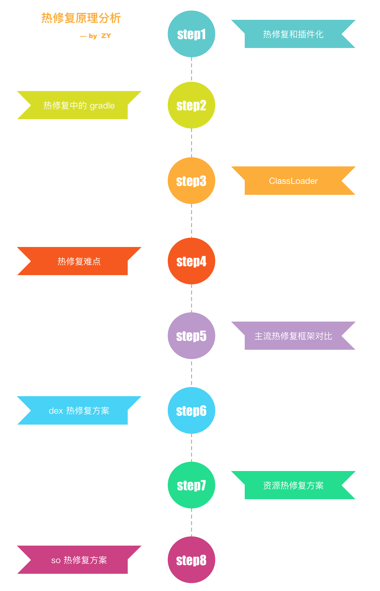
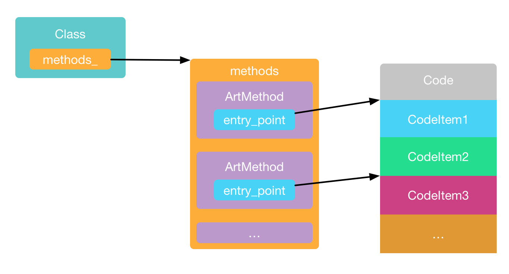
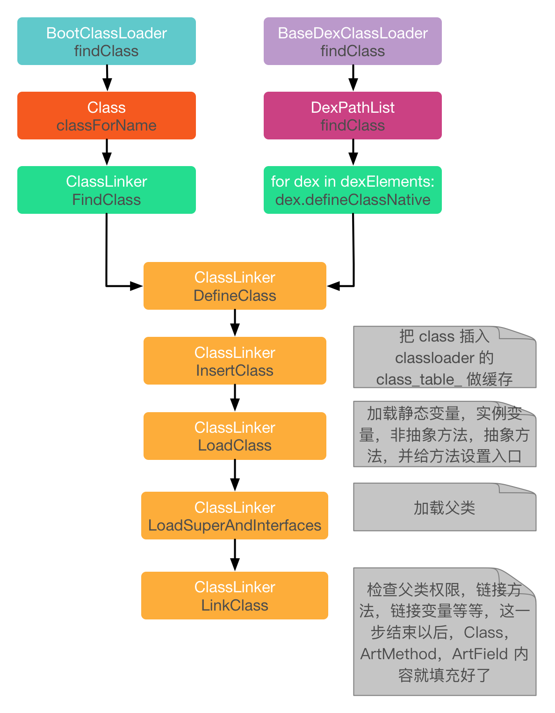
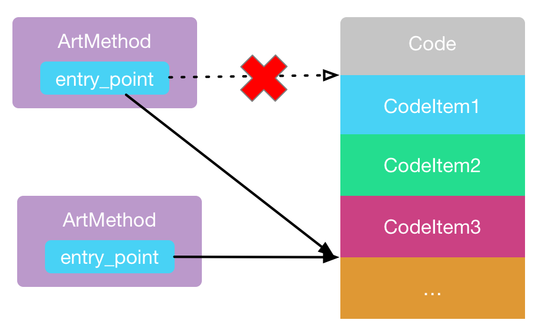
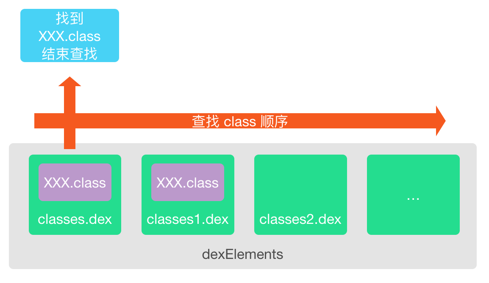
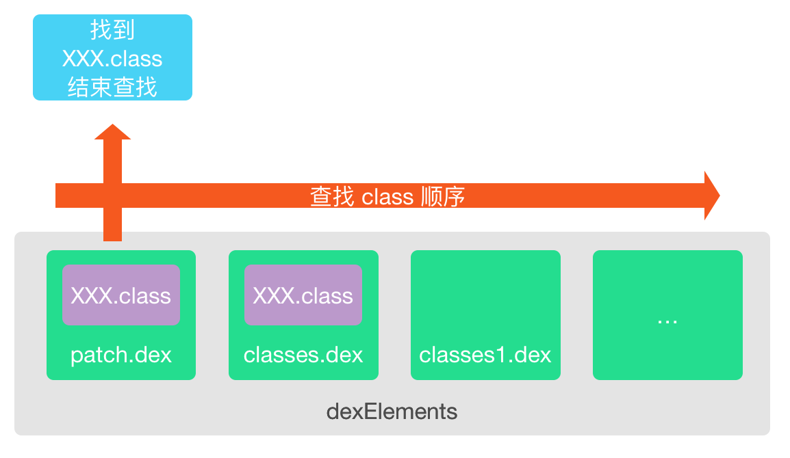
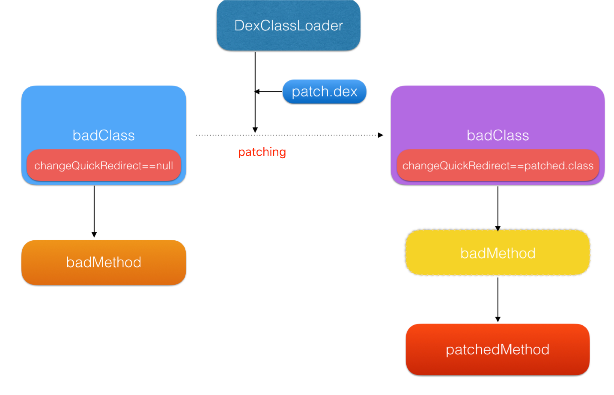
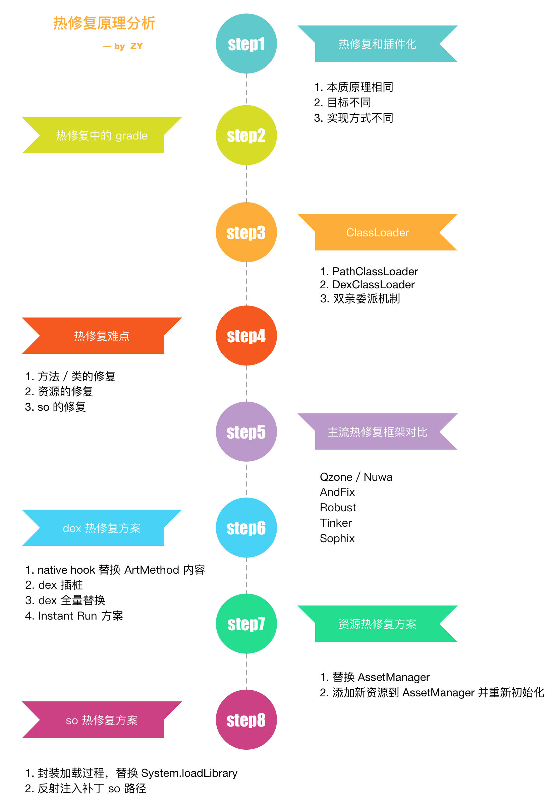

### 【Android 修炼手册】常用技术篇 -- Android 热修复解析

### 预备知识
1. 了解 android 基本开发
3. 了解 ClassLoader 相关知识

### 看完本文可以达到什么程度
1. 了解插件化常见的实现原理

### 阅读前准备工作
1. clone [CommonTec](https://github.com/5A59/android-training/tree/master/common-tec/CommonTec) 项目，其中 hotfix 和 patch 是热修复代码
示例代码基于 AndFix，NuWa，Robust 进行了调整，抽取主要部分用来讲解原理。

### 文章概览


### 一、热修复和插件化
插件化和热修复的原理，都是动态加载 dex／apk 中的类／资源，两者的目的不同。插件化目标在于加载 activity 等组件，达到动态下发组件的功能，热修复目标在修复已有的问题。目标不同，也就导致其实现方式上的差别。由于目标是动态加载组件，所以插件化重在解决组件的生命周期，以及资源的问题。而热修复重在解决替换已有的有问题的类／方法／资源等。
关于插件化，可以看前面分享的文章[Android 插件化分析](./android-插件化.md)

### 二、使用 gradle 简化插件开发流程
如果看过[Android 插件化分析](./android-插件化.md)里的 gradle 简化插件开发流程，这里可以略过～   

在学习和开发热修复的时候，我们需要动态去加载补丁 apk，所以开发过程中一般需要有两个 apk，一个是宿主 apk，一个是补丁 apk，对应的就需要有宿主项目和补丁项目。   
在 [CommonTec](https://github.com/5A59/android-training/tree/master/common-tec/CommonTec) 这里创建了 app 作为宿主项目，plugin 为插件项目。为了方便，我们直接把生成的插件 apk 放到宿主 apk 中的 assets 中，apk 启动时直接放到内部存储空间中方便加载。     
这样的项目结构，我们调试问题时的流程就是下面这样：   
修改插件项目 -> 编译生成插件 apk -> 拷贝插件 apk 到宿主 assets -> 修改宿主项目 -> 编译生成宿主 apk -> 安装宿主 apk -> 验证问题    
如果每次我们修改一个很小的问题，都经历这么长的流程，那么耐心很快就耗尽了。最好是可以**直接编译宿主 apk 的时候自动打包插件 apk 并拷贝到宿主 assets 目录下**，这样我们不管修改什么，都直接编译宿主项目就好了。如何实现呢？还记得我们之前讲解过的 gradle 系列么？现在就是学以致用的时候了。    
首先在 plugin 项目的 build.gradle 添加下面的代码：
``` groovy
project.afterEvaluate {
    project.tasks.each {
        if (it.name == "assembleDebug") {
            it.doLast {
                copy {
                    from new File(project.getBuildDir(), 'outputs/patch/debug/patch-debug.apk').absolutePath
                    into new File(project.getRootProject().getProjectDir(), 'hotfix/src/main/assets')
                    rename 'patch-debug.apk', 'patch.apk'
                }
            }
        }
    }
}
```
这段代码是在 afterEvaluate 的时候，遍历项目的 task，找到打包 task 也就是 assembleDebug，然后在打包之后，把生成的 apk 拷贝到宿主项目的 assets 目录下，并且重命名为 plugin.apk。

然后在 app 项目的 build.gradle 添加下面的代码：
``` groovy
project.afterEvaluate {
    project.tasks.each {
        if (it.name == 'mergeDebugAssets') {
            it.dependsOn ':patch:assembleDebug'
        }
    }
}
```
找到宿主打包的 mergeDebugAssets 任务，依赖插件项目的打包，这样每次编译宿主项目的时候，会先编译插件项目，然后拷贝插件 apk 到宿主 apk 的 assets 目录下，以后每次修改，只要编译宿主项目就可以了。

### 三、ClassLoader
如果看过[Android 插件化分析](./android-插件化.md)里的 ClassLoader 分析，这里可以略过～    

ClassLoader 是热修复和插件化中必须要掌握的，因为插件是未安装的 apk，系统不会处理其中的类，所以需要我们自己来处理。

#### 3.1 java 中的 ClassLoader
BootstrapClassLoader
负责加载 JVM 运行时的核心类，比如 JAVA_HOME/lib/rt.jar 等等

ExtensionClassLoader
负责加载 JVM 的扩展类，比如 JAVA_HOME/lib/ext 下面的 jar 包

AppClassLoader
负责加载 classpath 里的 jar 包和目录

#### 3.2 android 中的 ClassLoader
在这里，我们统称 dex 文件，包含 dex 的 apk 文件以及 jar 文件为 dex 文件
PathClassLoader
用来加载系统类和应用程序类，用来加载 dex 文件，但是 dex2oat 生成的 odex 文件只能放在系统的默认目录。

DexClassLoader
用来加载 dex 文件，可以从存储空间加载 dex 文件，可以指定 odex 文件的存放目录。

我们在插件化中一般使用的是 DexClassLoader。

#### 3.3 双亲委派机制
每一个 ClassLoader 中都有一个 parent 对象，代表的是父类加载器，在加载一个类的时候，会先使用父类加载器去加载，如果在父类加载器中没有找到，自己再进行加载，如果 parent 为空，那么就用系统类加载器来加载。通过这样的机制可以保证系统类都是由系统类加载器加载的。
下面是 ClassLoader 的 loadClass 方法的具体实现。
``` java
    protected Class<?> loadClass(String name, boolean resolve)
        throws ClassNotFoundException
    {
            // First, check if the class has already been loaded
            Class<?> c = findLoadedClass(name);
            if (c == null) {
                try {
                    if (parent != null) {
                        // 先从父类加载器中进行加载
                        c = parent.loadClass(name, false);
                    } else {
                        c = findBootstrapClassOrNull(name);
                    }
                } catch (ClassNotFoundException e) {
                    // ClassNotFoundException thrown if class not found
                    // from the non-null parent class loader
                }

                if (c == null) {
                    // 没有找到，再自己加载
                    c = findClass(name);
                }
            }
            return c;
    }
```

#### 3.4 如何加载插件中的类
要加载插件中的类，我们首先要创建一个 DexClassLoader，先看下 DexClassLoader 的构造函数需要那些参数。
``` java
public class DexClassLoader extends BaseDexClassLoader {
    public DexClassLoader(String dexPath, String optimizedDirectory, String librarySearchPath, ClassLoader parent) {
        // ...
    }
}
```
构造函数需要四个参数：    
**dexPath** 是需要加载的 dex / apk / jar 文件路径    
**optimizedDirectory** 是 dex 优化后存放的位置，在 ART 上，会执行 oat 对 dex 进行优化，生成机器码，这里就是存放优化后的 odex 文件的位置   
**librarySearchPath** 是 native 依赖的位置    
**parent** 就是父类加载器，默认会先从 parent 加载对应的类   

创建出 DexClassLaoder 实例以后，只要调用其 loadClass(className) 方法就可以加载插件中的类了。具体的实现在下面：
``` java
    // 从 assets 中拿出插件 apk 放到内部存储空间
    private fun extractPlugin() {
        var inputStream = assets.open("plugin.apk")
        File(filesDir.absolutePath, "plugin.apk").writeBytes(inputStream.readBytes())
    }

    private fun init() {
        extractPlugin()
        pluginPath = File(filesDir.absolutePath, "plugin.apk").absolutePath
        nativeLibDir = File(filesDir, "pluginlib").absolutePath
        dexOutPath = File(filesDir, "dexout").absolutePath
        // 生成 DexClassLoader 用来加载插件类
        pluginClassLoader = DexClassLoader(pluginPath, dexOutPath, nativeLibDir, this::class.java.classLoader)
    }
```

### 四、热修复需要解决的难点
热修复不同于插件化，不需要考虑各种组件的生命周期，唯一需要考虑的就是如何能将问题的方法／类／资源／so 替换为补丁中的新方法／类／资源／so。    
其中最重要的是方法和类的替换，所以有不少热修复框架只做了方法和类的替换，而没有对资源和 so 进行处理。

### 五、主流的热修复框架对比
这里选取几个比较主流的热修复框架进行对比

|            | Qzone／Nuwa | AndFix | Robust | Tinker | Sophix   |
| ---------- | ----------- | ------ | ------ | ------ | -------- |
| dex 修复   | y           | y      | y      | y      | y        |
| so 修复    | n           | n      | n      | y      | y        |
| 资源修复   | n           | n      | n      | y      | y        |
| 全平台支持 | y           | n      | y      | y      | y        |
| 即时生效   | n           | y      | y      | n      | 同时支持 |
| 补丁包大小 | 大          | 小     | 小     | 小     | 小       |

上面是热修复框架的一些对比，如果按照实现 dex 修复的原理来划分的话，大概能分成下面几种：

* native hook 
Andfix  
* dex 插桩
Qzone    
Nuwa
* InstantRun 
Robust    
Aceso
* 全量替换 dex
Tinker   
* 混合方案
Sophix

下面对这几种热修复的方案进行详细分析。

### 六、dex 热修复方案
#### 6.1 native hook 替换 ArtMethod 内容
##### 6.1.1 原理
在解释 native hook 原理之前，先介绍一下虚拟机的一些简单实现。java 中的类，方法，变量，对应到虚拟机里的实现是 [Class](https://www.androidos.net.cn/android/7.0.0_r31/xref/art/runtime/mirror/class.h)，[ArtMethod](https://www.androidos.net.cn/android/7.0.0_r31/xref/art/runtime/art_method.h)，[ArtField](https://www.androidos.net.cn/android/7.0.0_r31/xref/art/runtime/art_field.h)。以 Android N 为例，简单看一下这几个类的一些结构。
``` c++
class Class: public Object {
public:
    // ...
    // classloader 指针
	uint32_t class_loader_;
    // 数组的类型表示
	uint32_t component_type_;
    // 解析 dex 生成的缓存
	uint32_t dex_cache_;
    // interface table，保存了实现的接口方法
	uint32_t iftable_;
    // 类描述符，例如：java.lang.Class
	uint32_t name_;
    // 父类
	uint32_t super_class_;
    // virtual method table，虚方法表，指令 invoke-virtual 会用到，保存着父类方法以及子类复写或者覆盖的方法，是 java 多态的基础
	uint32_t vtable_;
    // public private 
	uint32_t access_flags_;
    // 成员变量
	uint64_t ifields_;
    // 保存了所有方法，包括 static，final，virtual 方法
	uint64_t methods_;
    // 静态变量
	uint64_t sfields_;
    // class 当前的状态，加载，解析，初始化等等
	Status status_;
	static uint32_t java_lang_Class_;
};

class ArtField {
public:
	uint32_t declaring_class_;
	uint32_t access_flags_;
	uint32_t field_dex_idx_;
	uint32_t offset_;
};

class ArtMethod {
public:
	uint32_t declaring_class_;
	uint32_t access_flags_;
    // 方法字节码的偏移
	uint32_t dex_code_item_offset_;
    // 方法在 dex 中的 index
	uint32_t dex_method_index_;
    // 在 vtable 或者 iftable 中的 index
	uint16_t method_index_;
    // 方法的调用入口
    struct PACKED(4) PtrSizedFields {
        ArtMethod** dex_cache_resolved_methods_;
        GcRoot<mirror::Class>* dex_cache_resolved_types_;
        void* entry_point_from_jni_;
        void* entry_point_from_quick_compiled_code_;
    } ptr_sized_fields_;
};
```
上面列出了三个结构的一部分变量，其实从这些变量可以比较清楚的看到，Class 中的 iftable_，vtable_，methods_ 里面保存了所有的类方法，sfields_，ifields_ 保存了所有的成员变量。而在 ArtMethod 中，ptr_sized_fields_ 变量指向了方法的调用入口，也就是执行字节码的地方。在虚拟机内部，调用一个方法的时候，可以简单的理解为会找到 ptr_sized_fields_ 指向的位置，跳转过去执行对应的方法字节码或者机器码。简图如下：   


这里也顺便说一下上面三个结构的内容是什么时候填充的，就是在 ClassLoader 加载类的时候。简图如下：


其实到这里，我们就简单理解了虚拟机的内部实现，也就很容易想到 native hook 的原理了。既然每次调用方法的时候，都是通过 ArtMethod 找到方法，然后跳转到其对应的字节码／机器码位置去执行，那么我们只要更改了跳转的目标位置，那么自然方法的实现也就被改变了。简图如下：

所以 native hook 的本质就是把旧方法的 ArtMethod 内容替换成新方法的 ArtMethod 内容。
具体的实现代码在[这里](./CommonTec/hotfix/src/main/java/com/zy/hotfix/native_hook/NativeHookUtils.kt)(只实现了 Android N 上的修复)，下面看一些重点代码。

##### 6.1.2 实现代码
1. 首先要找到替换的旧方法和新方法，这一步在 java 中进行，直接通过反射获取即可
``` java
// 创建补丁的 ClassLoader
pluginClassLoader = DexClassLoader(pluginPath, dexOutPath.absolutePath, nativeLibDir.absolutePath, this::class.java.classLoader)
// 通过补丁 ClassLoader 加载新方法
val toMethod = pluginClassLoader.loadClass("com.zy.hotfix.native_hook.PatchNativeHookUtils").getMethod("getMsg")
// 反射获取到需要修改的旧方法
val fromMethod = nativeHookUtils.javaClass.getMethod("getMsg")
```
2. 之后调用 native 方法替换 ArtMethod 内容
``` java
nativeHookUtils.patch(fromMethod, toMethod)
```

``` c++
Java_com_zy_hotfix_native_1hook_NativeHookUtils_patch(JNIEnv* env, jobject clazz, jobject src, jobject dest) {
    // 获取到 java 方法对应的 ArtMethod
    art::mirror::ArtMethod* smeth =
            (art::mirror::ArtMethod*) env->FromReflectedMethod(src);
    art::mirror::ArtMethod* dmeth =
            (art::mirror::ArtMethod*) env->FromReflectedMethod(dest);

    reinterpret_cast<art::mirror::Class*>(dmeth->declaring_class_)->clinit_thread_id_ =
            reinterpret_cast<art::mirror::Class*>(smeth->declaring_class_)->clinit_thread_id_;
    reinterpret_cast<art::mirror::Class*>(dmeth->declaring_class_)->status_ =
            static_cast<art::mirror::Class::Status>(reinterpret_cast<art::mirror::Class*>(smeth->declaring_class_)->status_ -1);
    //for reflection invoke
    reinterpret_cast<art::mirror::Class*>(dmeth->declaring_class_)->super_class_ = 0;

    // 替换方法中的内容
    smeth->declaring_class_ = dmeth->declaring_class_;
    smeth->access_flags_ = dmeth->access_flags_  | 0x0001;
    smeth->dex_code_item_offset_ = dmeth->dex_code_item_offset_;
    smeth->dex_method_index_ = dmeth->dex_method_index_;
    smeth->method_index_ = dmeth->method_index_;
    smeth->hotness_count_ = dmeth->hotness_count_;
    // 替换方法的入口
    smeth->ptr_sized_fields_.dex_cache_resolved_methods_ =
            dmeth->ptr_sized_fields_.dex_cache_resolved_methods_;
    smeth->ptr_sized_fields_.dex_cache_resolved_types_ =
            dmeth->ptr_sized_fields_.dex_cache_resolved_types_;
    smeth->ptr_sized_fields_.entry_point_from_jni_ =
            dmeth->ptr_sized_fields_.entry_point_from_jni_;
    smeth->ptr_sized_fields_.entry_point_from_quick_compiled_code_ =
            dmeth->ptr_sized_fields_.entry_point_from_quick_compiled_code_;
}
```
通过上述方法的替换，再次调用旧方法，就会跳转到新方法的入口，自然也就执行新方法的逻辑了。

##### 6.1.3 优缺点
**优点**：    
补丁可以实时生效    
**缺点**：     
1. 兼容性差，由于 Android 系统每个版本的实现都有差别，所以需要做很多的兼容。（这也就是为什么上面提供的 demo 代码只能运行在 Android N 上，因为没有对其他版本做兼容）  
2. 开发需要掌握 jni 相关知识

#### 6.2 dex 插桩
##### 6.2.1 原理
dex 插桩的实现，是 Qzone 团队提出来的，Nuwa 框架采用这种实现并且开源。系统默认使用的是 PathClassLoader，继承自 BaseDexClassLoader，在 BaseDexClassLoader 里，有一个 DexPathList 变量，在 DexPathList 的实现里，有一个 Element[] dexElements 变量，这里面保存了所有的 dex。在加载 Class 的时候，就遍历 dexElements 成员，依次查找 Class，找到以后就返回。


下面是重点代码。
``` java
public class PathClassLoader extends BaseDexClassLoader {
}

public class BaseDexClassLoader extends ClassLoader {
    private final DexPathList pathList;
}

final class DexPathList {
    // 保存了 dex 的列表
    private Element[] dexElements;

    public Class findClass(String name, List<Throwable> suppressed) {
        // 遍历 dexElements
        for (Element element : dexElements) {
            DexFile dex = element.dexFile;

            if (dex != null) {
                // 从 DexFile 中查找 Class
                Class clazz = dex.loadClassBinaryName(name, definingContext, suppressed);
                if (clazz != null) {
                    return clazz;
                }
            }
        }
        // ...
        return null;
    }
}
```
从上面 ClassLoader 的实现我们可以知道，查找 Class 的关键就是遍历 dexElements，那么自然就想到了把补丁 dex 插入到 dexElements 最前面，这样遍历 dexElements 就会优先从补丁 dex 中查找 Class 了。


具体的实现在[这里](./CommonTec/hotfix/src/main/java/com/zy/hotfix/insert_dex/InsertDexUtils.java)，下面放一些重点代码。
##### 6.2.2 实现代码
``` java
    public static void injectDexAtFirst(String dexPath, String defaultDexOptPath) throws NoSuchFieldException, IllegalAccessException, ClassNotFoundException {
        // 创建补丁 dex 的 classloader，目的是使用其中的补丁 dexElements
        DexClassLoader dexClassLoader = new DexClassLoader(dexPath, defaultDexOptPath, dexPath, getPathClassLoader());
        // 获取到旧的 classloader 的 pathlist.dexElements 变量
        Object baseDexElements = getDexElements(getPathList(getPathClassLoader()));
        // 获取到补丁 classloader 的 pathlist.dexElements 变量
        Object newDexElements = getDexElements(getPathList(dexClassLoader));
        // 将补丁 的 dexElements 插入到旧的 classloader.pathlist.dexElements 前面
        Object allDexElements = combineArray(newDexElements, baseDexElements);
    }

    private static PathClassLoader getPathClassLoader() {
        PathClassLoader pathClassLoader = (PathClassLoader) InsertDexUtils.class.getClassLoader();
        return pathClassLoader;
    }

    private static Object getDexElements(Object paramObject)
            throws IllegalArgumentException, NoSuchFieldException, IllegalAccessException {
        return Reflect.on(paramObject).get("dexElements");
    }

    private static Object getPathList(Object baseDexClassLoader)
            throws IllegalArgumentException, NoSuchFieldException, IllegalAccessException, ClassNotFoundException {
        return Reflect.on(baseDexClassLoader).get("pathList");
    }

    private static Object combineArray(Object firstArray, Object secondArray) {
        Class<?> localClass = firstArray.getClass().getComponentType();
        int firstArrayLength = Array.getLength(firstArray);
        int allLength = firstArrayLength + Array.getLength(secondArray);
        Object result = Array.newInstance(localClass, allLength);
        for (int k = 0; k < allLength; ++k) {
            if (k < firstArrayLength) {
                Array.set(result, k, Array.get(firstArray, k));
            } else {
                Array.set(result, k, Array.get(secondArray, k - firstArrayLength));
            }
        }
        return result;
    }
```

##### 6.2.3 优缺点
**优点**：   
1. 实现简单   
2. 不需要太多的适配   

**缺点**：   
1. 需要重新启动补丁才能生效。因为在插桩之前加载的类是不会再重新加载的，所以需要重新启动，让已经加载过的 Class 重新加载才能应用到补丁  
2. class verify 问题。关于这个问题可以看[Qzone 的解释](https://mp.weixin.qq.com/s?__biz=MzI1MTA1MzM2Nw==&mid=400118620&idx=1&sn=b4fdd5055731290eef12ad0d17f39d4a)，这里就不详细展开了
3. Art 虚拟机上由于 oat 导致的地址偏移问题，可能会需要在补丁包中打入补丁无关的类，导致补丁包体积增大    

#### 6.3 dex 替换
dex 替换的方案，主要是 tinker 在使用，这里生成的补丁包不只是需要修改的类，而是包含了整个 app 所有的类，在替换时原理和 dex 插桩类似，也是替换掉 dexElements 中的内容即可，这里就不详细说了。

#### 6.4 InstantRun
##### 6.4.1 原理
InstantRun 是 AndroidStudio 2.0 新增的功能，方便快速的增量编译应用并部署，美团参照其原理实现了 Robust 热修复框架。
其中的原理是，给每个 Class 中新增一个 changeQuickRedirect 的静态变量，并在每个方法执行之前，对这个变量进行了判断，如果这个变量被赋值了，就调用补丁类中的方法，如果没有被赋值，还是调用旧方法。
原理比较简单，下面看看实现。具体实现在[这里](./CommonTec/hotfix/src/main/java/com/zy/hotfix/instant_run/InstantRunUtils.java)。

##### 6.4.2 实现代码
``` java
public class InstantRunUtils {
    // 上文中说的 changeQuickRedirect 变量，改了一下名字
    public static PatchRedirect patchRedirect;

    // 需要补丁的方法
    public int getValue() {
        // 判断 patchRedirect 是否为空
        if (patchRedirect != null) {
            // 不为空，说明方法需要打补丁，由于一个类中有很多方法，所以这里需要判断此方法是否需要补丁
            if (patchRedirect.needPatch("getValue")) {
                // 需要补丁，就调用补丁中的方法
                return (String) patchRedirect.invokePatchMethod("getValue");
            }
        }
        return 100;
    }

    // 注入补丁
    public static void inject(ClassLoader classLoader) {
        try {
            // 获取到补丁中的补丁信息
            Class patchInfoClass = classLoader.loadClass("com.zy.hotfix.instant_run.PatchInfo");
            patchInfoClass.getMethod("init").invoke(null);
            // patchMap 中存着 className -> PatchRedirect，即需要补丁的类描述符和对应的 PatchRedirect
            Map<String, Object> patchMap = (Map<String, Object>) patchInfoClass.getField("patchMap").get(null);
            for (String key: patchMap.keySet()) {
                PatchRedirect redirect = (PatchRedirect) patchMap.get(key);
                Class clazz = Class.forName(key);
                // 替换 class 中的 PatchRedirect
                clazz.getField("patchRedirect").set(null, redirect);
            }
        } catch (Exception e) {
            e.printStackTrace();
        }
    }
}
```
然后我们看看补丁中的 PatchRefirect 是怎么实现的
``` java
public class InstantRunUtilsRedirect extends PatchRedirect {
    @Override
    public Object invokePatchMethod(String methodName, Object... params) {
        // 根据方法描述符调用对应的方法
        if (methodName.equals("getValue")) {
            return getValue();
        }
        return null;
    }

    @Override
    public boolean needPatch(String methodName) {
        // 判断方法是否需要补丁
        if ("getValue".equals(methodName)) {
            return true;
        }
        return false;
    }

    // 补丁方法，返回正确的值
    public int getValue() {
        return 200;
    }
}
```

##### 6.4.3 优缺点
**优点**：   
1. 使用 java 实现，开发方便 
2. 兼容性好
3. 补丁实时生效     

**缺点**：    
1. 代码是侵入比较高，需要在原有代码中新增逻辑，而且需要对方法进行插桩，将这里逻辑自动化处理   
2. 增大包体积

### 七、资源热修复方案
关于资源的修复方案，没有像代码修复一样方法繁多，基本上集中在对 AssetManager 的修改上。
#### 7.1 替换 AssetManager
这个是 InstantRun 采用的方案，就是构造一个新的 AssetManager，反射调用其 addAssetPath 函数，把新的补丁资源包添加到 AssetManager 中，从而得到含有完整补丁资源的 AssetManager，然后找到所有引用 AssetManager 的地方，通过反射将其替换为新的 AssetManager。

#### 7.2 添加修改的资源到 AssetManager 中，并重新初始化
这个是 Sophix 采用的方案，原理是构造一个 package id 为 0x66 的资源包，只含有改变的资源，将其直接添加到原有的 AssetManager 中，这样不会与原来的 package id 0x7f 冲突。然后将原来的 AssetManager 重新进行初始化即可，就不需要进行繁琐的反射替换操作了。

### 八、so 热修复方案
#### 8.1 对加载过程进行封装，替换 System.loadLibrary
在加载 so 库的时候，系统提供了两个接口
``` java
System.loadLibrary(String libName)：用来加载已经安装的 apk 中的 so
System.load(String pathName)：可以加载自定义路径下的 so
```
通过上面两个方法，我们可以想到，如果有补丁 so 下发，我们就调用 System.load 去加载，如果没有补丁 so 没有下发，那么还是调用 System.loadLibrary 去加载系统目录下的 so，原理比较简单，但是我们需要再上面进行一层封装，并对调用 System.loadLibrary 的地方都进行替换。

#### 8.2 反射注入补丁 so 路径
还记得上面 dex 插桩的原理么？在 DexPathList 中有 dexElements 变量，代表着所有 dex 文件，其实 DexPathList 中还有另一个变量就是 Element[] nativeLibraryPathElements，代表的是 so 的路径，在加载 so 的时候也会遍历 nativeLibraryPathElements 进行加载，代码如下：
``` java
    public String findLibrary(String libraryName) {
        String fileName = System.mapLibraryName(libraryName);
        // 遍历 nativeLibraryPathElements 
        for (Element element : nativeLibraryPathElements) {
            String path = element.findNativeLibrary(fileName);

            if (path != null) {
                return path;
            }
        }
        return null;
    }
```
看到这里我们就知道如何去做了吧，就像 dex 插桩一样的方法，将 so 的路径插入到 nativeLibraryPathElements 之前即可。

### 九、总结


### 参考资料
https://www.cnblogs.com/popfisher/p/8543973.html    
https://tech.meituan.com/2016/09/14/android-robust.html    
[深入探索Android热修复技术原理](https://yq.aliyun.com/articles/115122?spm=a2c4g.11186623.2.31.38ec5c56o0QqEx)
