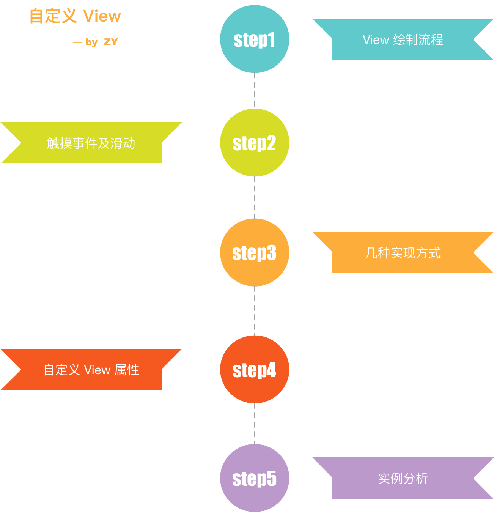
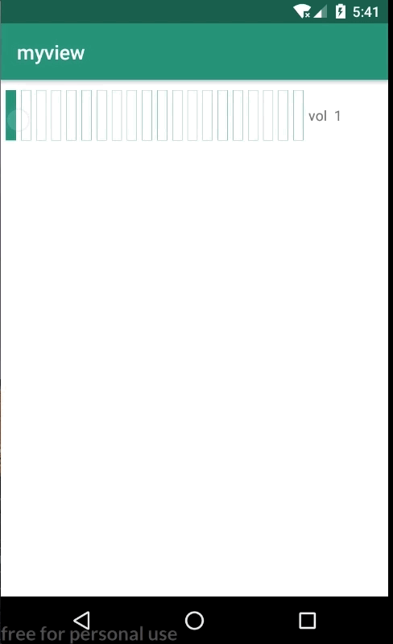
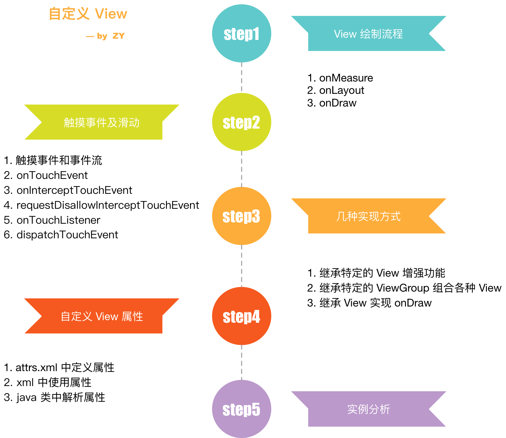

### 【Android 修炼手册】常用技术篇 -- Android 自定义 View

### 预备知识
1. 了解 android 基本开发

### 看完本文可以达到什么程度
1. 学会自定义 View 以及其中的关键点

### 阅读前准备工作
1. clone [CommonTec](https://github.com/5A59/android-training/tree/master/common-tec/CommonTec) 项目，其中 myview 是自定义 View 的代码

### 文章概览


自定义 View 内容总体来说还是比较简单，更多的是要满足具体的需求，所以本文内容并不太难，看起来比较愉悦。

在学习如何自定义 View 之前，需要先了解一下 Android 系统里，View 的绘制流程，熟悉了各个流程，我们在自定义过程中也就得心应手了。

### 一、Android View 绘制流程
Android View 的绘制流程是从 ViewRootImpl 的 performTraversals 开始的，会经历下面的过程。


所以一个 view 的绘制主要有三个流程，measure 确定宽度和高度，layout 确定摆放的位置，draw 绘制 view 内容。
下面就依次看看这三个步骤。

### 1.1 onMeasure
onMeasure 是用来测量 View 宽度和高度的，一般情况下可以理解为在 onMeasure 以后 View 的宽度和高度就确定了，然后我们就可以使用 getMeasuredWidth 和 getMeasuredHeight 来获取 View 的宽高了。
我们先看看 View 默认的 onMeasure 里做了什么事情。
#### setMeasuredDimension
``` java
class View {
    protected void onMeasure(int widthMeasureSpec, int heightMeasureSpec) {
        setMeasuredDimension(getDefaultSize(getSuggestedMinimumWidth(), widthMeasureSpec),
                getDefaultSize(getSuggestedMinimumHeight(), heightMeasureSpec));
    }

    protected final void setMeasuredDimension(int measuredWidth, int measuredHeight) {
        // ...
        setMeasuredDimensionRaw(measuredWidth, measuredHeight);
    }

    private void setMeasuredDimensionRaw(int measuredWidth, int measuredHeight) {
        mMeasuredWidth = measuredWidth;
        mMeasuredHeight = measuredHeight;

        mPrivateFlags |= PFLAG_MEASURED_DIMENSION_SET;
    }
}
```
可以看到里面是调用了 setMeasuredDimension，这个方法是设置 View 的测量宽高的，其实内部就是给 mMeasuredWidth 和 mMeasuredHeight 设置了值。之后 getMeasuredWidth 和 getMeasuredHeight 就是获取的这两个值。
#### getMeasuedWidth／getMeasuredHeight 和 getWidth／getHeight
这里说一下 getMeasuredWidth／getMeasuredHeight 和 getWidth／getHeight 的区别，getMeasuredWidth／getMeasuredHeight 是获取测量宽度和高度，也就是 onMeasure 以后确定的值，相当于是通知了系统我的 View 应该是这么大，但是 View 最终的宽度和高度是在 layout 以后才确定的，也就是 getWidth 和 getHeight 的值。而 getWidth 的值是 right - left，getHeight 也类似。    
一般情况下 getMeasuredWidth／getMeasuredHeight 和 getWidth／getHeight 的值是相同的，但是要记住，这两个值是可以不同的。我们可以写个小 demo 看看。   
``` java
class MyView constructor(context: Context?, attributes: AttributeSet?, defaultAttrStyle: Int) : TextView(context, attributes, defaultAttrStyle) {
    constructor(context: Context?, attributes: AttributeSet?) : this(context, attributes, 0)
    constructor(context: Context?) : this(context, null)

    override fun onMeasure(widthMeasureSpec: Int, heightMeasureSpec: Int) {
        super.onMeasure(widthMeasureSpec, heightMeasureSpec)
        setMeasuredDimension(100, 100)
    }

    override fun onLayout(changed: Boolean, left: Int, top: Int, right: Int, bottom: Int) {
        setFrame(0, 0, 100, 20)
        super.onLayout(changed, 0, 0, 100, 20)
    }
}
```
在上面的 MyView 中，onMeasure 里通过 setMeasuredDimension 设置了宽高是 100 * 100，但是在 onLayout 中我们设置了 setFrame 为 (0, 0, 100, 20)，通过计算，高度是 bottom - top。所以最后展示的高度就是 20。

#### MeasureSpec
在 onMeasure 函数中，有两个参数，widthMeasureSpec 和 heightMeasureSpec，这个是传入的父 View 能给予的最大宽高，和测量模式。
widthMeasureSpec 分为 mode 和 size，通过 MeasureSpec.getMode(widthMeasureSpec) 可以获得模式，MeasureSpec.getSize(widthMeasureSpec) 可以获取宽度。  
其中 mode 有三种类型，UNSPECIFIED，AT_MOST，EXACTLY。       
**UNSPECIFIED** 是不限制 View 的尺寸，根据实际情况，想多大可以设置多大。     
**AT_MOST** 是最大就是父 View 的宽度／高度，也就是我们在 xml 中设置 wrap_content 的效果。    
**EXACTLY** 是确定的 View 尺寸，我们在 xml 中设置 一个固定的值或者父 View 是一个固定的值且子 View 设置了 match_parent。   

所以在 onMeasure 中，我们要根据上面的情况，正确的处理对应 mode 下的尺寸。

这里我们额外看一下 View 默认的 onMeasure 方法对各种 mode 的处理。
``` java
class View {
    public static int getDefaultSize(int size, int measureSpec) {
        int result = size;
        int specMode = MeasureSpec.getMode(measureSpec);
        int specSize = MeasureSpec.getSize(measureSpec);

        switch (specMode) {
        case MeasureSpec.UNSPECIFIED:
            result = size;
            break;
        case MeasureSpec.AT_MOST:
        case MeasureSpec.EXACTLY:
            result = specSize;
            break;
        }
        return result;
    }
}
```
默认对 AT_MOST 和 EXACTLY 的处理方式是一样的，所以我们对一个 View 设置 wrap_content 和 match_parent 的效果其实是一样的。

### 1.2 onLayout
onLayout 是对 View 的位置进行摆放。在 layout 中通过 **setFrame(left, top, right, bottom)** 设置 View 的上下左右位置。这一步只要处理好 View 的位置即可。如果是 ViewGroup 及其子类，还要处理子 View 的位置。

### 1.3 onDraw
onDraw 过程也比较简单，就是绘制 View 的内容。分为几个步骤（基于 Sdk 28 源码分析）：
drawBackground 绘制背景     
onDraw 绘制自身     
dispatchDraw 绘制子 View    
onDrawForeground 绘制前景     

在绘制过程中，有两个类 Canvas 和 Paint 需要特别注意一下。这两个类是绘制过程中常用的。    
**Canvas 中常用的一些 api 如下：**    
drawBitmap 绘制图片    
drawCircle 绘制圆形     
drawLine 绘制直线    
drawPoint 绘制点     
drawText 绘制文字     
具体的 api 在 https://developer.android.com/reference/android/graphics/Canvas.html 这里查看。其实在开发中要养成查看官方文档的习惯，毕竟官方的才是权威的。    

**Paint 中一些常用的 api 如下：**    
setColor 设置颜色
setAntiAlias 抗锯齿    
setStyle 设置线条或者填充风格    
setStrokeWidth 设置线条宽度    
setStrokeCap 设置线头形状    
setStrokeJoin 设置线条拐角的形状    
具体的 api 在 https://developer.android.com/reference/android/graphics/Paint.html 在这里查看。

### 二、触摸事件以及滑动冲突
关于触摸事件以及滑动冲突，也是自定义 View 经常遇到的问题。在此之前，先要了解一下 View 的事件分发机制。
#### 2.1 事件和事件流
在 Android 系统中，触摸事件是以 MotionEvent 传递给 View 的。在其中定义了一些常用的操作，ACTION_DOWN，ACTION_UP，ACTION_MOVE，ACTION_CANCEL 等等。分别代表了按下，抬起，以及中间的移动，事件取消等操作。    
而我们处理事件的本质，就是对这些操作进行判断，在正确的时机去做正确的事情。而一些列事件操作就构成一次事件操作流，也就是一次用户完整的操作。      
触摸事件的操作流都是以 ACTION_DOWN 为起始。以 ACTION_UP 或者 ACTION_CANCEL 结束。      
``` 
ACTION_DOWN -> ACTION_UP
ACTION_DOWN -> ACTION_MOVE -> ACTION_MOVE -> ... -> ACTION_UP
ACTION_DOWN -> ACTION_MOVE -> ACTION_MOVE -> ... -> ACTION_CANCEL
```
这里需要注意的就是**事件**和**事件流**的区别。

#### 2.2 onTouchEvent
在 View 中，处理触摸事件的方法是 onTouchEvent(MotionEvent event)，传入的参数就是操作，我们要处理触摸事件的时候，就要重写 onTouchEvent 方法，在其中做自定义的处理。    
这里值得注意的是，onTouchEvent 是有一个 boolean 类型的返回值的，这个返回值也很重要。返回值代表了本次【**次事件流**】是否要执行处理，如果返回 true，那么就表示本次事件流都由自己全权负责，后续的【**事件**】就不出再传递给其他 View 了。       
因为代表的是整个事件流的处理，所以这个返回值只在 ACTION_DOWN 的时候有效，如果 ACTINO_DOWN 的时候返回 false，那么后面就不会收到其他的事件了。      
如果 View 设置了 OnClickListener，那么在默认的 View 里的 onTouchEvent 中会在 ACTION_UP 的时候调用其 onClick。    

#### 2.3 onInterceptTouchEvent
上面说了 View 中触摸事件的处理，如果是在 ViewGroup 中，在 onTouchEvent 之前还会有一个校验 onInterceptTouchEvent，意思是是否拦截触摸事件。    
如果 onInterceptTouchEvent 返回 true，那么说明需要拦截此次事件，就不会再分发事件给子 View 了。增加这个拦截以后，父 View 可以把一些事件下方给子 View，在合适的还能进行拦截，把事件收回来做自己的处理。典型的应用就是列表中 item 的点击和列表的滑动。      
这里强调一点，onInterceptTouchEvent 是事件流中的每个【**事件**】到来时都会调用，而 onTouchEvent 如果在 ACTION_DOWN 以后返回 false，那么【**事件流**】后续的事件就不会再收到了。

#### 2.4 requestDisallowInterceptTouchEvent
从上面的分析我们知道了，ViewGroup 中如果遇到自己需要处理的事件，就会通过 onIntercepTouchEvent 拦截这个事件，这样这个事件就不会传递到子 View 里了。但是事情总有例外，如果某些事件子 View 想要自己来处理，不需要父 View 来插手，那么就可以调用 requestDisallowInterceptTouchEvent 告诉父 View 后面的事件不需要拦截。    
这个只在一次【**事件流**】中有效，因为在父 View 收到 ACTION_DOWN 以后，会重置此标识位。

#### 2.5 OnTouchListener
还有一个点是 onTouchListener，对于一个 View，可以设置 OnTouchListener，在其 onTouch 方法中也可以处理触摸事件。如果 onTouch 中返回了 true，就代表消耗了这次事件，就不会再去调用 onTouchEvent 了。

#### 2.6 dispatchTouchEvent
上面说的几个 View 以及 ViewGroup 的事件处理方法，都是在 dispatchTouchEvent 中进行分发的。整个事件分发机制可以用下面的伪代码来表示。
``` java
public boolean dispatchTouchEvent() {
   boolean res = false;
   if (onInterceptTouchEvent()) { // View 不会调用这个，直接执行下面的 touchlistener 判断
       if (mOnTouchListener && mOnTouchListener.onTouch()) { // 处理 OnTouchListener
           return true;
       }
       // 没有设置 OnTouchListener 或者其 onTouch 返回 false，就调用 onTouchEvent
       res = onTouchEvent(); // -> clicklistener.onClick()
   } else {
       // 本次事件不需要拦截，就分发给子 View 去处理
       for (child in childrenView) {
           res = child.dispatchTouchEvent();
       }
   }
   return res;
}
```

### 三、自定义 view 的几种方式
了解了上面自定义 View 的一些基础知识，我们看看自定义 View 常用的几种方法。
#### 1. 继承特定的 View 实现增强功能
这种方式一般是已有的控件功能无法满足需求，需要在已有控件上进行扩展。通常只要实现我们需要扩展的功能即可，比较简单。

#### 2. 继承特定的 ViewGroup，组合各种 View
这种方式一般是对已有的一些控件的封装，使用起来比较方便。

#### 3. 继承 View 实现 onDraw 方法
这种方式一般是已有控件无法满足需求，所以需要我们自己来绘制 View

### 四、设置自定义 View 的属性
在自定义 View 的时候，我们经常需要加一些自定义的属性，方便在 xml 中进行配置，类似 TextView 的 text。下面就看看自定义 View 属性的方法。我们以创建一个 MyView 的 message 属性为例。

#### 1. 在 xml 定义需要的属性
先在 res/valuse 目录下创建 attrs.xml，在其中添加自定义的属性
``` xml
<?xml version="1.0" encoding="utf-8"?>
<resources>
    <declare-styleable name="MyView">
        <attr name="message" format="string" />
    </declare-styleable>
</resources>
```

#### 2. 在 xml 中使用属性
``` xml
<LinearLayout xmlns:android="http://schemas.android.com/apk/res/android"
    xmlns:app="http://schemas.android.com/apk/res-auto"
    android:layout_width="match_parent"
    android:layout_height="match_parent"
    android:orientation="vertical">

    <com.zy.myview.MyView
        android:layout_width="wrap_content"
        android:layout_height="wrap_content"
        android:background="#ff6633"
        android:text="Hello World!"
        app:message="this is my view" />
</LinearLayout>
```
在使用自定义的属性时，需要注意命名空间的问题，默认属性的命名空间是 android，我们这里需要新增一个 xmlns:app="http://schemas.android.com/apk/res-auto"，使用自定义属性的时候需要用这个命名空间 app:message=""。不过命名空间这一步，一般 AndroidStudio 会自动加上。

#### 3. 在 java 类中获取属性
``` kotlin
class MyView constructor(context: Context?, attributes: AttributeSet?, defaultAttrStyle: Int) : TextView(context, attributes, defaultAttrStyle) {
    constructor(context: Context?, attributes: AttributeSet?) : this(context, attributes, 0)
    constructor(context: Context?) : this(context, null)

    init {
        // 获取 TypeArray
        val typedArray = context?.obtainStyledAttributes(attributes, R.styleable.MyView)
        // 获取 message 属性
        val message = typedArray?.getString(R.styleable.MyView_message)
        typedArray?.recycle()  //注意回收
    }
}
```
通过上面三个步骤，我们就把自定义属性用起来了。

### 五、实例分析
通过上面的分析我们知道了自定义 View 的关键点以及如何去自定义 View，下面就写个例子实战一下。     
我这里简单写了一个类似音量条的控件，可以跟随手指滑动提高降低音量，仅做自定义控件的演示，所以里面的逻辑和 ui 可能比较丑，重点关注上面关键点的处理～     
完整代码在[这里](./CommonTec/myview/src/main/java/com/zy/myview/VolumeBar.kt)查看   


我们这里先看一下如何使用的这个控件
``` xml
<?xml version="1.0" encoding="utf-8"?>
<LinearLayout xmlns:android="http://schemas.android.com/apk/res/android"
    xmlns:app="http://schemas.android.com/apk/res-auto"
    xmlns:tools="http://schemas.android.com/tools"
    android:layout_width="match_parent"
    android:layout_height="match_parent"
    android:orientation="vertical"
    tools:context=".MainActivity">

    <com.zy.myview.VolumeBar
        android:layout_width="match_parent"
        android:layout_height="50dp"
        android:layout_marginTop="10dp"
        app:col_color="@color/colorPrimaryDark"
        app:count="20"
        app:tip="vol" />
</LinearLayout>
```
这里我们把 VolumeBar 作为一个整体控件来引用的，其中定义了 col_color，count，tip 三个属性，分别表示音量条的颜色，音量条的数量，提示文案。属性的定义如下：
``` xml
<?xml version="1.0" encoding="utf-8"?>
<resources>
    <declare-styleable name="VolumeBar">
        <attr name="count" format="integer" />
        <attr name="col_color" format="color" />
        <attr name="tip" format="string" />
    </declare-styleable>
</resources>
```
然后我们再来分析一下 VolumeBar 这个控件，由于这个控件内部还有音量条和文案，所以我们采用了【继承特定 ViewGroup，组合各种 View】这种方式来实现控件。VolumeBar 继承自 LinearLayout，然后在内部组合了音量条控件和提示文案控件，我们先看看关键代码。
``` kotlin
class VolumeBar constructor(context: Context?, attributes: AttributeSet?, defaultAttrStyle: Int) : LinearLayout(context, attributes, defaultAttrStyle) {

    init {
        // 解析自定义属性
        val typedArray = context?.obtainStyledAttributes(attributes, R.styleable.VolumeBar)
        tip = typedArray?.getString(R.styleable.VolumeBar_tip) ?: ""
        count = typedArray?.getInt(R.styleable.VolumeBar_count, 20) ?: 20
        color = typedArray?.getColor(R.styleable.VolumeBar_col_color, context.resources.getColor(R.color.colorPrimary))
                ?: context!!.resources.getColor(R.color.colorPrimary)
        typedArray?.recycle()  //注意回收
        gravity = Gravity.CENTER_VERTICAL
        // 处理子 View
        initVolumeView()
    }

    private fun initVolumeView() {
        val params = LinearLayout.LayoutParams(LayoutParams.WRAP_CONTENT, ViewGroup.LayoutParams.WRAP_CONTENT)
        params.leftMargin = 10
        // 添加音量条子 View
        (0 until count).forEach { _ ->
            val view = VolumeView(context)
            addView(view, params)
            viewList.add(view)
        }
        // 添加文案
        text = TextView(context)
        text.text = "$tip  0"
        addView(text, params)
    }

    override fun onTouchEvent(event: MotionEvent): Boolean {
        // 处理触摸事件
        when (event.action) {
            MotionEvent.ACTION_DOWN,
            MotionEvent.ACTION_MOVE -> {
                handleEvent(event)
            }
        }
        return true
    }

    // 触摸事件的处理逻辑，主要是在查找当前触摸事件的位置，确定是在第几个子 View 上，然后将此子 View 之前的所有子 View 都设置成实心的
    private fun handleEvent(event: MotionEvent) {
        val index = getCurIndex(event.x)
        // 设置子 View 为实心
    }

    private fun getCurIndex(x: Float): Int {
        val pos = IntArray(2)
        var res = -1
        // 遍历子 View，确定当前触摸事件的位置
        viewList.forEachIndexed { index, view ->
            view.getLocationOnScreen(pos)
            if ((pos[0] + view.width) <= x) {
                res = index
            }
        }
        return res
    }
}
```
我们这里主要关注自定义属性的解析，和 onTouchEvent 触摸事件的处理。其中 MotionEvent 携带了当前事件的位置，所以我们遍历子 View，来确定当前触摸的位置是在哪个子 View 上，然后将其之前的 View 全部绘制成实心的。

然后再看看音量条 VolumeView 的实现。VolumeView 是采用【继承 View 重写 onDraw】方式来实现的。
``` kotlin
class VolumeView constructor(context: Context?, attributes: AttributeSet?, defaultAttrStyle: Int) : View(context, attributes, defaultAttrStyle) {
    val DEFAULT_LENGTH = 50
    var color: Int = 0
    var full: Boolean = false
    var paint: Paint = Paint()

    constructor(context: Context?, attributes: AttributeSet?) : this(context, attributes, 0)
    constructor(context: Context?) : this(context, null)

    override fun onMeasure(widthMeasureSpec: Int, heightMeasureSpec: Int) {
        val height = MeasureSpec.getSize(heightMeasureSpec)
        setMeasuredDimension(height / 5, height)
    }

    override fun onDraw(canvas: Canvas) {
        super.onDraw(canvas)
        color = if (color > 0)  color else context.resources.getColor(R.color.colorPrimary)
        paint.isAntiAlias = true
        paint.color = color
        if (full) {
            paint.style = Paint.Style.FILL
        } else {
            paint.style = Paint.Style.STROKE
        }
        canvas.drawRect(0f, 0f, width.toFloat(), height.toFloat(), paint)
    }
}
```
这里的实现主要在演示 onMeasure 和 onDraw 的作用，我们在 onMeasure 中设置了宽高，其中宽度是高度的五分之一，然后在 onDraw 中通过 Canvas.drawReact() 绘制了长方形的音量条。

其实这样看下来，自定义 View 也没有那么难，来自己动手试试吧～

### 总结
