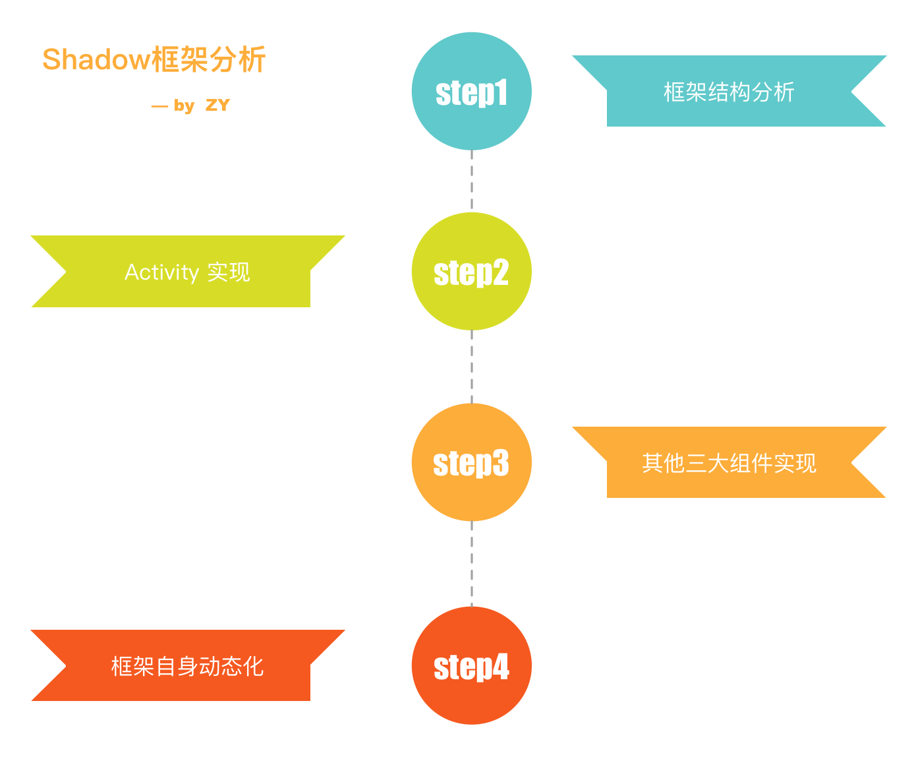
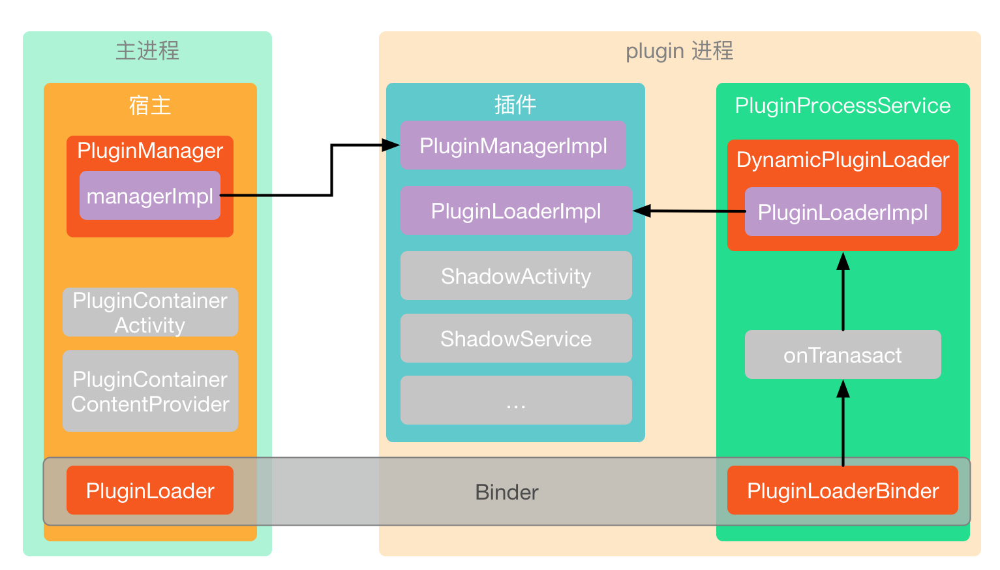
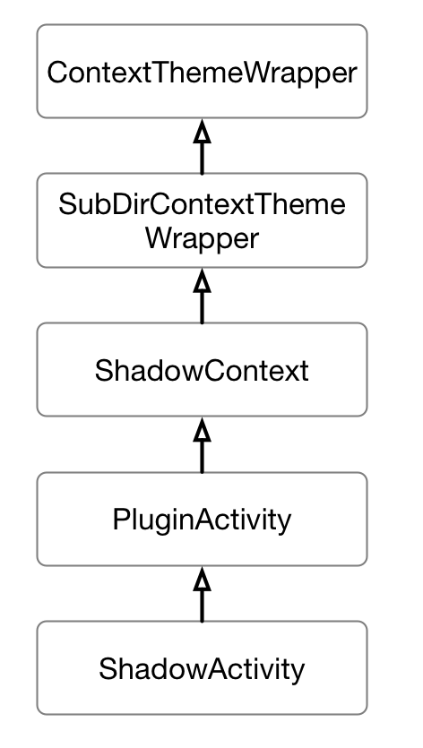
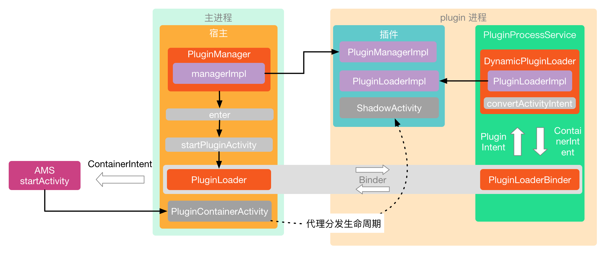
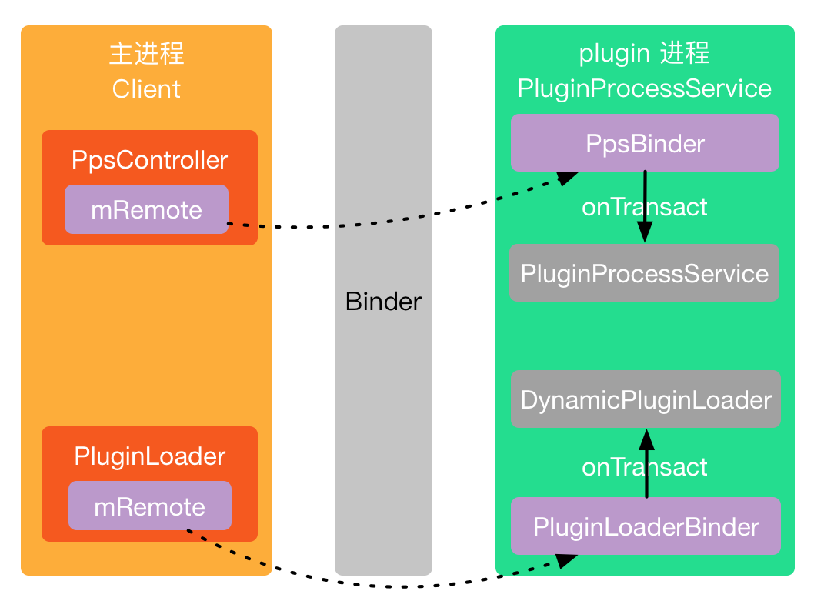
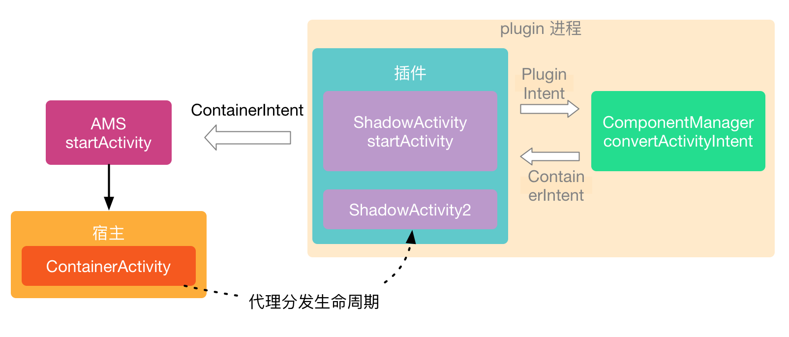
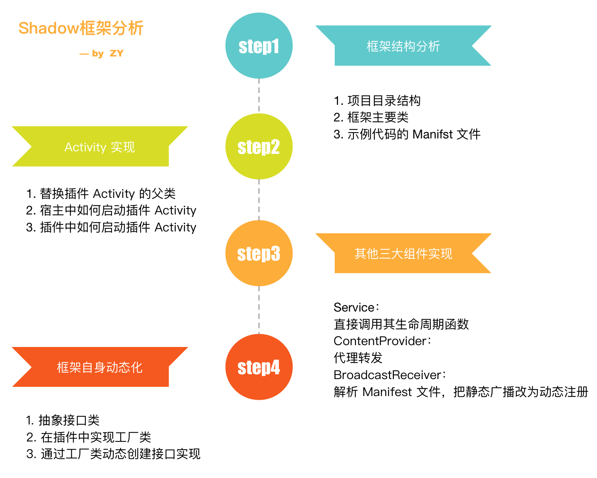

### Shadow 插件化框架分析
### 框架简单介绍
Shadow 是最近腾讯开源的一款插件化框架。原理是使用宿主代理的方式实现组件的生命周期。   
目前的插件化框架，大部分都是使用 hook 系统的方式来做的。使用代理的基本上没有成体系的框架，只是一些小 demo，Shadow 框架的开源，在系统 api 控制越来越严格的趋势下，算是一个新的方向。   
Shadow 最大的两个亮点是：
1. 零反射
2. 框架自身动态化

下面就具体分析一下框架的实现。


### 框架结构分析
#### 框架结构图图


#### 项目目录结构
```
├── projects
│   ├── sample // 示例代码
│   │   ├── README.md
│   │   ├── maven
│   │   ├── sample-constant // 定义一些常量
│   │   ├── sample-host // 宿主实现
│   │   ├── sample-manager // PluginManager 实现
│   │   └── sample-plugin // 插件的实现
│   ├── sdk // 框架实现代码
│   │   ├── coding // lint
│   │   ├── core
│   │   │   ├── common
│   │   │   ├── gradle-plugin // gradle 插件
│   │   │   ├── load-parameters
│   │   │   ├── loader // 负责加载插件
│   │   │   ├── manager // 装载插件，管理插件
│   │   │   ├── runtime // 插件运行时需要，包括占位 Activity，占位 Provider 等等
│   │   │   ├── transform // Transform 实现，用于替换插件 Activity 父类等等
│   │   │   └── transform-kit
│   │   └── dynamic // 插件自身动态化实现，包括一些接口的抽象
```

#### 框架主要类说明
**PluginContainerActivity**   
代理 Activity    
**ShadowActivity**    
插件 Activity 统一父类，在打包时通过 Transform 统一替换    
**ComponentManager**    
管理插件和宿主代理的对应关系    
**PluginManager**    
装载插件   
**PluginLoader**    
管理插件 Activity 生命周期等等    

#### sample 示例代码 AndroidManifest.xml 分析 
#### 注册 sample MainActivity
负责启动插件

#### 注册代理 Activity 
注册了三个代理 Activity，分别是 PluginDefaultProxyActivity，PluginSingleInstance1ProxyActivity，PluginSingleTask1ProxyActivity。    
可以看到，这三个 Activity 都是继承自 **PluginContainerActivity**，只是设置了不同的 launchMode，这里就明显的看出来，PluginContainerActivity 就是代理 Activity。

#### 注册代理 Provider
PluginContainerContentProvider 也是代理 Provider。

### Activity 实现
关于插件 Activity 的实现，我们主要看两个地方：
0. 替换插件 Activity 的父类
1. 宿主中如何启动插件 Activity
2. 插件中如何启动插件 Activity

#### 替换插件 Activity 的父类
Shadow 中有一个比较巧妙的地方，就是插件开发的时候，插件的 Activity 还是正常继承 Activity，在打包的时候，会通过 Transform 替换其父类为 ShadowActivity。如果对 Transform 不太了解，可以看看之前的 [Gradle 学习系列文章](../gradle/gradle-summary.md)。
projects/sdk/core/transform 和 projects/sdk/core/transform-kit 两个项目就是 Transform，入口是 ShadowTransform。这里对 Transform 做了一些封装，提供了友好的开发方式，这里就不多做分析了，我们主要看下 TransformManager。   
``` groovy
class TransformManager(ctClassInputMap: Map<CtClass, InputClass>,
                       classPool: ClassPool,
                       useHostContext: () -> Array<String>
) : AbstractTransformManager(ctClassInputMap, classPool) {

    override val mTransformList: List<SpecificTransform> = listOf(
            ApplicationTransform(),
            ActivityTransform(),
            ServiceTransform(),
            InstrumentationTransform(),
            RemoteViewTransform(),
            FragmentTransform(ctClassInputMap),
            DialogTransform(),
            WebViewTransform(),
            ContentProviderTransform(),
            PackageManagerTransform(),
            KeepHostContextTransform(useHostContext())
    )
}
```
这里的 mTransformList 就是要依次执行的 Transform 内容，也就是需要替换的类映射。我们以 ApplicationTransform 和 ActivityTransform 为例。   
``` groovy
class ApplicationTransform : SimpleRenameTransform(
        mapOf(
                "android.app.Application"
                        to "com.tencent.shadow.core.runtime.ShadowApplication"
                ,
                "android.app.Application\$ActivityLifecycleCallbacks"
                        to "com.tencent.shadow.core.runtime.ShadowActivityLifecycleCallbacks"
        )
)

class ActivityTransform : SimpleRenameTransform(
        mapOf(
                "android.app.Activity"
                        to "com.tencent.shadow.core.runtime.ShadowActivity"
        )
)
```
可以看到，打包过程中，插件的 Application 会被替换成 ShadowApplication，Activity 会被替换成 ShadowActivity，这里主要看一下 ShadowActivity 的继承关系。    

为何插件 Activity 可以不用继承 Activity 呢？因为在代理 Activity 的方式中，插件 Activity 是被当作一个普通类来使用的，只要负责执行对应的生命周期即可。   

#### 宿主中如何启动插件 Activity
宿主中启动插件 Activity 原理如下图：


我们就从 sample 里的 MainActivity 开始看起。
sample-host/src/main/java/com/tencent/shadow/sample/host/MainActivity 是 demo 的主入口。    
启动插件的方式是：
``` java
startPluginButton.setOnClickListener(new View.OnClickListener() {
    @Override
    public void onClick(View v) {
        // ...
        Intent intent = new Intent(MainActivity.this, PluginLoadActivity.class);
        intent.putExtra(Constant.KEY_PLUGIN_PART_KEY, partKey);
        intent.putExtra(Constant.KEY_ACTIVITY_CLASSNAME, "com.tencent.shadow.sample.plugin.app.lib.gallery.splash.SplashActivity");
        // ...
        startActivity(intent);
    }
});
```
可以看到，这里是通过 PluginLoadActivity 来启动的，传入了要启动的插件 Activity：SplashActivity，接着就到 PluginLoadActivity 里看一下具体的启动。
``` java
class PluginLoadActivity extends Activity {
    public void startPlugin() {
        PluginHelper.getInstance().singlePool.execute(new Runnable() {
            @Override
            public void run() {
                HostApplication.getApp().loadPluginManager(PluginHelper.getInstance().pluginManagerFile);
                // ...
                bundle.putString(Constant.KEY_ACTIVITY_CLASSNAME, getIntent().getStringExtra(Constant.KEY_ACTIVITY_CLASSNAME));
                HostApplication.getApp().getPluginManager()
                        .enter(PluginLoadActivity.this, Constant.FROM_ID_START_ACTIVITY, bundle, new EnterCallback() {
                            @Override
                            public void onShowLoadingView(final View view) {
                                // 设置加载的样式
                                mHandler.post(new Runnable() {
                                    @Override
                                    public void run() {
                                        mViewGroup.addView(view);
                                    }
                                });
                            }
                            // ...
                        });
            }
        });
    }
}
```
这里可以看到，是通过 HostApplication 获取到 PluginManager，然后调用其 enter 方法，进入插件。这里先看看返回的 PluginManager 是什么。
``` java
class HostApplication extends Application {
    public void loadPluginManager(File apk) {
        if (mPluginManager == null) {
            // 创建 PluginManager
            mPluginManager = Shadow.getPluginManager(apk);
        }
    }

    public PluginManager getPluginManager() {
        return mPluginManager;
    }
}

public class Shadow {
    public static PluginManager getPluginManager(File apk){
        final FixedPathPmUpdater fixedPathPmUpdater = new FixedPathPmUpdater(apk);
        File tempPm = fixedPathPmUpdater.getLatest();
        if (tempPm != null) {
            // 创建 DynamicPluginManager
            return new DynamicPluginManager(fixedPathPmUpdater);
        }
        return null;
    }
}
```
可以看到，HostApplication 里返回的其实是一个 DynamicPluginManager 实例，那么接下来就要看 DynamicPluginManager 的 enter 方法。
``` java
class DynamicPluginManager implements PluginManager {
    @Override
    public void enter(Context context, long fromId, Bundle bundle, EnterCallback callback) {
        // 加载 mManagerImpl 实现，这里涉及到了框架的自身动态化，在后面会讲到，这里只要知道，mManagerImpl 最终是 SamplePluginManager 实例即可
        updateManagerImpl(context);
        // mManagerImpl 是 SamplePluginManager 实例，调用其实现
        mManagerImpl.enter(context, fromId, bundle, callback);
        mUpdater.update();
    }
}
```
通过上面的代码我们知道了，调用 DynamicPluginManager.enter 会转发到 SamplePluginManager.enter 中去，接着就看看这个实现。
``` java
class SamplePluginManager extends FastPluginManager {
    public void enter(final Context context, long fromId, Bundle bundle, final EnterCallback callback) {
        // ...
        // 启动 Activity
        onStartActivity(context, bundle, callback);
        // ...
    }

    private void onStartActivity(final Context context, Bundle bundle, final EnterCallback callback) {
        // ...
        final String className = bundle.getString(Constant.KEY_ACTIVITY_CLASSNAME);
        // ...
        final Bundle extras = bundle.getBundle(Constant.KEY_EXTRAS);
        if (callback != null) {
            // 创建 loading view
            final View view = LayoutInflater.from(mCurrentContext).inflate(R.layout.activity_load_plugin, null);
            callback.onShowLoadingView(view);
        }
        executorService.execute(new Runnable() {
            @Override
            public void run() {
                // ...
                // 加载插件
                InstalledPlugin installedPlugin = installPlugin(pluginZipPath, null, true);
                // 创建插件 Intent
                Intent pluginIntent = new Intent();
                pluginIntent.setClassName(
                        context.getPackageName(),
                        className
                );
                if (extras != null) {
                    pluginIntent.replaceExtras(extras);
                }
                // 启动插件 Activity
                startPluginActivity(context, installedPlugin, partKey, pluginIntent);
                // ...
            }
        });
    }
}
```
在 SamplePluginManager.enter 中，调用 onStartActivity 启动插件 Activity，其中开线程去加载插件，然后调用 startPluginActivity。      
startPluginActivity 实现在其父类 FastPluginManager 里。   
``` java
class FastPluginManager {
    public void startPluginActivity(Context context, InstalledPlugin installedPlugin, String partKey, Intent pluginIntent) throws RemoteException, TimeoutException, FailedException {
        Intent intent = convertActivityIntent(installedPlugin, partKey, pluginIntent);
        if (!(context instanceof Activity)) {
            intent.setFlags(Intent.FLAG_ACTIVITY_NEW_TASK);
        }
        context.startActivity(intent);
    }
}
```
其中的重点是 convertActivityIntent，将插件 intent 转化成宿主的 intent，然后调用 系统的 context.startActivity 启动插件。这里的 context 是 PluginLoadActivity.this，从其 enter 方法中一直传进来的。   
下面重点看看 convertActivityIntent 的实现。   
``` java
class FastPluginManager {
    public Intent convertActivityIntent(InstalledPlugin installedPlugin, String partKey, Intent pluginIntent) throws RemoteException, TimeoutException, FailedException {
        // 创建 mPluginLoader
        loadPlugin(installedPlugin.UUID, partKey);
        // 先调用 Application onCreate 方法
        mPluginLoader.callApplicationOnCreate(partKey);
        // 转化插件 intent 为 代理 Activity intent
        return mPluginLoader.convertActivityIntent(pluginIntent);
    }
}
```
到了这里其实有一些复杂了，因为 mPluginLoader 是通过 Binder 去调用相关方法的。由于这里涉及到了 Binder 的使用，需要读者了解 Binder 相关的知识，代码比较繁琐，这里就不具体分析代码实现了，用一张图理顺一下对应的关系：


通过上面的 Binder 对应图，我们可以简单的理解为，调用 mPluginLoader 中的方法，就是调用 DynamicPluginLoader 中的方法，调用 mPpsController 的方法，就是调用 PluginProcessService 中的方法。   
所以这里的 mPluginLoader.convertActivityIntent 相当于调用了 DynamicPluginLoader.convertActivityIntent。
``` kotlin
internal class DynamicPluginLoader(hostContext: Context, uuid: String) {
    fun convertActivityIntent(pluginActivityIntent: Intent): Intent? {
        return mPluginLoader.mComponentManager.convertPluginActivityIntent(pluginActivityIntent)
    }
}
```
调用到了 ComponentManager.convertPluginActivityIntent 方法。
``` kotlin
abstract class ComponentManager : PluginComponentLauncher {
    override fun convertPluginActivityIntent(pluginIntent: Intent): Intent {
        return if (pluginIntent.isPluginComponent()) {
            pluginIntent.toActivityContainerIntent()
        } else {
            pluginIntent
        }
    }

    private fun Intent.toActivityContainerIntent(): Intent {
        // ...
        return toContainerIntent(bundleForPluginLoader)
    }

    private fun Intent.toContainerIntent(bundleForPluginLoader: Bundle): Intent {
        val className = component.className!!
        val packageName = packageNameMap[className]!!
        component = ComponentName(packageName, className)
        val containerComponent = componentMap[component]!!
        val businessName = pluginInfoMap[component]!!.businessName
        val partKey = pluginInfoMap[component]!!.partKey

        val pluginExtras: Bundle? = extras
        replaceExtras(null as Bundle?)

        val containerIntent = Intent(this)
        containerIntent.component = containerComponent

        bundleForPluginLoader.putString(CM_CLASS_NAME_KEY, className)
        bundleForPluginLoader.putString(CM_PACKAGE_NAME_KEY, packageName)

        containerIntent.putExtra(CM_EXTRAS_BUNDLE_KEY, pluginExtras)
        containerIntent.putExtra(CM_BUSINESS_NAME_KEY, businessName)
        containerIntent.putExtra(CM_PART_KEY, partKey)
        containerIntent.putExtra(CM_LOADER_BUNDLE_KEY, bundleForPluginLoader)
        containerIntent.putExtra(LOADER_VERSION_KEY, BuildConfig.VERSION_NAME)
        containerIntent.putExtra(PROCESS_ID_KEY, DelegateProviderHolder.sCustomPid)
        return containerIntent
    }
}
```
这里最终调用到 toContainerIntent 方法，终于水落石出了。在 toContainerIntent 中，创建了新的 宿主代理 Activity 的 intent，这里的 containerComponent 对应的就是前面在 Manifest 里注册的 PluginDefaultProxyActivity，返回代理 activity intent 以后，调用 context.startActivity(intent) 就启动了代理 Activity。
PluginDefaultProxyActivity 继承自 PluginContainerActivity，这个也就是整个框架的代理 Activity，在 PluginContainerActivity 里，就是常规的分发生命周期了。和之前在[插件化原理](./android-插件化.md)里介绍的差不多了。     
中间通过 HostActivityDelegate 分发生命周期。
``` kotlin
class ShadowActivityDelegate(private val mDI: DI) : HostActivityDelegate, ShadowDelegate() {
    // ...
    override fun onCreate(savedInstanceState: Bundle?) {
        // ...
        // 设置 application，resources 等等
        mDI.inject(this, partKey)
        // 创建插件资源
        mMixResources = MixResources(mHostActivityDelegator.superGetResources(), mPluginResources)
        // 设置插件主题
        mHostActivityDelegator.setTheme(pluginActivityInfo.themeResource)
        try {
            val aClass = mPluginClassLoader.loadClass(pluginActivityClassName)
            // 创建插件 activity
            val pluginActivity = PluginActivity::class.java.cast(aClass.newInstance())
            // 初始化插件 activity
            initPluginActivity(pluginActivity)
            mPluginActivity = pluginActivity
            //设置插件AndroidManifest.xml 中注册的WindowSoftInputMode
            mHostActivityDelegator.window.setSoftInputMode(pluginActivityInfo.activityInfo.softInputMode)
            // 获取 savedInstanceState
            val pluginSavedInstanceState: Bundle? = savedInstanceState?.getBundle(PLUGIN_OUT_STATE_KEY)
            pluginSavedInstanceState?.classLoader = mPluginClassLoader
            // 调用插件 activity onCreate 
            pluginActivity.onCreate(pluginSavedInstanceState)
            mPluginActivityCreated = true
        } catch (e: Exception) {
            throw RuntimeException(e)
        }
    }

    // 获取插件资源
    override fun getResources(): Resources {
        if (mDependenciesInjected) {
            return mMixResources;
        } else {
            return Resources.getSystem()
        }
    }
}
```

上面就是在宿主中启动插件 Activity 的整个流程，下面看看在插件中如何启动 Activity 的。  

#### 插件中如何启动插件 Activity
插件中启动 Activity 原理如下图：


我们上面说到过，插件 Activity 会在打包过程中替换其父类为 ShadowActivity，很明显了，在插件中启动 Activity 即调用 startActivity，自然就是调用 ShadowActivity 的 startActivity 了。startActivity 在其父类 ShadowContext 里实现，我们来具体看下。
``` java
class ShadowContext extends SubDirContextThemeWrapper {
    public void startActivity(Intent intent) {
        final Intent pluginIntent = new Intent(intent);
        // ...
        final boolean success = mPluginComponentLauncher.startActivity(this, pluginIntent);
        // ...
    }
}
```
可以看到，是通过 mPluginComponentLauncher.startActivity 继续调用的，mPluginComponentLauncher 就是 ComponentManager 的一个实例，是在前面说到的初始化插件 Activity 的时候设置的。内部实现就比较简单了。
``` kotlin
abstract class ComponentManager : PluginComponentLauncher {
    override fun startActivity(shadowContext: ShadowContext, pluginIntent: Intent): Boolean {
        return if (pluginIntent.isPluginComponent()) {
            shadowContext.superStartActivity(pluginIntent.toActivityContainerIntent())
            true
        } else {
            false
        }
    }
}

public class ShadowContext extends SubDirContextThemeWrapper {
    public void superStartActivity(Intent intent) {
        // 调用系统 startActivity
        super.startActivity(intent);
    }
}
```
通过调用 toActivityContainerIntent 转化 intent 为代理 Activity 的 intent，然后调用系统 startActivity 启动代理 Activity，剩下的步骤就和上面宿主启动插件 Activity 中讲到的一样了。      

到现在，我们就对框架中 Activity 的启动基本了解了。

### Service 实现
Service 的实现，我们直接看 插件中如何启动的即可。看一下 ShadowContext 中的 startService 实现：
``` java
public class ShadowContext extends SubDirContextThemeWrapper {
    public ComponentName startService(Intent service) {
        if (service.getComponent() == null) {
            return super.startService(service);
        }
        Pair<Boolean, ComponentName> ret = mPluginComponentLauncher.startService(this, service);
        if (!ret.first)
            return super.startService(service);
        return ret.second;
    }
}
```
也是调用 mPluginComponentLauncher.startService，这里我们就比较熟悉了，就是 ComponentManager.startService
``` kotlin
abstract class ComponentManager : PluginComponentLauncher {
    override fun startService(context: ShadowContext, service: Intent): Pair<Boolean, ComponentName> {
        if (service.isPluginComponent()) {
            // 插件service intent不需要转换成container service intent，直接使用intent
            val component = mPluginServiceManager!!.startPluginService(service)
            // ...
        }
        return Pair(false, service.component)
    }
}
```
这里直接调用 PluginServiceManager.startPluginService。
``` kotlin
class PluginServiceManager(private val mPluginLoader: ShadowPluginLoader, private val mHostContext: Context) {
    fun startPluginService(intent: Intent): ComponentName? {
        val componentName = intent.component
        // 检查所请求的service是否已经存在
        if (!mAliveServicesMap.containsKey(componentName)) {
            // 创建 Service 实例并调用 onCreate 方法
            val service = createServiceAndCallOnCreate(intent)
            mAliveServicesMap[componentName] = service
            // 通过startService启动集合
            mServiceStartByStartServiceSet.add(componentName)
        }
        mAliveServicesMap[componentName]?.onStartCommand(intent, 0, getNewStartId())
        return componentName
    }
    
    private fun createServiceAndCallOnCreate(intent: Intent): ShadowService {
        val service = newServiceInstance(intent.component)
        service.onCreate()
        return service
    }
}
```
可以看到，在 Shadow 中对 Service 的处理很简单，直接调用其生命周期方法，不过如此的实现方式，可能会带来一些时序问题。

### BroadcastReceiver 实现
广播的实现也比较常规，在插件中动态注册和发送广播，直接调用系统的方法即可，因为广播不涉及生命周期等复杂的内容。需要处理的就是在 Manifest 中静态注册的广播。这个理论上也和我们之前讲解[插件化原理](./android-插件化.md)时候实现基本一致，解析 Manifest 然后进行动态注册。不过在 Shadow 的 demo 里，并没有做解析，就是直接写在了代码里。
``` java
// AndroidManifest.xml
        <receiver android:name="com.tencent.shadow.sample.plugin.app.lib.usecases.receiver.MyReceiver">
            <intent-filter>
                <action android:name="com.tencent.test.action" />
            </intent-filter>
        </receiver>

// SampleComponentManager
public class SampleComponentManager extends ComponentManager {
    public List<BroadcastInfo> getBroadcastInfoList(String partKey) {
        List<ComponentManager.BroadcastInfo> broadcastInfos = new ArrayList<>();
        if (partKey.equals(Constant.PART_KEY_PLUGIN_MAIN_APP)) {
            broadcastInfos.add(
                    new ComponentManager.BroadcastInfo(
                            "com.tencent.shadow.sample.plugin.app.lib.usecases.receiver.MyReceiver",
                            new String[]{"com.tencent.test.action"}
                    )
            );
        }
        return broadcastInfos;
    }
}
```

### ContentProvider 实现
关于 ContentProvider 的实现，其实和之前[插件化原理](./android-插件化.md)文章中思路是一致的，也是通过注册代理 ContentProvider 然后分发给插件 Provider，这里就不多做介绍了。

### 框架自身动态化
Shadow 框架还有一个特点，就是 框架本身也实现了动态化，这里的实现主要是三步：
1. 抽象接口类
2. 在插件中实现工厂类
3. 通过工厂类动态创建接口的实现  

我们以 PluginLoaderImpl 为例来看看，在前面介绍 Activity 启动流程的时候，有说到 mPluginLoader.convertActivityIntent 用来转换 插件 intent 为代理 Activity 的 intent，这里的 mPluginLoader 就是动态创建的。我们来看一下创建过程。
创建入口在 PluginProcessService.loadPluginLoader 里
``` java
public class PluginProcessService extends Service {
    void loadPluginLoader(String uuid) throws FailedException {
        // ...
        PluginLoaderImpl pluginLoader = new LoaderImplLoader().load(installedApk, uuid, getApplicationContext());
        // ...
    }
}
```
接下来需要看一下 LoaderImplLoader 的具体实现
``` java
final class LoaderImplLoader extends ImplLoader {
    // 创建 PluginLoaderImpl 的工厂类
    private final static String sLoaderFactoryImplClassName
            = "com.tencent.shadow.dynamic.loader.impl.LoaderFactoryImpl";

    // 动态创建 PluginLoaderImpl
    PluginLoaderImpl load(InstalledApk installedApk, String uuid, Context appContext) throws Exception {
        // 创建插件 ClassLoader
        ApkClassLoader pluginLoaderClassLoader = new ApkClassLoader(
                installedApk,
                LoaderImplLoader.class.getClassLoader(),
                loadWhiteList(installedApk),
                1
        );
        // 获取插件中的 工厂类
        LoaderFactory loaderFactory = pluginLoaderClassLoader.getInterface(
                LoaderFactory.class,
                sLoaderFactoryImplClassName
        );
        // 调用工厂类方法创建 PluginLoaderImpl 实例
        return loaderFactory.buildLoader(uuid, appContext);
    }
}
```
从上面的代码和注释来看，其实很简单，创建插件的 ClassLoader，通过 ClassLoader 创建一个工厂类的实例，然后调用工厂类方法生成 PluginLoaderImpl。而工厂类和 PluginLoaderImpl 的实现都在插件中，就达到了框架自身的动态化。
PluginManagerImpl 也是一样的道理，在 DynamicPluginManager.updateManagerImpl 中通过 ManagerImplLoader.load 加载。

### 总结


其实整个框架看下来，没有什么黑科技，就是代理 Activity 的原理加上设计模式的运用。其实目前几大插件化框架，基本上都是 hook 系统为主，像使用代理 Activity 原理的，Shadow 应该算是第一个各方面实现都比较完整的框架，带来的好处就是不用去调用系统限制的 api，更加稳定。在系统控制越来越严格的趋势下，也算是一个比较好的选择。
原理简单，其中的设计思想可以学习～