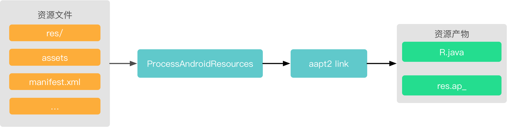
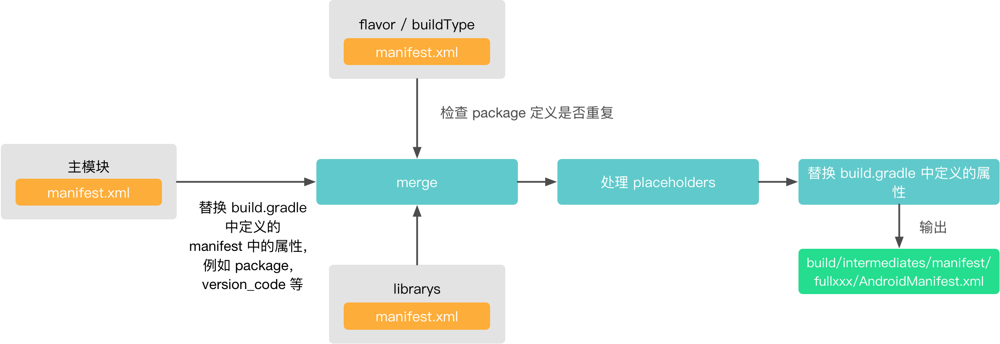
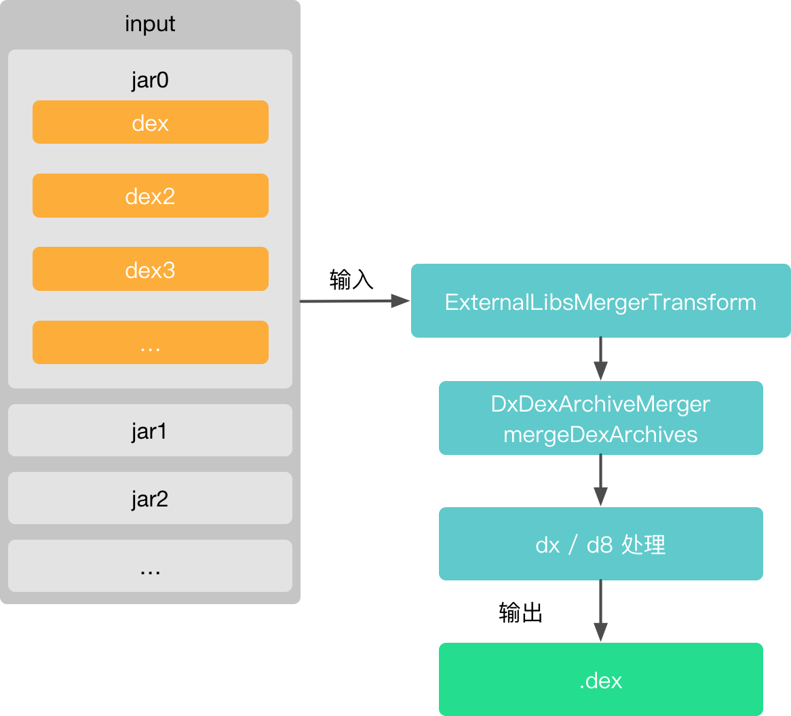
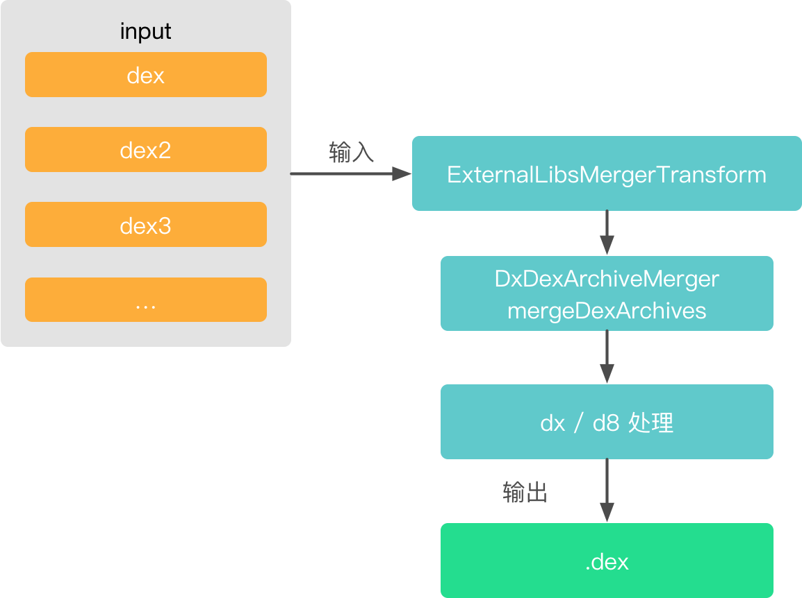

### 【Android 修炼手册】Gradle 篇 -- Android Gradle Plugin 主要 Task 分析
### 上文回顾
上篇文章里讲了 android gradle plugin 的整体流程，引入插件以后生成了很多 Task，这篇文章就谈谈生成的这些 Task 都有什么用处，以及一些主要 Task 的实现

### 预备知识
1. 理解 gradle 的基本开发
2. 了解 gradle task 和 plugin 使用及开发
3. 了解 android gradle plugin 的使用

### 看完本文可以达到什么程度
1. 了解 android gradle plugin 中各个 task 作用
2. 了解 android gradle plugin 中主要 task 的实现

### 阅读前准备工作
1. 项目添加 android gradle plugin 依赖    
``` groovy
compile 'com.android.tools.build:gradle:3.0.1'
```
通过这种方式，可以直接依赖 plugin 的源码，读起来比较方便     
2. 官方对照源码地址 [android gradle plugin 源码地址](https://android.googlesource.com/platform/tools/base/+/refs/tags/gradle_3.0.0/build-system/)

大家可以直接 clone [EasyGradle](./EasyGradle) 项目，把 andorid-gradle-plugin-source/build.gradle 里的 implementation 'com.android.tools.build:gradle:3.0.1' 注释打开就可以了。

在 [Gradle 的基本使用](./gradle的基本使用.md) 和 [Android Gradle Plugin 主要流程分析](./android_gradle_plugin-主要流程分析.md) 里，我们知道了 gradle 中 task 的重要性，以及 android gradle plugin 的主要流程，这一篇就来分析一下 android gradle plugin 中一些重要的 task 是怎么执行的。

### 一、Android 打包流程
在介绍 Android Gradle Plugin Task 之前，我们先看看一个 apk 的构建流程，先放一张官方流程图：

官方介绍的流程如下：   
1. 编译器将您的源代码转换成 DEX（Dalvik Executable) 文件（其中包括 Android 设备上运行的字节码），将所有其他内容转换成已编译资源。   
2. APK 打包器将 DEX 文件和已编译资源合并成单个 APK。 不过，必须先签署 APK，才能将应用安装并部署到 Android 设备上。   
3. APK 打包器使用调试或发布密钥库签署您的 APK：   
4. 在生成最终 APK 之前，打包器会使用 zipalign 工具对应用进行优化，减少其在设备上运行时占用的内存。   

那么以 **Task 的维度**来看 apk 的打包，是什么流程呢？我们先执行下面的命令，看一下打包一个 apk 需要哪些 task   

首先我们看一下 打包一个 apk 需要哪些 task。
在项目根目录下执行命令
``` gradle
./gradlew android-gradle-plugin-source:assembleDebug --console=plain

```
看一下输出结果
``` 
:android-gradle-plugin-source:preBuild UP-TO-DATE
:android-gradle-plugin-source:preDebugBuild
:android-gradle-plugin-source:compileDebugAidl
:android-gradle-plugin-source:compileDebugRenderscript
:android-gradle-plugin-source:checkDebugManifest
:android-gradle-plugin-source:generateDebugBuildConfig
:android-gradle-plugin-source:prepareLintJar UP-TO-DATE
:android-gradle-plugin-source:generateDebugResValues
:android-gradle-plugin-source:generateDebugResources
:android-gradle-plugin-source:mergeDebugResources
:android-gradle-plugin-source:createDebugCompatibleScreenManifests
:android-gradle-plugin-source:processDebugManifest
:android-gradle-plugin-source:splitsDiscoveryTaskDebug
:android-gradle-plugin-source:processDebugResources
:android-gradle-plugin-source:generateDebugSources
:android-gradle-plugin-source:javaPreCompileDebug
:android-gradle-plugin-source:compileDebugJavaWithJavac
:android-gradle-plugin-source:compileDebugNdk NO-SOURCE
:android-gradle-plugin-source:compileDebugSources
:android-gradle-plugin-source:mergeDebugShaders
:android-gradle-plugin-source:compileDebugShaders
:android-gradle-plugin-source:generateDebugAssets
:android-gradle-plugin-source:mergeDebugAssets
:android-gradle-plugin-source:transformClassesWithDexBuilderForDebug
:android-gradle-plugin-source:transformDexArchiveWithExternalLibsDexMergerForDebug
:android-gradle-plugin-source:transformDexArchiveWithDexMergerForDebug
:android-gradle-plugin-source:mergeDebugJniLibFolders
:android-gradle-plugin-source:transformNativeLibsWithMergeJniLibsForDebug
:android-gradle-plugin-source:transformNativeLibsWithStripDebugSymbolForDebug
:android-gradle-plugin-source:processDebugJavaRes NO-SOURCE
:android-gradle-plugin-source:transformResourcesWithMergeJavaResForDebug
:android-gradle-plugin-source:validateSigningDebug
:android-gradle-plugin-source:packageDebug
:android-gradle-plugin-source:assembleDebug
```
上面就是打包一个 apk 需要的 Task

### 二、Task 对应实现类
我们先看看每个 task 都是做什么的，以及其对应的实现类。   
先回忆一下，我们在前面 android-gradle-plugin 主要流程分析里说到过，task 的实现可以在 TaskManager 里找到，创建 Task 的方法主要是两个，TaskManager.createTasksBeforeEvaluate() 和 ApplicationTaskManager.createTasksForVariantScope()，所以这些 task 的实现，也在这两个类里找就可以，下面列出了各个 task 的作用及实现类。

| Task                                                 | 对应实现类                  | 作用                                                                 |
| ---------------------------------------------------- | --------------------------- | -------------------------------------------------------------------- |
| preBuild                                             |                             | 空 task，只做锚点使用                                                |
| preDebugBuild                                        |                             | 空 task，只做锚点使用，与 preBuild 区别是这个 task 是 variant 的锚点 |
| compileDebugAidl                                     | AidlCompile                 | 处理 aidl                                                            |
| compileDebugRenderscript                             | RenderscriptCompile         | 处理 renderscript                                                    |
| checkDebugManifest                                   | CheckManifest               | 检测 manifest 是否存在                                               |
| generateDebugBuildConfig                             | GenerateBuildConfig         | 生成 BuildConfig.java                                                |
| prepareLintJar                                       | PrepareLintJar              | 拷贝 lint jar 包到指定位置                                           |
| generateDebugResValues                               | GenerateResValues           | 生成 resvalues，generated.xml                                        |
| generateDebugResources                               |                             | 空 task，锚点                                                        |
| mergeDebugResources                                  | MergeResources              | 合并资源文件                                                         |
| createDebugCompatibleScreenManifests                 | CompatibleScreensManifest   | manifest 文件中生成 compatible-screens，指定屏幕适配                 |
| processDebugManifest                                 | MergeManifests              | 合并 manifest 文件                                                   |
| splitsDiscoveryTaskDebug                             | SplitsDiscovery             | 生成 split-list.json，用于 apk 分包                                  |
| processDebugResources                                | ProcessAndroidResources     | aapt 打包资源                                                        |
| generateDebugSources                                 |                             | 空 task，锚点                                                        |
| javaPreCompileDebug                                  | JavaPreCompileTask          | 生成 annotationProcessors.json 文件                                  |
| compileDebugJavaWithJavac                            | AndroidJavaCompile          | 编译 java 文件                                                       |
| compileDebugNdk                                      | NdkCompile                  | 编译 ndk                                                             |
| compileDebugSources                                  |                             | 空 task，锚点使用                                                    |
| mergeDebugShaders                                    | MergeSourceSetFolders       | 合并 shader 文件                                                     |
| compileDebugShaders                                  | ShaderCompile               | 编译 shaders                                                         |
| generateDebugAssets                                  |                             | 空 task，锚点                                                        |
| mergeDebugAssets                                     | MergeSourceSetFolders       | 合并 assets 文件                                                     |
| transformClassesWithDexBuilderForDebug               | DexArchiveBuilderTransform  | class 打包 dex                                                       |
| transformDexArchiveWithExternalLibsDexMergerForDebug | ExternalLibsMergerTransform | 打包三方库的 dex，在 dex 增量的时候就不需要再 merge 了，节省时间     |
| transformDexArchiveWithDexMergerForDebug             | DexMergerTransform          | 打包最终的 dex                                                       |
| mergeDebugJniLibFolders                              | MergeSouceSetFolders        | 合并 jni lib 文件                                                    |
| transformNativeLibsWithMergeJniLibsForDebug          | MergeJavaResourcesTransform | 合并 jnilibs                                                         |
| transformNativeLibsWithStripDebugSymbolForDebug      | StripDebugSymbolTransform   | 去掉 native lib 里的 debug 符号                                      |
| processDebugJavaRes                                  | ProcessJavaResConfigAction  | 处理 java res                                                        |
| transformResourcesWithMergeJavaResForDebug           | MergeJavaResourcesTransform | 合并 java res                                                        |
| validateSigningDebug                                 | ValidateSigningTask         | 验证签名                                                             |
| packageDebug                                         | PackageApplication          | 打包 apk                                                             |
| assembleDebug                                        |                             | 空 task，锚点                                                        |

### 三、如何去读 Task 的代码
在 gradle plugin 中的 Task 主要有三种，一种是普通的 task，一种是增量 task，一种是 transform，下面分别看下这三种 task 怎么去读。

#### 如何读 Task 的代码
1. 看 Task 继承的父类，一般来说，会继承 DefaultTask，IncrementalTask  
2. 看 @TaskAction 注解的方法，此方法就是这个 Task 做的事情   

#### 如何读 IncrementalTask
我们先看看下这个类，这个类表示的是增量 Task，什么是增量呢？是相对于 全量来说的，全量我们可以理解为调用 clean 以后第一次编译的过程，这个就是全量编译，之后修改了代码或者资源文件，再次编译，就是增量编译。   
其中比较重要的几个方法如下：      
``` groovy
public abstract class IncrementalTask extends BaseTask {
    // ...
    @Internal
    protected boolean isIncremental() { 
        // 是否需要增量，默认是 false
        return false;
    }

    // 需要子类实现，全量的时候执行的任务
    protected abstract void doFullTaskAction() throws Exception;

    // 增量的时候执行的任务，默认是什么都不执行，参数是增量的时候修改过的文件
    protected void doIncrementalTaskAction(Map<File, FileStatus> changedInputs) throws Exception {
    }

    @TaskAction
    void taskAction(IncrementalTaskInputs inputs) throws Exception {
        // 判断是否是增量
        if(this.isIncremental() && inputs.isIncremental()) { 
            this.doIncrementalTaskAction(this.getChangedInputs(inputs));
        } else {
            this.getProject().getLogger().info("Unable do incremental execution: full task run");
            this.doFullTaskAction();
        }
    }

    // 获取修改的文件
    private Map<File, FileStatus> getChangedInputs(IncrementalTaskInputs inputs) {
        Map<File, FileStatus> changedInputs = Maps.newHashMap();
        inputs.outOfDate((change) -> {
            FileStatus status = change.isAdded()?FileStatus.NEW:FileStatus.CHANGED;
            changedInputs.put(change.getFile(), status);
        });
        inputs.removed((change) -> {
            FileStatus var10000 = (FileStatus)changedInputs.put(change.getFile(), FileStatus.REMOVED);
        });
        return changedInputs;
    }
}
```
简单介绍了 IncrementalTask 之后，我们这里强调一下，如何去读一个 增量 Task 的代码，主要有四步：      
1. 首先这个 Task 要继承 IncrementalTask，
2. 其次看 **isIncremental** 方法，如果返回 true，说明支持增量，返回 false 则不支持   
3. 然后看 **doFullTaskAction** 方法，是全量的时候执行的操作    
4. 最后看 **doIncrementalTaskAction** 方法，这里是增量的时候执行的操作     

#### 如何读 Transform
1. 继承自 Transform
2. 看其 transform 方法的实现

### 四、重点 Task 实现分析
上面每个 task 已经简单说明了具体做什么以及对应的实现类，下面选了几个比较重要的来分析一下其实现   
为什么分析这几个呢？这几个代表了 gradle 自动生成代码，资源的处理，以及 dex 的处理，算是 apk 打包过程中比较重要的几环。  
generateDebugBuildConfig    
processDebugManifest   
mergeDebugResources   
processDebugResources   
transformClassesWithDexBuilderForDebug   
transformDexArchiveWithExternalLibsDexMergerForDebug   
transformDexArchiveWithDexMergerForDebug   

分析过程主要下面几个步骤，整体实现图，调用链路（方便以后回看代码），以及重要代码分析
#### 4.1 generateDebugBuildConfig 
##### 4.1.1 实现类
GenerateBuildConfig

##### 4.1.2 整体实现图


##### 4.1.3 代码调用链路
```
GenerateBuildConfig.generate -> BuildConfigGenerator.generate -> JavaWriter
```

##### 4.1.4 主要代码分析
在 GenerateBuildConfig 中，主要生成代码的步骤如下：   
1. 生成 BuildConfigGenerator
2. 添加默认的属性，包括 DEBUG，APPLICATION_ID，FLAVOR，VERSION_CODE，VERSION_NAME
3. 添加自定义属性
4. 调用 JavaWriter 生成 BuildConfig.java 文件

``` java
// GenerateBuildConfig.generate()  
@TaskAction
void generate() throws IOException {
    // ...
    BuildConfigGenerator generator = new BuildConfigGenerator(
            getSourceOutputDir(),
            getBuildConfigPackageName());
    // 添加默认的属性，包括 DEBUG，APPLICATION_ID，FLAVOR，VERSION_CODE，VERSION_NAME
    generator
            .addField(
                    "boolean",
                    "DEBUG",
                    isDebuggable() ? "Boolean.parseBoolean(\"true\")" : "false")
            .addField("String", "APPLICATION_ID", '"' + appPackageName.get() + '"')
            .addField("String", "BUILD_TYPE", '"' + getBuildTypeName() + '"')
            .addField("String", "FLAVOR", '"' + getFlavorName() + '"')
            .addField("int", "VERSION_CODE", Integer.toString(getVersionCode()))
            .addField(
                    "String", "VERSION_NAME", '"' + Strings.nullToEmpty(getVersionName()) + '"')
            .addItems(getItems()); // 添加自定义属性

    List<String> flavors = getFlavorNamesWithDimensionNames();
    int count = flavors.size();
    if (count > 1) {
        for (int i = 0; i < count; i += 2) {
            generator.addField(
                    "String", "FLAVOR_" + flavors.get(i + 1), '"' + flavors.get(i) + '"');
        }
    }

    // 内部调用 JavaWriter 生成 java 文件
    generator.generate();
}
```

#### 4.2 mergeDebugResources
##### 4.2.1 实现类
MergeResources

##### 4.2.2 整体实现图


##### 4.2.3 调用链路
```
MergeResources.doFullTaskAction -> ResourceMerger.mergeData -> MergedResourceWriter.end -> QueueableAapt2.compile -> Aapt2QueuedResourceProcessor.compile -> AaptProcess.compile -> AaptV2CommandBuilder.makeCompile
```

##### 4.2.4 主要代码分析
MergeResources 这个类，继承自 IncrementalTask，按照前面说的阅读增量 Task 代码的步骤，依次看三个方法的实现：isIncremental，doFullTaskAction，doIncrementalTaskAction
- isIncremental
``` groovy
    // 说明 Task 支持增量
    protected boolean isIncremental() {
        return true;
    }
```

- doFullTaskAction
1. 通过 getConfiguredResourceSets() 获取 resourceSets，包括了自己的 res/ 和 依赖库的 res/ 以及 build/generated/res/rs
``` groovy
// MergeResources.doFullTaskAction()
List<ResourceSet> resourceSets = getConfiguredResourceSets(preprocessor);
```
2. 创建 ResourceMerger
``` groovy
// MergeResources.doFullTaskAction()
ResourceMerger merger = new ResourceMerger(minSdk);
```
3. 创建 QueueableResourceCompiler，因为 gradle3.x 以后支持了 aapt2，所以这里有两种选择 aapt 和 aapt2。其中 aapt2 有三种模式，OutOfProcessAaptV2，AaptV2Jni，QueueableAapt2，这里默认创建了 QueueableAapt2，resourceCompiler = QueueableAapt2
``` groovy
// MergeResources.doFullTaskAction()
// makeAapt 中会判断使用 aapt 还是 aapt2，这里以 aapt2 为例，返回的是 QueueableAapt2 对象
QueueableResourceCompiler resourceCompiler =
    makeAapt(
        aaptGeneration,
        getBuilder(),
        fileCache,
        crunchPng,
        variantScope,
        getAaptTempDir(),
        mergingLog)
```
4. 将第一步获取的 resourceSet 加入 ResourceMerger 中
``` groovy
for (ResourceSet resourceSet : resourceSets) {
    resourceSet.loadFromFiles(getILogger());
    merger.addDataSet(resourceSet);
}
```
5. 创建 MergedResourceWriter
6. 调用 ResourceMerger.mergeData 合并资源
``` groovy
// MergeResources.doFullTaskAction()
merger.mergeData(writer, false /*doCleanUp*/);
```
7. 调用 MergedResourceWriter 的 start()，addItem()，end() 方法，伪代码如下：
``` groovy
// DataMerger.mergeData
consumer.start()
for item in sourceSets:
  // item 包括了需要处理的资源，包括 xml 和 图片资源，每一个 item 对应的文件，会创建一个 CompileResourceRequest 对象，加入到 mCompileResourceRequests 里
  consumer.addItem(item)
consumer.end()
```
8. 调用 QueueableAapt2 -> Aapt2QueuedResourceProcessor -> AaptProcess 处理资源
``` groovy
// MergedResourceWriter.end()
Future<File> result = this.mResourceCompiler.compile(new CompileResourceRequest(fileToCompile, request.getOutput(), request.getFolderName(), this.pseudoLocalesEnabled, this.crunchPng));
// AaptProcess.compile
public void compile(
        @NonNull CompileResourceRequest request,
        @NonNull Job<AaptProcess> job,
        @Nullable ProcessOutputHandler processOutputHandler)
        throws IOException {
    // ... 
    // 使用 AaptV2CommandBuilder 生成 aapt2 命令
    mWriter.write(joiner.join(AaptV2CommandBuilder.makeCompile(request)));
    mWriter.flush(); // 输出命令
}
```
这一步调用 aapt2 命令去处理资源，处理完以后 xxx.xml.flat 格式

- doIncrementalTaskAction   
增量任务过程和全量其实差异不大，只不过是在获取 resourceSets 的时候，使用的是修改后的文件

#### 4.3 processDebugResources   
##### 4.3.1 实现类
ProcessAndroidResources   

##### 4.3.2 整体实现图


##### 4.3.3 调用链路
```
ProcessAndroidResources.doFullTaskAction -> ProcessAndroidResources.invokeAaptForSplit -> AndroidBuilder.processResources -> QueueAapt2.link -> Aapt2QueuedResourceProcessor.link -> AaptProcess.link -> AaptV2CommandBuilder.makeLink
```

##### 4.3.4 主要代码分析
ProcessAndroidResources 也是继承自 IncrementalTask，但是没有重写 isIncremental，所以不是增量的 Task，直接看 doFullTaskAction 即可  
- doFullTaskAction    
这个里面代码虽然多，但是主要的逻辑比较简单，就是调用 aapt2 link 去生成资源包。     
这里会处理 splits apk 相关的内容，关于 splits apk 具体可以查看 [splits apk](https://developer.android.com/studio/build/configure-apk-splits)，简单来说，就是可以按照屏幕分辨率，abis 来生成不同的 apk，从而让特定用户的安装包变小。        
分下面几个步骤：
1. 获取 split 数据
``` groovy
List<ApkData> splitsToGenerate =
        getApksToGenerate(outputScope, supportedAbis, buildTargetAbi, buildTargetDensity);
```
返回的是一个 ApkData 列表，ApkData 有三个子类，分别是 Main，Universal，FullSplit   
我们配置 如下：
``` groovy
android {
    splits {
        // Configures multiple APKs based on screen density.
        density {
            // Configures multiple APKs based on screen density.
            enable true
            // Specifies a list of screen densities Gradle should not create multiple APKs for.
            exclude "ldpi", "xxhdpi", "xxxhdpi"
            // Specifies a list of compatible screen size settings for the manifest.
            compatibleScreens 'small', 'normal', 'large', 'xlarge'
        }
    }
}
```
这里的 ApkData 会返回一个 Universal 和多个 FullSplit，Universal 代表的是主 apk，FullSplit 就是根据屏幕密度拆分的 apk。     
如果我们没有配置 splits apk，那么这里只会返回一个 Main 的实例，标识完整的 apk。    
2. 先处理 main 和 不依赖 density 的 ApkData 资源  
``` groovy
// ProcessAndroidResources.doFullTaskAction
List<ApkData> apkDataList = new ArrayList<>(splitsToGenerate);
for (ApkData apkData : splitsToGenerate) {
    if (apkData.requiresAapt()) {
        // 这里只处理 main 和不依赖 density 的资源
        boolean codeGen =
                (apkData.getType() == OutputFile.OutputType.MAIN
                        || apkData.getFilter(OutputFile.FilterType.DENSITY) == null);
        if (codeGen) {
            apkDataList.remove(apkData);
            invokeAaptForSplit(
                    manifestsOutputs,
                    libraryInfoList,
                    packageIdFileSet,
                    splitList,
                    featureResourcePackages,
                    apkData,
                    codeGen,
                    aapt);
            break;
        }
    }
}
```
3. 调用 invokeAaptForSplit 处理资源
``` groovy
// ProcessAndroidResources.invokeAaptForSplit
void invokeAaptForSplit(...) {
    // ...
    String packageForR = null;
    File srcOut = null;
    File symbolOutputDir = null;
    File proguardOutputFile = null;
    File mainDexListProguardOutputFile = null;
    // 如果传了 generateCode 参数，会生成 R.java 
    if (generateCode) {
        packageForR = originalApplicationId;

        // we have to clean the source folder output in case the package name changed.
        srcOut = getSourceOutputDir();
        if (srcOut != null) {
            FileUtils.cleanOutputDir(srcOut);
        }

        symbolOutputDir = textSymbolOutputDir.get();
        proguardOutputFile = getProguardOutputFile();
        mainDexListProguardOutputFile = getMainDexListProguardOutputFile();
    }
    // ...
    getBuilder().processResources(aapt, config);
}
```
4. 调用 AndroidBuilder.processResources -> QueueAapt2.link -> Aapt2QueuedResourceProcessor.link -> AaptProcess.link -> AaptV2CommandBuilder.makeLink 处理资源，生成资源包以及 R.java 文件   
5. 处理其他 ApkData 资源，这里只会生成资源包而不会生成 R.java 文件

关于 aapt2 的 compile 和 link 参数，可以在 https://developer.android.com/studio/command-line/aapt2#aapt2_changes 这里看    

#### 4.4 processDebugManifest
##### 4.4.1 实现类
MergeManifests   

##### 4.4.2 整体实现图


##### 4.4.3 调用链路
```
MergeManifests.dofFullTaskAction -> AndroidBuilder.mergeManifestsForApplication -> Invoker.merge -> ManifestMerge2.merge
```

##### 4.4.4 主要代码分析
MergeManifests 也是继承了 IncrementalTask，但是没有实现 isIncremental，所以只看其 doFullTaskAction 即可。   
这个 task 功能主要是合并 mainfest，包括 module 和 flavor 里的，整个过程通过 MergingReport，ManifestMerger2 和 XmlDocument 进行    
这里直接看 ManifestMerger2.merge() 的 merge 过程。   
主要有几个步骤：   
1. 获取依赖库的 manifest 信息，用 LoadedManifestInfo 标识  
2. 获取主 module 的 manifest 信息   
3. 替换主 module 的 Manifest 中定义的某些属性，替换成 gradle 中定义的属性 例如: package, version_code, version_name, min_sdk_versin 等等   
``` groovy
performSystemPropertiesInjection(mergingReportBuilder, xmlDocumentOptional.get());
// ManifestMerger2.performSystemPropertiesInjection
protected void performSystemPropertiesInjection(
        @NonNull MergingReport.Builder mergingReport,
        @NonNull XmlDocument xmlDocument) {
    for (ManifestSystemProperty manifestSystemProperty : ManifestSystemProperty.values()) {
        String propertyOverride = mSystemPropertyResolver.getValue(manifestSystemProperty);
        if (propertyOverride != null) {
            manifestSystemProperty.addTo(
                    mergingReport.getActionRecorder(), xmlDocument, propertyOverride);
        }
    }
}
```
4. 合并 flavor，buildType 中的 manifest
``` groovy
for (File inputFile : mFlavorsAndBuildTypeFiles) {
    LoadedManifestInfo overlayDocument = load(
            new ManifestInfo(null, inputFile, XmlDocument.Type.OVERLAY,
                    Optional.of(mainPackageAttribute.get().getValue())),
            selectors,
            mergingReportBuilder);

    // 检查 package 定义
    Optional<XmlAttribute> packageAttribute =
            overlayDocument.getXmlDocument().getPackage();
    if (loadedMainManifestInfo.getOriginalPackageName().isPresent() &&
            packageAttribute.isPresent()
            && !loadedMainManifestInfo.getOriginalPackageName().get().equals(
            packageAttribute.get().getValue())) {
        // 如果 package 定义重复的话，会输出下面信息，我们平时应该或多或少见过类似的错误
        String message = mMergeType == MergeType.APPLICATION
                ? String.format(
                        "Overlay manifest:package attribute declared at %1$s value=(%2$s)\n"
                                + "\thas a different value=(%3$s) "
                                + "declared in main manifest at %4$s\n"
                                + "\tSuggestion: remove the overlay declaration at %5$s "
                                + "\tand place it in the build.gradle:\n"
                                + "\t\tflavorName {\n"
                                + "\t\t\tapplicationId = \"%2$s\"\n"
                                + "\t\t}",
                        packageAttribute.get().printPosition(),
                        packageAttribute.get().getValue(),
                        mainPackageAttribute.get().getValue(),
                        mainPackageAttribute.get().printPosition(),
                        packageAttribute.get().getSourceFile().print(true))
                : String.format(
                        "Overlay manifest:package attribute declared at %1$s value=(%2$s)\n"
                                + "\thas a different value=(%3$s) "
                                + "declared in main manifest at %4$s",
                        packageAttribute.get().printPosition(),
                        packageAttribute.get().getValue(),
                        mainPackageAttribute.get().getValue(),
                        mainPackageAttribute.get().printPosition());
        // ...
        return mergingReportBuilder.build();
    }
}
```
5. 合并依赖库的 manifest
``` groovy
for (LoadedManifestInfo libraryDocument : loadedLibraryDocuments) {
    mLogger.verbose("Merging library manifest " + libraryDocument.getLocation());
    xmlDocumentOptional = merge(
            xmlDocumentOptional, libraryDocument, mergingReportBuilder);
    if (!xmlDocumentOptional.isPresent()) {
        return mergingReportBuilder.build();
    }
}
```
6. 处理 manifest 的 placeholders
``` groovy
performPlaceHolderSubstitution(loadedMainManifestInfo, xmlDocumentOptional.get(), mergingReportBuilder, severity);
```
7. 之后对最终合并后的 manifest 中的一些属性重新进行一次替换，类似步骤 4
8. 保存 manifest 到 build/intermediates/manifest/fullxxx/AndroidManifest.xml
这就生成了最终的 Manifest 文件

#### 4.5 transformClassesWithDexBuilderForDebug
##### 4.5.1 实现类
DexArchiveBuilderTransform

##### 4.5.2 整体实现图


##### 4.5.3 调用链路
```
DexArchiveBuilderTransform.transform -> DexArchiveBuilderTransform.convertJarToDexArchive -> DexArchiveBuilderTransform.convertToDexArchive -> DexArchiveBuilderTransform.launchProcessing -> DxDexArchiveBuilder.convert
```

##### 4.5.4 主要代码分析
在 DexArchiveBuilderTransform 中，对 class 的处理分为两种方式，一种是对 目录下的 class 进行处理，一种是对 .jar 里的 class 进行处理。     
为什么要分为这两种方式呢？.jar 中的 class 一般来说都是依赖库，基本上不会改变，gradle 在这里做了一个缓存，但是两种方式最终都会调用到 convertToDexArchive，可以说是殊途同归吧。   

- convertJarToDexArchive 处理 jar     
处理 .jar 时，会对 jar 包中的每一个 class 都单独打成一个 .dex 文件，之后还是放在 .jar 包中
``` groovy
    private List<File> convertJarToDexArchive(
            @NonNull Context context,
            @NonNull JarInput toConvert,
            @NonNull TransformOutputProvider transformOutputProvider)
            throws Exception {

        File cachedVersion = cacheHandler.getCachedVersionIfPresent(toConvert);
        if (cachedVersion == null) {
                // 如果没有缓存，调用 convertToDexArchive 去生成 dex
            return convertToDexArchive(context, toConvert, transformOutputProvider, false);
        } else {
                // 如果有缓存，直接使用缓存的 jar
            File outputFile = getPreDexJar(transformOutputProvider, toConvert, null);
            Files.copy(
                    cachedVersion.toPath(),
                    outputFile.toPath(),
                    StandardCopyOption.REPLACE_EXISTING);
            // no need to try to cache an already cached version.
            return ImmutableList.of();
        }
    }
```
- convertToDexArchive 处理 dir 以及 jar 的后续处理     
对 dir 处理使用 convertToDexArchive   
其中会调用 launchProcessing  
``` groovy
    private static void launchProcessing(
            @NonNull DexConversionParameters dexConversionParameters,
            @NonNull OutputStream outStream,
            @NonNull OutputStream errStream)
            throws IOException, URISyntaxException {
        // ...
        boolean hasIncrementalInfo =
                dexConversionParameters.isDirectoryBased() && dexConversionParameters.isIncremental;
        // 判断 class 是否新增或者修改过，如果新增或者修改过，就需要处理
        Predicate<String> toProcess =
                hasIncrementalInfo
                        ? path -> {
                            Map<File, Status> changedFiles =
                                    ((DirectoryInput) dexConversionParameters.input)
                                            .getChangedFiles();

                            File resolved = inputPath.resolve(path).toFile();
                            Status status = changedFiles.get(resolved);
                            return status == Status.ADDED || status == Status.CHANGED;
                        }
                        : path -> true;

        bucketFilter = bucketFilter.and(toProcess);

        try (ClassFileInput input = ClassFileInputs.fromPath(inputPath)) {
            // 内部调用 dx 或者 d8 去打 dex
            dexArchiveBuilder.convert(
                    input.entries(bucketFilter),
                    Paths.get(new URI(dexConversionParameters.output)),
                    dexConversionParameters.isDirectoryBased());
        } catch (DexArchiveBuilderException ex) {
            throw new DexArchiveBuilderException("Failed to process " + inputPath.toString(), ex);
        }
    }
```
在 launchProcessing 中，有下面几个步骤：
1. 判断目录下的 class 是否新增或者修改过
2. 调用 DexArchiveBuilder.build 去处理修改过的 class      
3. DexArchiveBuilder 有两个子类，D8DexArchiveBuilder 和 DxDexArchiveBuilder，分别是调用 d8 和 dx 去打 dex    

#### 4.6 transformDexArchiveWithExternalLibsDexMergerForDebug
##### 4.6.1 实现类
ExternalLibsMergerTransform

##### 4.6.2 整体实现图


##### 4.6.3 调用链路
这一步是处理依赖库的 dex，把上一步生成的依赖库的 dex merge 成一个 dex   
``` 
// dx 
ExternalLibsMergerTransform.transform -> DexMergerTransformCallable.call -> DxDexArchiveMerger.mergeDexArchives -> DxDexArchiveMerger.mergeMonoDex -> DexArchiveMergerCallable.call -> DexMerger.merge
```
```
// d8
ExternalLibsMergerTransform.transform -> DexMergerTransformCallable.call -> D8DexArchiveMerger.mergeDexArchives -> 调用 D8 命令
```
这里逻辑比较简单，就不具体分析了

#### 4.7 transformDexArchiveWithDexMergerForDebug
##### 4.7.1 实现类
DexMergerTransform

##### 4.7.2 整体实现图


##### 4.7.3 调用链路
和上一步类似
```
// dx 
DexMergerTransform.transform -> DexMergerTransform.handleLegacyAndMonoDex -> DexMergerTransformCallable.call -> DxDexArchiveMerger.mergeDexArchives -> DxDexArchiveMerger.mergeMonoDex -> DexArchiveMergerCallable.call -> DexMerger.merge
```

```
// d8
DexMergerTransform.transform -> DexMergerTransform.handleLegacyAndMonoDex -> DexMergerTransformCallable.call -> D8DexArchiveMerger.mergeDexArchives -> 调用 D8 命令
```

### 五、本文重点
1. Android Gradle Plugin 中各个 Task 的作用及实现类，具体可参考文中第二节「Task 对应实现类」
2. 如何阅读 Task 的代码