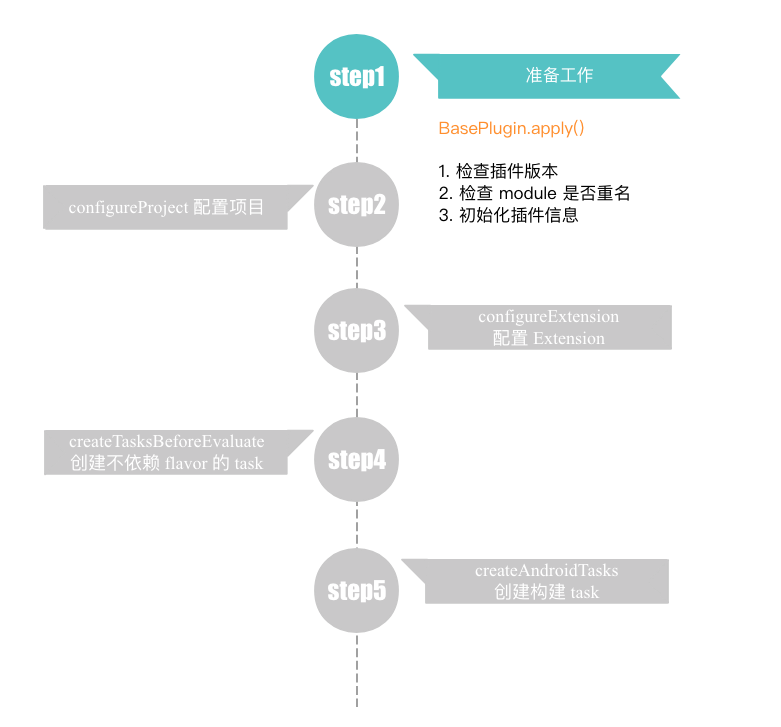
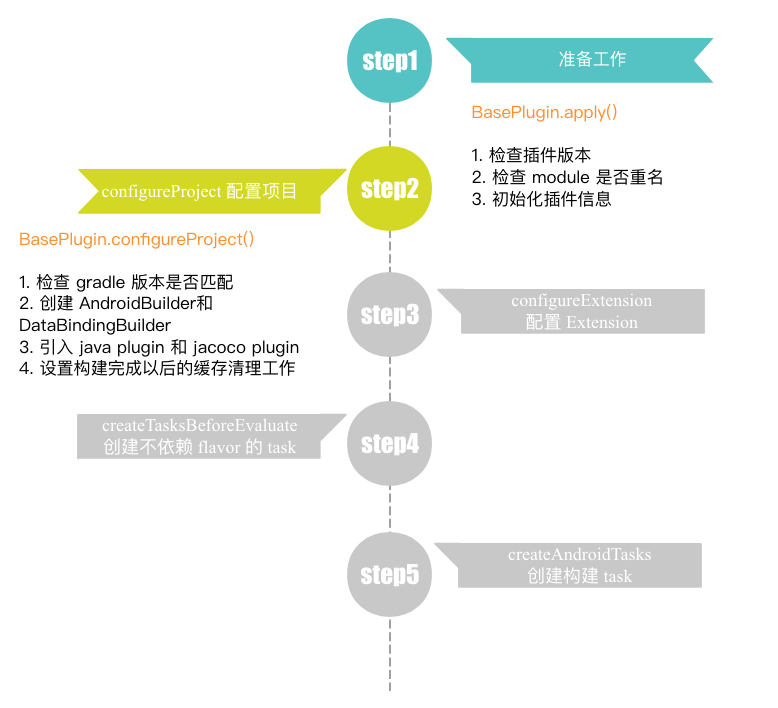
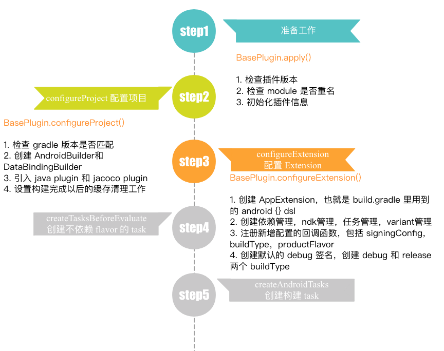
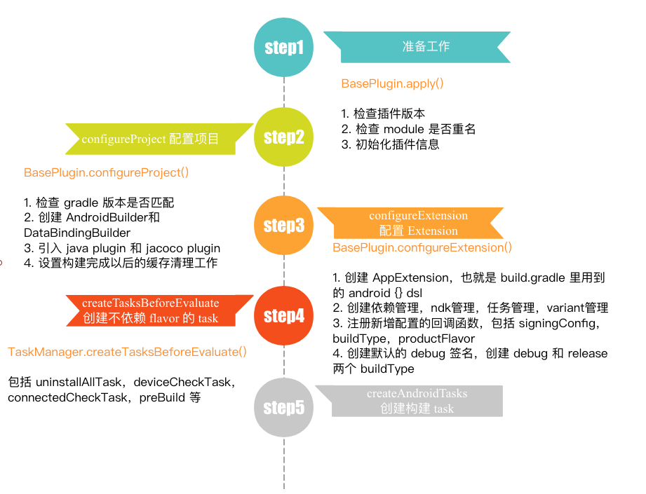
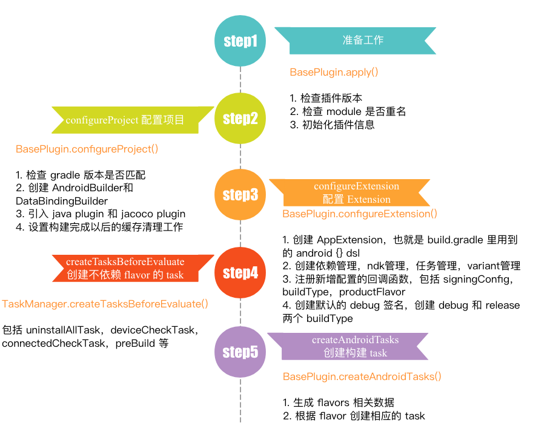

### 【Android 修炼手册】Gradle 篇 -- Android Gradle Plugin 插件主要流程
### 预备知识
1. 理解 gradle 的基本开发
2. 了解 gradle task 和 plugin 使用及开发
3. 了解 android gradle plugin 的使用

### 看完本文可以达到什么程度
1. 了解 android gradle plugin 的构建流程
2. 了解 android gradle plugin 的主要 task 的实现
3. 学会 hook android 构建流程，添加自己想要的功能

### 阅读前准备工作
1. 项目添加 android gradle plugin 依赖
``` groovy
compile 'com.android.tools.build:gradle:3.0.1'
```
通过这种方式，可以直接依赖 plugin 的源码，读起来比较方便。  
2. 官方对照源码地址 [android gradle plugin 源码地址](https://android.googlesource.com/platform/tools/base/+/refs/tags/gradle_3.0.0/build-system/)

大家可以直接 clone [EasyGradle](https://github.com/5A59/android-training/tree/master/gradle/EasyGradle) 项目，把 android-gradle-plugin-source/build.gradle 里的 implementation 'com.android.tools.build:gradle:3.0.1' 注释打开就可以了。

com.android.application 主要有下面几个流程:


### 一、插件启动的准备工作


在前面讲解自定义插件的时候说到过，要定义一个 xxx.properties 文件，里面声明插件的入口类，而 xxx 就是 apply plugin 时候使用的 id，这里要知道 android gradle plugin 的入口类，看 com.android.application.properties 文件就可以，内容如下：
```
implementation-class=com.android.build.gradle.AppPlugin
```
这里定义了入口是 AppPlugin，AppPlugin 继承自 BasePlugin。   
AppPlugin 里没有做太多的操作，主要是重写了 createTaskManager 和 createExtension，剩下的大部分工作还是在 BasePlugin 里做的。   
插件准备工作中主要做的事情: 
1. 检查插件版本
``` groovy
// method: BasePlugin.apply()
checkPluginVersion();
```
2. 检查 module 是否重名
``` groovy
// method: BasePlugin.apply()
// 方法中会遍历所有子项目，判断是否有重复的 id
this.checkModulesForErrors();
```
3. 初始化插件信息
``` groovy
// method: BasePlugin.apply()
PluginInitializer.initialize(project, this.projectOptions);
// 创建 Profiler 文件
ProfilerInitializer.init(project, this.projectOptions);
// profiler 信息中写入 plugin 版本
ProcessProfileWriter.getProject(project.getPath()).setAndroidPluginVersion(Version.ANDROID_GRADLE_PLUGIN_VERSION).setAndroidPlugin(this.getAnalyticsPluginType()).setPluginGeneration(PluginGeneration.FIRST);
```

### 二、配置项目


配置项目这一阶段主要做的事情:
1. 检查 gradle 版本是否匹配
``` groovy
// method: BasePlugin.configureProject()
this.checkGradleVersion();
```
2. 创建 AndroidBuilder和 DataBindingBuilder
3. 引入 java plugin 和 jacoco plugin
``` groovy
this.project.getPlugins().apply(JavaBasePlugin.class);
this.project.getPlugins().apply(JacocoPlugin.class);
```
4. 设置构建完成以后的混存清理工作
添加了 BuildListener，在 buildFinished 回调里做缓存清理工作

### 三、配置 Extension


实现在 BasePlugin.configureExtension()    
这一阶段主要做了下面几个事情：   

1. 创建 AppExtension，也就是 build.gradle 里用到的 android {} dsl
``` groovy
this.extension = this.createExtension(...);

// AppPlugin 中实现了 createExtension，创建了 android {} dsl
protected BaseExtension createExtension(...) {
    return (BaseExtension)project.getExtensions().create("android", AppExtension.class, new Object[]{project, projectOptions, instantiator, androidBuilder, sdkHandler, buildTypeContainer, productFlavorContainer, signingConfigContainer, buildOutputs, extraModelInfo});
}
```
2. 创建依赖管理，ndk管理，任务管理，variant管理
3. 注册新增配置的回调函数，包括 signingConfig，buildType，productFlavor
```groovy
// BasePlugin.java createExtension()
// map the whenObjectAdded callbacks on the containers.
signingConfigContainer.whenObjectAdded(variantManager::addSigningConfig);
buildTypeContainer.whenObjectAdded(
    buildType -> {
        SigningConfig signingConfig =
                signingConfigContainer.findByName(BuilderConstants.DEBUG);
        buildType.init(signingConfig);
        // addBuildType，会检查命名是否合法，然后创建 BuildTypeData
        variantManager.addBuildType(buildType);
    });
// addProductFlavor 会检查命名是否合法，然后创建 ProductFlavorData
productFlavorContainer.whenObjectAdded(variantManager::addProductFlavor);
// VariantManager.java
// addSigningConfig 就是在 signingConfigs 里新增一个配置
public void addSigningConfig(SigningConfig signingConfig) {
    this.signingConfigs.put(signingConfig.getName(), signingConfig);
}
// VariantManager.java
public void addProductFlavor(CoreProductFlavor productFlavor) {
    String name = productFlavor.getName();
    // checkName 会检查
    checkName(name, "ProductFlavor");
    if(this.buildTypes.containsKey(name)) {
        throw new RuntimeException("ProductFlavor names cannot collide with BuildType names");
    } else {
        // 获取源码位置
        DefaultAndroidSourceSet mainSourceSet = (DefaultAndroidSourceSet)this.extension.getSourceSets().maybeCreate(productFlavor.getName());
        DefaultAndroidSourceSet androidTestSourceSet = null;
        DefaultAndroidSourceSet unitTestSourceSet = null;
        if(this.variantFactory.hasTestScope()) {
            // 获取单测源码位置
            androidTestSourceSet = (DefaultAndroidSourceSet)this.extension.getSourceSets().maybeCreate(computeSourceSetName(productFlavor.getName(), VariantType.ANDROID_TEST));
            unitTestSourceSet = (DefaultAndroidSourceSet)this.extension.getSourceSets().maybeCreate(computeSourceSetName(productFlavor.getName(), VariantType.UNIT_TEST));
        }

        // 创建 productFlavorData 对象
        ProductFlavorData<CoreProductFlavor> productFlavorData = new ProductFlavorData(productFlavor, mainSourceSet, androidTestSourceSet, unitTestSourceSet, this.project);
        this.productFlavors.put(productFlavor.getName(), productFlavorData);
    }
}
```
4. 创建默认的 debug 签名，创建 debug 和 release 两个 buildType
``` groovy
variantFactory.createDefaultComponents(
    buildTypeContainer, productFlavorContainer, signingConfigContainer);
// ApplicationVariantFactory.java
public void createDefaultComponents(...) {
    signingConfigs.create("debug");
    buildTypes.create("debug");
    buildTypes.create("release");
}
```

### 四、创建不依赖 flavor 的 task

上述准备，配置阶段完成以后，就开始创建构建需要的 Task 了，是在 BasePlugin.createTasks() 里实现的，主要有两步，创建**不依赖 flavor 的 task** 和创建**构建 task**。     
先看不依赖 flavor 的 task，其实现在 TaskManager.createTasksBeforeEvaluate()。    
这里主要创建了几个 task，包括 uninstallAll，deviceCheck，connectedCheck，preBuild，extractProguardFiles，sourceSets，assembleAndroidTest，compileLint，lint，lintChecks，cleanBuildCacheresolveConfigAttr，consumeConfigAttr。   
这些 task 都是不需要依赖 flavor 数据的公共 task。

### 五、创建构建 task


在介绍下面的流程之前，先明确几个概念，flavor，dimension，variant。   
在 android gradle plugin 3.x 之后，每个 flavor 必须对应一个 dimension，可以理解为 flavor 的分组，然后不同 dimension 里的 flavor 组合成一个 variant。     
举个例子：
```
flavorDimensions "size", "color"

productFlavors {
    big {
        dimension "size"
    }
    small {
        dimension "size"
    }
    blue {
        dimension "color"
    }
    red {
        dimension "color"
    }
}
```
上面配置对应生成的 variant 就是 bigBlue，bigRed，smallBlue，smallRed，在这个基础上，再加上 buildTypes，就是 bigBlueDebug，bigRedDebug，smallBlueDebug，smallRedDebug，bigBlueRelease，bigRedRelease，smallBlueRelease，smallRedRelease。     

createAndroidTasks 的调用时机和上面不一样，是在 project.afterEvaluate 里调用的，还记得之前文章里说道的 afterEvaluate 回调么？这个时候所有模块配置已经完成了。所以在这个阶段可以获取到对应的 flavor 以及其他配置了。   
在 BasePlugin.createAndroidTasks 里，是调用 VariantManager.createAndroidTasks 完成工作的。     
创建 task 的时候，会先通过 populateVariantDataList 生成 flavor 相关的数据结构，然后调用 createTasksForVariantData 创建 flavor 对应的 task。   
分别看下这两个方法做的事情    
**1.populateVariantDataList**  
在方法里，会先根据 flavor 和 dimension 创建对应的组合，存放在 flavorComboList 里，之后调用 createVariantDataForProductFlavors 创建对应的 VariantData。   
其中重要的几个方法：
``` groovy
// 创建 flavor 和 dimension 的组合
List<ProductFlavorCombo<CoreProductFlavor>> flavorComboList =
                    ProductFlavorCombo.createCombinations(
                            flavorDimensionList,
                            flavorDsl);
// 为每个组合创建 VariantData
for (ProductFlavorCombo<CoreProductFlavor>  flavorCombo : flavorComboList) {
    //noinspection unchecked
    createVariantDataForProductFlavors(
            (List<ProductFlavor>) (List) flavorCombo.getFlavorList());
}
```
创建出来的 VariantData 都是 BaseVariantData 的子类，里面保存了一些 Task，可以看一下 BaseVariantData 里的一些重要的结构，对 BaseVariantData 有个大概的了解。   
``` groovy
public abstract class BaseVariantData implements TaskContainer {
    private final GradleVariantConfiguration variantConfiguration;
    private VariantDependencies variantDependency;
    private final VariantScope scope;
    public Task preBuildTask;
    public Task sourceGenTask;
    public Task resourceGenTask; // 资源处理
    public Task assetGenTask;
    public CheckManifest checkManifestTask; // 检测manifest
    public AndroidTask<PackageSplitRes> packageSplitResourcesTask; // 打包资源
    public AndroidTask<PackageSplitAbi> packageSplitAbiTask;
    public RenderscriptCompile renderscriptCompileTask; 
    public MergeResources mergeResourcesTask; // 合并资源
    public ManifestProcessorTask processManifest; // 处理 manifest
    public MergeSourceSetFolders mergeAssetsTask; // 合并 assets
    public GenerateBuildConfig generateBuildConfigTask; // 生成 BuildConfig
    public GenerateResValues generateResValuesTask;
    public Sync processJavaResourcesTask;
    public NdkCompile ndkCompileTask; // ndk 编译
    public JavaCompile javacTask; 
    public Task compileTask;
    public Task javaCompilerTask; // java 文件编译
    // ...
}
```
VariantData 里保存了很多 task，下一步就要创建这些 task。   

**2.createTasksForVariantData**   
创建完 variant 数据，就要给 每个 variantData 创建对应的 task，对应的 task 有 assembleXXXTask，prebuildXXX，generateXXXSource，generateXXXResources，generateXXXAssets，processXXXManifest 等等，重点关注几个方法：
``` groovy
VariantManager.createAssembleTaskForVariantData() // 创建 assembleXXXTask
TaskManager.createTasksForVariantScope() // 是一个抽象类，具体实现在 ApplicationTaskManager.createTasksForVariantScope()
TaskManager.createPostCompilationTasks() // 创建 .class to dex 的 task， 创建 transformTask，我们创建的 transform 就是这个阶段添加进来的，是在 addCompileTask 里调用的

// createTasksForVariantScope 是一个抽象方法，具体实现在子类中，可以看一下 ApplicationTaskManager.createTasksForVariantScope()
// createTasksForVariantScope 里的实现，如果在业务中有需要查看相关 task 源码时，可以来这里找
void createTasksForVariantScope() {
    this.createCheckManifestTask(tasks, variantScope); // 检测 manifest
    this.handleMicroApp(tasks, variantScope);
    this.createDependencyStreams(tasks, variantScope);
    this.createApplicationIdWriterTask(tasks, variantScope); // application id 
    this.createMergeApkManifestsTask(tasks, variantScope); // 合并 manifest
    this.createGenerateResValuesTask(tasks, variantScope);
    this.createRenderscriptTask(tasks, variantScope);
    this.createMergeResourcesTask(tasks, variantScope, true); // 合并资源文件
    this.createMergeAssetsTask(tasks, variantScope, (BiConsumer)null); // 合并 assets
    this.createBuildConfigTask(tasks, variantScope); // 生成 BuildConfig
    this.createApkProcessResTask(tasks, variantScope); // 处理资源
    this.createProcessJavaResTask(tasks, variantScope);
    this.createAidlTask(tasks, variantScope); // 处理 aidl
    this.createShaderTask(tasks, variantScope);
    this.createNdkTasks(tasks, variantScope); // 处理 ndk
    this.createExternalNativeBuildJsonGenerators(variantScope);
    this.createExternalNativeBuildTasks(tasks, variantScope);
    this.createMergeJniLibFoldersTasks(tasks, variantScope); // 合并 jni
    this.createDataBindingTasksIfNecessary(tasks, variantScope); // 处理 databinding
    this.addCompileTask(tasks, variantScope); 
    createStripNativeLibraryTask(tasks, variantScope);
    this.createSplitTasks(tasks, variantScope);
    this.createPackagingTask(tasks, variantScope, buildInfoWriterTask); // 打包 apk
    this.createLintTasks(tasks, variantScope); // lint 
}

// createPostCompilationTasks 实现:
// 处理 Android Transform
void createPostCompilationTasks() {
    for (int i = 0, count = customTransforms.size(); i < count; i++) {
        Transform transform = customTransforms.get(i);
        // TransformManager.addTransform 实际上是为 transform 创建了一个 Task
        transformManager
                .addTransform(tasks, variantScope, transform)
                .ifPresent(t -> {
                    if (!deps.isEmpty()) {
                        t.dependsOn(tasks, deps);
                    }
                    // if the task is a no-op then we make assemble task depend on it.
                    if (transform.getScopes().isEmpty()) {
                        variantScope.getAssembleTask().dependsOn(tasks, t);
                    }
                });
    }
}
```

### 六、总结
android gradle plugin 的主要流程基本上就结束了，主要流程图如下所示


这里总结几个要点:
1. com.android.application 入口类是 AppPlugin，但大部分工作都是在 BasePlugin 里完成的
2. build.gradle 里见到的 android {} dsl 是在 BasePlugin.configureExtension() 里声明的
3. 主要的 task 是在 BasePlugin.createAndroidTasks() 里生成的
4. 主要 task 的实现可以在 TaskManager 中找到
5. transform 会转化成 TransformTask