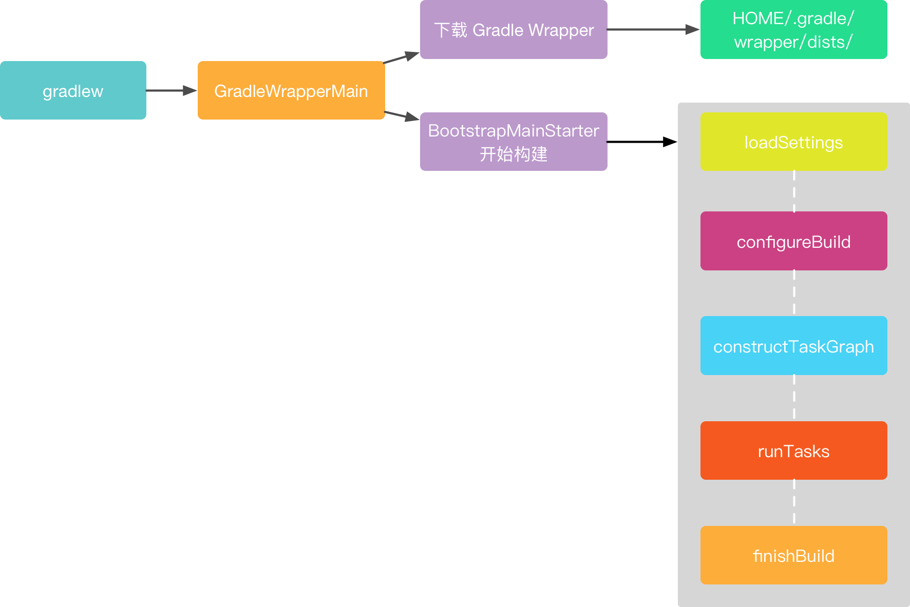
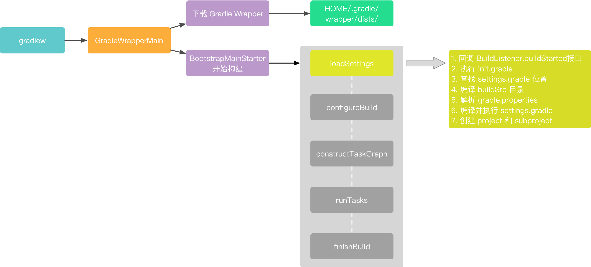
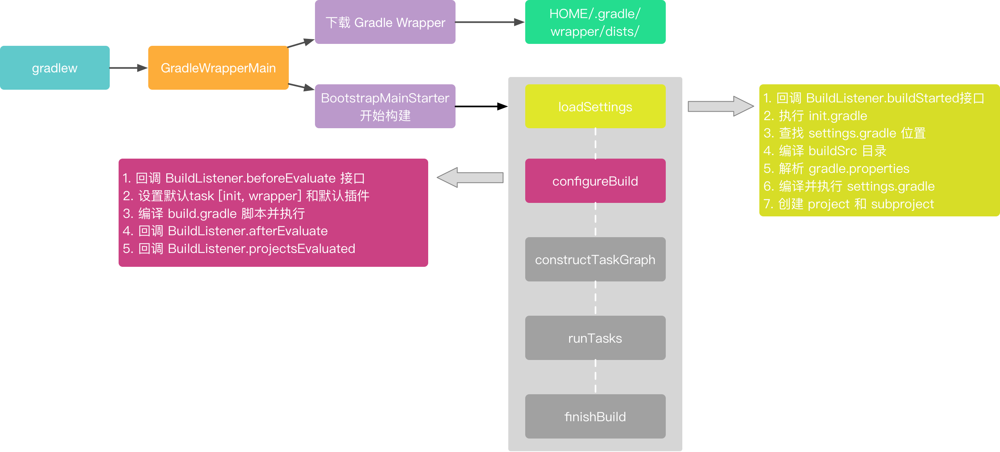
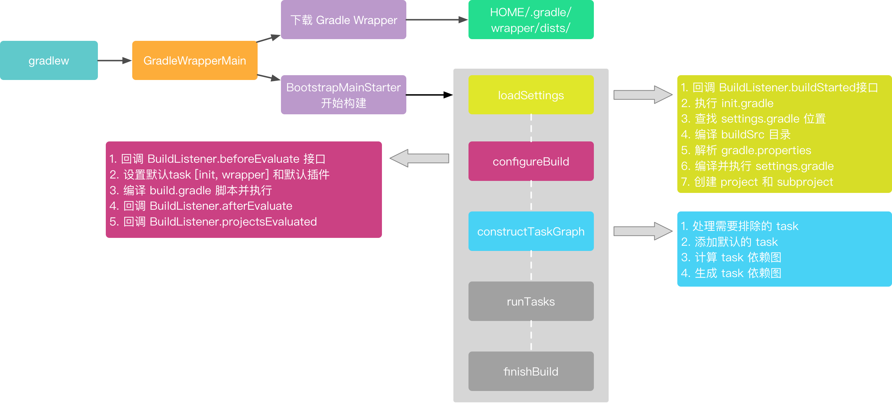
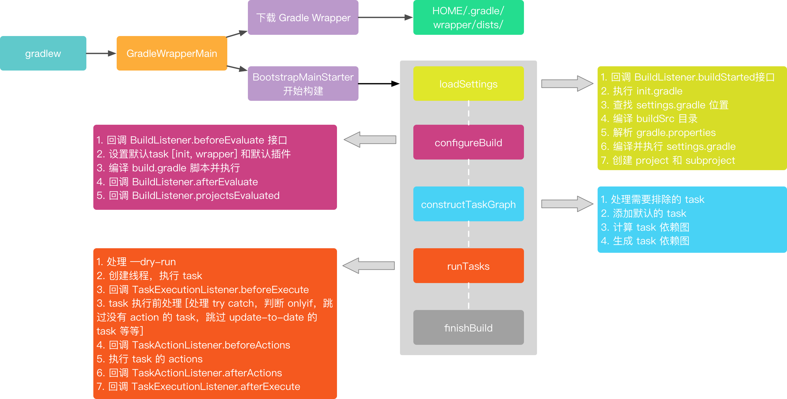
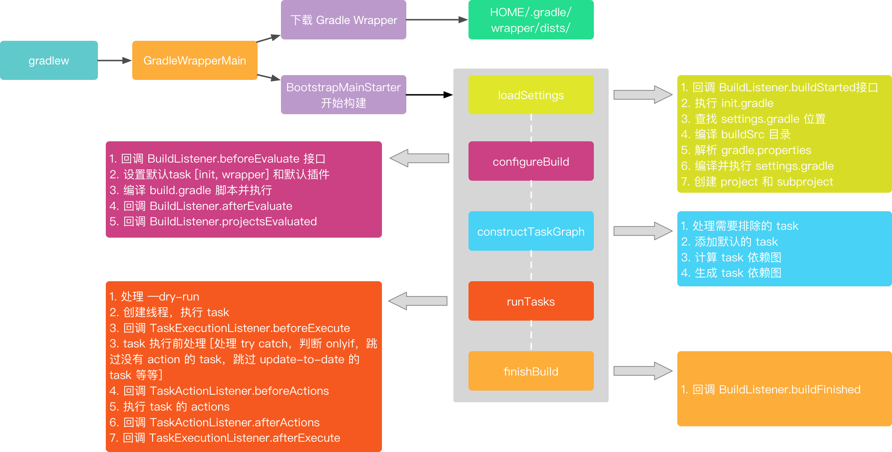
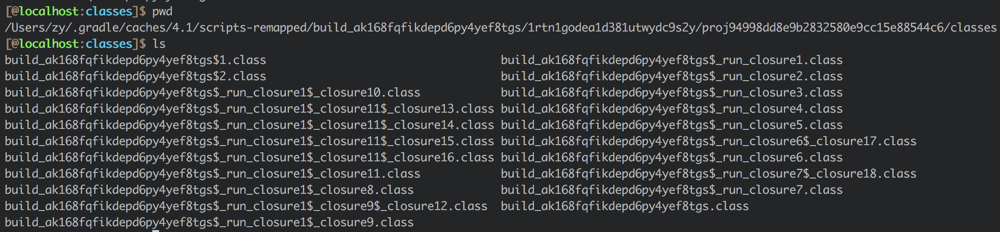
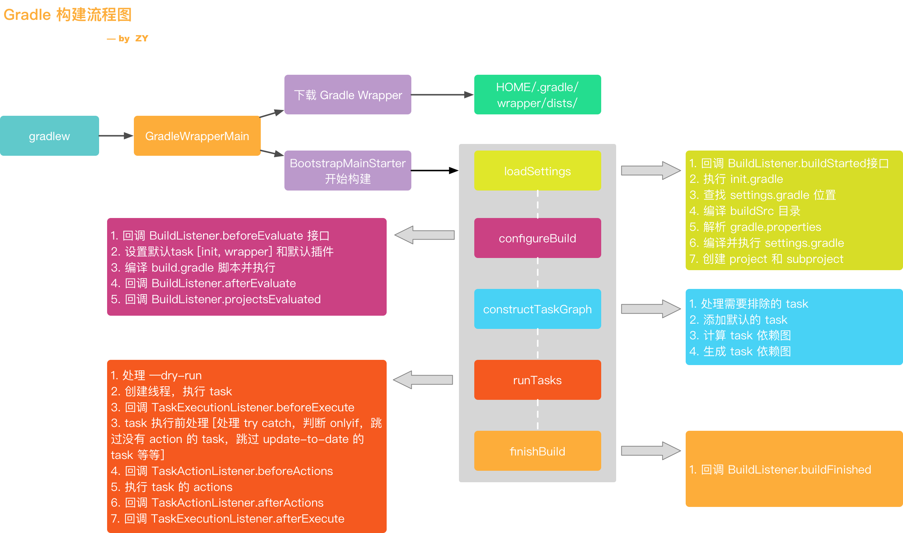

### 【Android 修炼手册】Gradle 篇 -- Gradle 源码分析

### 预备知识
1. 理解 gradle 的基本开发
2. 了解 gradle task 和 plugin 使用及开发
3. 了解 android gradle plugin 的使用

### 看完本文可以达到什么程度
1. 了解 gradle 的实现原理

### 阅读前准备工作
1. clone [EasyGradle](./EasyGradle) 项目
2. 下载 [Gradle 源码](https://github.com/gradle/gradle/tree/v4.1.0) 作为参考

### 读代码的姿势
1. 调用链路，方便读代码时对照
2. 集中于整体框架，一些细节不做追究

### 目录
本文主要从下面几个部分进行分析
1. Gradle 的启动
2. loadSettings
3. configureBuild
4. constructTaskGraph
5. runTasks
6. finishBuild
7. gradle 脚本如何编译和执
8. 插件调用流程

### 一、Gradle 的启动
#### 1.1 整体实现图


#### 1.2 具体分析
我们执行一个构建任务的时候，都是执行 ./gradlew assembleDebug 这样的命令，其中的 gradlew 脚本就是整个 gradle 构建的入口，我们先从这里看起。   
前面的代码基本上就是判断环境，设置变量的，直接看最后一行：
``` shell
exec "$JAVACMD" "${JVM_OPTS[@]}" -classpath "$CLASSPATH" org.gradle.wrapper.GradleWrapperMain "$@"
```
最后执行的命令基本上如下：  
``` shell
exec $JAVA_HOME/bin/java -classpath $APP_HOME/gradle/wrapper/gradle-wrapper.jar org.gradle.wrapper.GradleWrapperMain 
```
基本上可以看到，就是执行了 gradle/wrapper/gradle-wrapper.jar 里的 org.gradle.wrapper.GradleWrapperMain，这样我们就知道了，gradle 的入口类是 org.gradle.wrapper.GradleWrapperMain，也就知道代码该从何开始看了。   
先看 GradleWrapperMain 的 main 函数：
``` java
// GradleWrapperMain
public static void main(String[] args) throws Exception {
    // ...
    WrapperExecutor wrapperExecutor = WrapperExecutor.forWrapperPropertiesFile(propertiesFile);
    wrapperExecutor.execute(
            args,
            new Install(logger, new Download(logger, "gradlew", wrapperVersion()), new PathAssembler(gradleUserHome)),
            new BootstrapMainStarter());
}
```
重要的类有两个 org.gradle.wrapper.WrapperExecutor 和 org.gradle.wrapper.BootstrapMainStarter。我们继续跟进 WrapperExecutor.execute 里看一下：
``` java
// WrapperExecutor.execute
public void execute(String[] args, Install install, BootstrapMainStarter bootstrapMainStarter) throws Exception {
    File gradleHome = install.createDist(config);
    bootstrapMainStarter.start(args, gradleHome);
}
```
这里就做了两件事：
1. **下载 gradle wrapper 需要的依赖以及源码**。其中的 gradle wrapper 版本就是我们在 gradle/wrapper/gradle-wrapper.properties 里配置的 distributionUrl，下载位置就是在 gradle-wrapper.properties 里配置的 distributionPath 和 zipStorePath。zipStorePath 是下载的压缩包位置，distributionPath 是解压后的位置，一般默认的位置就是 HOME/.gradle/wrapper/dists/，在这里就可以找到 gradle wrapper 的内容了。    
   如果创建过多个项目的话，我们在 HOME/.gradle/wrapper/dists/ 里可以看到不同版本的 gradle wrapper，这也说明了我们之前最开始说的，为什么要使用 gradle wrapper 而不是直接在电脑里安装 gradle，就是因为 gradle wrapper 会根据不同的项目下载不同版本的内容，项目彼此之间互不影响。   
2. **执行 gradle 构建流程**。这里就是顺着 BootstrapMainStarter.start() 往下执行了，中间过程就不看了，比较曲折，对理解整体流程也没什么太大的帮助。最终会运行到 DefaultGradleLauncher.executeTasks()，然后再往下的流程就非常清晰了。    
``` java
// DefaultGradleLauncher
public GradleInternal executeTasks() {
    doBuildStages(Stage.Build);
    return gradle;
}

private void doBuildStages(Stage upTo) {
    // ...
    loadSettings();
    configureBuild();
    constructTaskGraph();
    runTasks();
    finishBuild();
}
```
基本上构建过程就是分五步走，下面分别看这五个流程

### 二、loadSettings
#### 2.1 整体实现图


#### 2.2 具体分析
loadSettings 主要是加载 settings.gradle 文件，然后创建对应的 project   
``` java
// DefaultGradleLauncher.loadSettings   
private void loadSettings() {
    if (stage == null) {
        buildListener.buildStarted(gradle);

        buildOperationExecutor.run(new LoadBuild());

        stage = Stage.Load;
    }
}
```

整体构建流程：   
##### 2.2.1 调用 BuildListener.buildStarted() 回调接口
通知构建开始。这个就是我们之前在 [Gradle 基本使用](./gradle的基本使用.md) 里说的生命周期回调

##### 2.2.2 执行 init 脚本
**调用链路**    
``` java
LoadBuild.run -> InitScriptHandler.executeScripts
```
之前在 [Gradle 基本使用](./gradle的基本使用.md) 里说过 init.gradle 的作用，会在每个项目 build 之前被调用，做一些初始化的操作，就是在这里被调用的。     

##### 2.2.3 查找 settings.gradle 位置
**调用链路**    
```java
LoadBuild.run -> NotifyingSettingsLoader.findAndLoadSettings -> CompositeBuildSettingsLoader.findAndLoadSettings -> DefaultSettingsLoader.findAndLoadSettings -> DefaultSettingsLoader.findSettingsAndLoadIfAppropriate -> DefaultSettingsLoader.findSettings -> DefaultSettingsFinder.find -> BuildLayoutFactory.getLayoutFor
```

**实现分析**    
在 getLayoutFor 里，查找 settings.gradle 文件逻辑如下：   
1. 如果参数里通过 -c xxx.gradle 指定了 settings.gradle 文件的位置，那么直接使用指定的 settings.gradle 文件   
2. 如果没有指定 settings 文件，就在当前目录下查找   
3. 如果当前目录没有，会一直往上级目录查找，以及同级的 maseter/ 目录下查找   
4. 如果都没有找到，还是默认在当前目录下   
``` java
// BuildLayoutFactory
public BuildLayout getLayoutFor(BuildLayoutConfiguration configuration) {
    if (configuration.isUseEmptySettings()) {
        return new BuildLayout(configuration.getCurrentDir(), configuration.getCurrentDir(), null);
    }
    File explicitSettingsFile = configuration.getSettingsFile();
    if (explicitSettingsFile != null) {
        if (!explicitSettingsFile.isFile()) {
            throw new MissingResourceException(explicitSettingsFile.toURI(), String.format("Could not read settings file '%s' as it does not exist.", explicitSettingsFile.getAbsolutePath()));
        }
        return new BuildLayout(configuration.getCurrentDir(), configuration.getCurrentDir(), explicitSettingsFile);
    }

    File currentDir = configuration.getCurrentDir();
    boolean searchUpwards = configuration.isSearchUpwards();
    return getLayoutFor(currentDir, searchUpwards ? null : currentDir.getParentFile());
}
```

##### 2.2.4 编译 buildSrc 文件夹下的内容，buildSrc 可以看作插件类似的功能
**调用链路**    
```java
LoadBuild.run -> NotifyingSettingsLoader.findAndLoadSettings -> CompositeBuildSettingsLoader.findAndLoadSettings -> DefaultSettingsLoader.findAndLoadSettings -> DefaultSettingsLoader.findSettingsAndLoadIfAppropriate -> BuildSourceBuilder.buildAndCreateClassLoader
```

在上一步找到 settings.gradle 文件以后，会以 settings.gradle 所在的同级目录下，查找 buildSrc 目录，并进行编译，这样可以保证在构建 settings.gradle 的时候可以引用到 buildSrc 目录里的内容。  

##### 2.2.5 解析 gradle.properites
**调用链路**    
``` java
LoadBuild.run -> NotifyingSettingsLoader.findAndLoadSettings -> CompositeBuildSettingsLoader.findAndLoadSettings -> DefaultSettingsLoader.findAndLoadSettings -> DefaultSettingsLoader.findSettingsAndLoadIfAppropriate -> NotifyingSettingsProcessor.process -> PropertiesLoadingSettingsProcessor.process -> DefaultGradlePropertiesLoader.loadProperties
```

**实现分析**    
这一步会读取 gradle.properties 文件里的配置，系统配置，环境变量，以及命令行传入的配置并存储。
``` java
// DefaultGradlePropertiesLoader
void loadProperties(File settingsDir, StartParameter startParameter, Map<String, String> systemProperties, Map<String, String> envProperties) {
    defaultProperties.clear();
    overrideProperties.clear();
    addGradleProperties(defaultProperties, new File(settingsDir, Project.GRADLE_PROPERTIES));
    addGradleProperties(overrideProperties, new File(startParameter.getGradleUserHomeDir(), Project.GRADLE_PROPERTIES));
    setSystemProperties(startParameter.getSystemPropertiesArgs());
    overrideProperties.putAll(getEnvProjectProperties(envProperties));
    overrideProperties.putAll(getSystemProjectProperties(systemProperties));
    overrideProperties.putAll(startParameter.getProjectProperties());
}
```

##### 2.2.6 解析 settings.gradle
**调用链路**    
``` java
LoadBuild.run -> NotifyingSettingsLoader.findAndLoadSettings -> CompositeBuildSettingsLoader.findAndLoadSettings -> DefaultSettingsLoader.findAndLoadSettings -> DefaultSettingsLoader.findSettingsAndLoadIfAppropriate -> NotifyingSettingsProcessor.process -> PropertiesLoadingSettingsProcessor.process -> ScriptEvaluatingSettingsProcessor.process -> ScriptEvaluatingSettingsProcessor.applySettingsScript -> BuildOperationScriptPlugin.apply
```

**实现分析**   
在 ScriptEvaluatingSettingsProcessor 里，先创建了 SettingsInternal 实例，以及 ScriptSource 实例，代表 settings.gradle 文件在内存中的映射，之后就调用 BuildOperationScriptPlugin.apply 去执行 settings.gradle 文件了。    
关于 BuildOperationScriptPlugin.apply，我们后面细说，因为在解析 build.gradle 文件的时候也会用到这个方法。  
下面是对应的代码：
``` java
// ScriptEvaluatingSettingsProcessor
public SettingsInternal process(GradleInternal gradle,
                                SettingsLocation settingsLocation,
                                ClassLoaderScope buildRootClassLoaderScope,
                                StartParameter startParameter) {
    Timer settingsProcessingClock = Timers.startTimer();
    Map<String, String> properties = propertiesLoader.mergeProperties(Collections.<String, String>emptyMap());
    SettingsInternal settings = settingsFactory.createSettings(gradle, settingsLocation.getSettingsDir(),
            settingsLocation.getSettingsScriptSource(), properties, startParameter, buildRootClassLoaderScope);
    applySettingsScript(settingsLocation, settings);
    LOGGER.debug("Timing: Processing settings took: {}", settingsProcessingClock.getElapsed());
    return settings;
}

private void applySettingsScript(SettingsLocation settingsLocation, final SettingsInternal settings) {
    ScriptSource settingsScriptSource = settingsLocation.getSettingsScriptSource();
    ClassLoaderScope settingsClassLoaderScope = settings.getClassLoaderScope();
    ScriptHandler scriptHandler = scriptHandlerFactory.create(settingsScriptSource, settingsClassLoaderScope);
    ScriptPlugin configurer = configurerFactory.create(settingsScriptSource, scriptHandler, settingsClassLoaderScope, settings.getRootClassLoaderScope(), true);
    configurer.apply(settings);
}
```

##### 2.2.7 创建 project 以及 subproject
**调用链路**    
``` java
LoadBuild.run -> NotifyingSettingsLoader.findAndLoadSettings -> CompositeBuildSettingsLoader.findAndLoadSettings -> DefaultSettingsLoader.findAndLoadSettings -> DefaultSettingsLoader.findSettingsAndLoadIfAppropriate -> NotifyingSettingsProcessor.process -> ProjectPropertySettingBuildLoader.load -> InstantiatingBuildLoader.load
```

**实现分析**   
在解析了 settings.gradle 文件以后，就可以知道项目里有哪些 project，就可以创建 project 实例了。
``` java
// InstantiatingBuildLoader
// 这里传入的参数对应的是：rootProjectDescriptor: SettingsInternal.getRootProject() defaultProject: SettingsInternal.getDefaultProject() buildRootClassLoaderScope:SettingsInternal.getRootClassLoaderScope()
public void load(ProjectDescriptor rootProjectDescriptor, ProjectDescriptor defaultProject, GradleInternal gradle, ClassLoaderScope buildRootClassLoaderScope) {
    createProjects(rootProjectDescriptor, gradle, buildRootClassLoaderScope);
    attachDefaultProject(defaultProject, gradle);
}

private void attachDefaultProject(ProjectDescriptor defaultProject, GradleInternal gradle) {
    gradle.setDefaultProject(gradle.getRootProject().getProjectRegistry().getProject(defaultProject.getPath()));
}

private void createProjects(ProjectDescriptor rootProjectDescriptor, GradleInternal gradle, ClassLoaderScope buildRootClassLoaderScope) {
    // 创建主项目实例
    // ProjectInternal 继承自 Project，最终返回的 rootProject 是 DefaultProject 类型
    ProjectInternal rootProject = projectFactory.createProject(rootProjectDescriptor, null, gradle, buildRootClassLoaderScope.createChild("root-project"), buildRootClassLoaderScope);
    gradle.setRootProject(rootProject);
    addProjects(rootProject, rootProjectDescriptor, gradle, buildRootClassLoaderScope);
}

private void addProjects(ProjectInternal parent, ProjectDescriptor parentProjectDescriptor, GradleInternal gradle, ClassLoaderScope buildRootClassLoaderScope) {
    // 创建子项目实例
    for (ProjectDescriptor childProjectDescriptor : parentProjectDescriptor.getChildren()) {
        ProjectInternal childProject = projectFactory.createProject(childProjectDescriptor, parent, gradle, parent.getClassLoaderScope().createChild("project-" + childProjectDescriptor.getName()), buildRootClassLoaderScope);
        addProjects(childProject, childProjectDescriptor, gradle, buildRootClassLoaderScope);
    }
}

// ProjectFactory
public DefaultProject createProject(ProjectDescriptor projectDescriptor, ProjectInternal parent, GradleInternal gradle, ClassLoaderScope selfClassLoaderScope, ClassLoaderScope baseClassLoaderScope) {
    // 获取 project 对应的 build.gradle 
    File buildFile = projectDescriptor.getBuildFile();
    ScriptSource source = UriScriptSource.file("build file", buildFile);
    // 创建 project 实例
    DefaultProject project = instantiator.newInstance(DefaultProject.class,
            projectDescriptor.getName(),
            parent,
            projectDescriptor.getProjectDir(),
            source,
            gradle,
            gradle.getServiceRegistryFactory(),
            selfClassLoaderScope,
            baseClassLoaderScope
    );

    // 设置 project 的层级关系
    if (parent != null) {
        parent.addChildProject(project);
    }
    // 注册 project
    projectRegistry.addProject(project);

    return project;
}
```
这里根据 settings.gradle 的配置，创建项目实例。创建子项目的时候，如果父项目不为空，就将自己设置成父项目的子项目，这样就可以通过 project.getChildProjects 获取项目的子项目了。    
我们在写 gradle 脚本的时候，经常会用到的 project 属性，就是在这个时候创建出来了。

到此为止，就解析了 settings.gradle 文件然后创建了项目实例。

### 三、configureBuild
#### 3.1 整体实现图


#### 3.2 具体分析
我们之前有说到，gradle 构建过程分为**配置阶段和运行阶段**，配置阶段主要是执行脚本的内容，运行阶段是执行 task 的内容，这里就是配置阶段的流程。要注意，之前说的配置和运行阶段，是从整体来看的两个阶段，从源码来理解，就是这篇文章介绍的几个阶段，要更细化一点。    
配置阶段执行的内容比较简单，就是把 gradle 脚本编译成 class 文件，然后运行（gradle 是采用 groovy 语言编写的，groovy 是一门 jvm 语言，所以必须要编译成 class 才能运行）。    
``` java
// DefaultGradleLauncher
private void configureBuild() {
    if (stage == Stage.Load) {
        buildOperationExecutor.run(new ConfigureBuild());

        stage = Stage.Configure;
    }
}
```
在配置项目的时候，如果指定了 [configure-on-demand 参数](https://docs.gradle.org/current/userguide/multi_project_builds.html#sec:configuration_on_demand)，只会配置主项目以及执行 task 需要的项目，默认没有指定，会配置所有的项目，这里只看默认情况。

##### 3.2.1 配置主项目及其子项目的主要链路
**调用链路**    
``` java
ConfigureBuild.run -> DefaultBuildConfigurer.configure -> TaskPathProjectEvaluator.configureHierarchy -> TaskPathProjectEvaluator.configure -> DefaultProject.evaluate -> LifecycleProjectEvaluator.evaluate -> LifecycleProjectEvaluator.doConfigure -> ConfigureActionsProjectEvaluator.evaluate 
```

**实现分析**   
``` java
// TaskPathProjectEvaluator
public void configureHierarchy(ProjectInternal project) {
    configure(project);
    for (Project sub : project.getSubprojects()) {
        configure((ProjectInternal) sub);
    }
}
```
最终执行到了 LifecycleProjectEvaluator.doConfigure   

##### 3.2.2 回调 BuildListener.beforeEvaluate 接口
在这里回调 beforeEvaluate 接口，通知配置将要开始。我们也就知道了这个回调执行的阶段。

##### 3.2.3 设置默认的 task 和 插件
**调用链路**    
``` java
ConfigureBuild.run -> DefaultBuildConfigurer.configure -> TaskPathProjectEvaluator.configureHierarchy -> TaskPathProjectEvaluator.configure -> DefaultProject.evaluate -> LifecycleProjectEvaluator.evaluate -> LifecycleProjectEvaluator.doConfigure -> ConfigureActionsProjectEvaluator.evaluate -> PluginsProjectConfigureActions.execute
```

**实现分析**   
在 PluginsProjectConfigureActions 里，会给 project 添加两个 task：init 和 wrapper，然后添加帮助插件：org.gradle.help-tasks

##### 3.2.4 编译脚本并执行
**调用链路**    
``` java
ConfigureBuild.run -> DefaultBuildConfigurer.configure -> TaskPathProjectEvaluator.configureHierarchy -> TaskPathProjectEvaluator.configure -> DefaultProject.evaluate -> LifecycleProjectEvaluator.evaluate -> LifecycleProjectEvaluator.doConfigure -> ConfigureActionsProjectEvaluator.evaluate -> BuildScriptProcessor.execute -> BuildOperationScriptPlugin.apply
```

**实现分析**   
这里调用的还是 BuildOperationScriptPlugin.apply 去编译和执行 build.gradle 脚本，和前面解析 settings.gradle 是一样的，这里我们先知道这个就是编译 build.gradle 为 class 文件并且执行，然后先往后看流程，后面再详细说脚本是如何编译和执行的。

##### 3.2.5 回调 BuildListener.afterEvaluate

##### 3.2.6 回调 BuildListener.projectsEvaluated

### 四、constructTaskGraph
#### 4.1 整体实现图


#### 4.2 具体分析
这一步是构建 task 依赖图
``` java
// DefaultGradleLauncher
private void constructTaskGraph() {
    if (stage == Stage.Configure) {
        buildOperationExecutor.run(new CalculateTaskGraph());

        stage = Stage.TaskGraph;
    }
}
```

##### 4.2.1 处理需要排除的 task
**调用链路**    
``` java
CalculateTaskGraph.run -> DefaultBuildConfigurationActionExecuter.select -> ExcludedTaskFilteringBuildConfigurationAction.configure
```

**实现分析**   
``` java
// ExcludedTaskFilteringBuildConfigurationAction
public void configure(BuildExecutionContext context) {
    GradleInternal gradle = context.getGradle();
    Set<String> excludedTaskNames = gradle.getStartParameter().getExcludedTaskNames();
    if (!excludedTaskNames.isEmpty()) {
        final Set<Spec<Task>> filters = new HashSet<Spec<Task>>();
        for (String taskName : excludedTaskNames) {
            filters.add(taskSelector.getFilter(taskName));
        }
        gradle.getTaskGraph().useFilter(Specs.intersect(filters));
    }

    context.proceed();
}
```
这一步是用来处理需要排除的 task，也就是在命令行通过 -x or --exclude-task 指定的 task，这里主要是给 TaskGraph 设置了 filter，以便在后面计算依赖的时候排除相应的 task

##### 4.2.2 添加默认的 task
**调用链路**    
``` java
CalculateTaskGraph.run -> DefaultBuildConfigurationActionExecuter.select -> DefaultTasksBuildExecutionAction.configure
```

**实现分析**   
这里会检查命令行里是否有传入 Task 名称进来，如果指定了要执行的 task，那么什么都不做。    
如果没有指定，就看 project 是否有默认的 task，默认的 task 可以通过 defaultTasks 在 build.gradle 里进行指定。    
如果也默认 task 也没有，那么就把要指定的 task 设置成 help task，也就是输出 gradle 的帮助内容。

##### 4.2.3 计算 task 依赖图
**调用链路**    
``` java
CalculateTaskGraph.run -> DefaultBuildConfigurationActionExecuter.select -> TaskNameResolvingBuildConfigurationAction.configure
```

**实现分析**   
1. 根据命令行的 taskname 筛选 task。如果我们的 task 指定了 project，也就是类似这样的 :app:assembleDebug，那么就直接选中了 task，如果没有指定具体 project，那么会把所有 project 下符合 taskname 的 task 都筛选出来。
``` java
CalculateTaskGraph.run -> DefaultBuildConfigurationActionExecuter.select -> TaskNameResolvingBuildConfigurationAction.configure -> CommandLineTaskParser.parseTasks
```

2. 把 task 添加到 taskGraph 中，这里会处理 task 的依赖关系，包括 dependson finalizedby mustrunafter shouldrunafter，然后把信息都保存在 org.gradle.execution.taskgraph.TaskInfo 里。
``` java
CalculateTaskGraph.run -> DefaultBuildConfigurationActionExecuter.select -> TaskNameResolvingBuildConfigurationAction.configure -> DefaultTaskGraphExecuter.addTasks
```

##### 4.2.4 生成 task graph
**调用链路**    
``` java
CalculateTaskGraph.run -> TaskGraphExecuter.populate -> DefaultTaskExecutionPlan.determineExecutionPlan
```

**实现分析**   
根据上一步计算的 task 及其依赖，生成 task 图

### 五、runTasks
#### 5.1 整体实现图


#### 5.2 具体分析
task 图生成以后，就开始执行 task   

##### 5.2.1 处理 dry run
**调用链路**    
``` java
DefaultBuildExecuter.execute -> DryRunBuildExecutionAction.execute
```

**实现分析**   
如果在命令行里指定了 --dry-run，在这里就会拦截 task 的执行，直接输出 task 的名称以及执行的先后关系。

##### 5.2.2 创建线程，执行 task
**调用链路**    
``` java
DefaultBuildExecuter.execute -> SelectedTaskExecutionAction.execute -> DefaultTaskPlanExecutor.process
```

**实现分析**   
创建 TaskExecutorWorker 去执行 task，默认是 8 个线程。

``` java
// DefaultTaskPlanExecutor
public void process(TaskExecutionPlan taskExecutionPlan, Action<? super TaskInternal> taskWorker) {
    ManagedExecutor executor = executorFactory.create("Task worker for '" + taskExecutionPlan.getDisplayName() + "'");
    try {
        WorkerLease parentWorkerLease = workerLeaseService.getCurrentWorkerLease();
        // 开线程
        startAdditionalWorkers(taskExecutionPlan, taskWorker, executor, parentWorkerLease); 
        taskWorker(taskExecutionPlan, taskWorker, parentWorkerLease).run();
        taskExecutionPlan.awaitCompletion();
    } finally {
        executor.stop();
    }
}
```

##### 5.2.3 task 执行前处理
**调用链路**    
``` java
DefaultBuildExecuter.execute -> SelectedTaskExecutionAction.execute -> DefaultTaskPlanExecutor.process -> TaskExecutorWorker.run -> DefaultTaskExecutionPlan.executeWithTask -> DefaultTaskExecutionPlan.selectNextTask -> DefaultTaskExecutionPlan.processTask -> EventFiringTaskWorker.execute -> DefaultBuildOperationExecutor.run
```

**实现分析**   
到这里就正式开始 task 的执行过程了。有几个步骤：
1. 回调 TaskExecutionListener.beforeExecute
2. 链式执行一些列对 Task 的处理，具体的处理如下：
``` java
CatchExceptionTaskExecuter.execute // 加了 try catch，防止执行过程中异常
ExecuteAtMostOnceTaskExecuter.execute  // 判断 task 是否执行过
SkipOnlyIfTaskExecuter.execute  // 判断 task 的 onlyif 条件是否满足执行
SkipTaskWithNoActionsExecuter.execute  // 跳过没有 action 的 task，没有 action 说明 task 不需要执行
ResolveTaskArtifactStateTaskExecuter.execute  // 设置 artifact 状态 
SkipEmptySourceFilesTaskExecuter.execute  // 跳过设置了 source file 但是 source file 为空的 task，source file 为空说明 task 没有需要处理的资源
ValidatingTaskExecuter.execute()  // 确认 task 是否可以执行
ResolveTaskOutputCachingStateExecuter.execute // 处理 task output 缓存
SkipUpToDateTaskExecuter.execute  // 跳过 update-to-date 的 task 
ExecuteActionsTaskExecuter.execute // 真正执行 task
```

##### 5.2.4 task 执行
**调用链路**    
``` java
DefaultBuildExecuter.execute -> SelectedTaskExecutionAction.execute -> DefaultTaskPlanExecutor.process -> TaskExecutorWorker.run -> DefaultTaskExecutionPlan.executeWithTask -> DefaultTaskExecutionPlan.selectNextTask -> DefaultTaskExecutionPlan.processTask -> EventFiringTaskWorker.execute -> DefaultBuildOperationExecutor.run -> ExecuteActionsTaskExecuter.execute
```

**实现分析**   
经过前面一系列处理，这里开始真正执行 task 了。
1. 回调 TaskActionListener.beforeActions
2. 回调 OutputsGenerationListener.beforeTaskOutputsGenerated
3. 取出 task 中的 Actions 全部执行
``` java
// ExecuteActionsTaskExecuter
private GradleException executeActions(TaskInternal task, TaskStateInternal state, TaskExecutionContext context) {
    final List<ContextAwareTaskAction> actions = new ArrayList<ContextAwareTaskAction>(task.getTaskActions());
    int actionNumber = 1;
    for (ContextAwareTaskAction action : actions) {
        // ...
        executeAction("Execute task action " + actionNumber + "/" + actions.size() + " for " + task.getPath(), task, action, context);
        // ...
        actionNumber++;
    }
    return null;
}
```
这里可以看到，Task 的本质，其实就是执行其中的 Actions。举个例子来说，我们一般自定义 Task 的时候，经常用下面的写法：
``` java
task {
    doLast {
        // task 具体任务
    }
}
```
这里的 doLast 就相当于给 Task 添加了一个 Action。   
看一下 AbstractTask 的 doLast 方法   
``` java
// AbstractTask
public Task doLast(final Action<? super Task> action) {
    // ...
    taskMutator.mutate("Task.doLast(Action)", new Runnable() {
        public void run() {
            getTaskActions().add(wrap(action));
        }
    });
    return this;
}

private ContextAwareTaskAction wrap(final Action<? super Task> action) {
    if (action instanceof ContextAwareTaskAction) {
        return (ContextAwareTaskAction) action;
    }
    return new TaskActionWrapper(action);
}
```
可以看到，我们传入的闭包，最终是包装成 TaskActionWrapper 添加到 task 的 actions 中的。

4. 回调 TaskActionListener.afterActions
5. 回调 TaskExecutionListener.afterExecute

### 六、finishBuild
#### 6.1 整体实现图


#### 6.2 具体分析
``` java
private void finishBuild(BuildResult result) {
    if (stage == Stage.Finished) {
        return;
    }

    buildListener.buildFinished(result);
    if (!isNestedBuild()) {
        gradle.getServices().get(IncludedBuildControllers.class).stopTaskExecution();
    }
    stage = Stage.Finished;
}
```
这里逻辑不多，回调了 BuildListener.buildFinished 接口

通过上面几个步骤，我们基本上看到了 gradle 的执行流程，简单来说，步骤如下：
1. 解析 settings.gradle 并执行，生成 Project 实例
2. 解析 build.gradle 并执行
3. 生成 task 依赖图
4. 执行 task

### 七、gradle 脚本如何编译和执行
在前面介绍 loadsettings 和 configureBuild 阶段的时候，我们提到了 BuildOperationScriptPlugin.apply 这个方法，只是简单带过，是用来编译 gradle 脚本并执行的，这里来具体分析一下。   
##### 7.1 编译脚本
**调用链路**    
``` java
BuildOperationScriptPlugin.apply -> DefaultScriptPluginFactory.ScriptPluginImpl.apply -> DefaultScriptCompilerFactory.ScriptCompilerImpl.compile -> BuildScopeInMemoryCachingScriptClassCompiler.compile -> CrossBuildInMemoryCachingScriptClassCache.getOrCompile -> FileCacheBackedScriptClassCompiler.compile
```

**实现分析**   
这里编译过程分为两部分，首先编译脚本的 buildscript {} 部分，忽略其他部分，然后再编译脚本的其他部分并执行。所以 **buildscript {} 里的内容会先于其他内容执行**。   
1. 会先检查缓存，如果有缓存的话，直接使用，没有缓存再进行编译   
2. 最终会调用到 CompileToCrossBuildCacheAction.execute -> DefaultScriptCompilationHandler.compileToDir -> DefaultScriptCompilationHandler.compileScript 去执行真正的编译操作   
脚本缓存路径：
/Users/zy/.gradle/caches/4.1/scripts-remapped/build_a3v29m9cbrge95ug6eejz9wuw/31f5shvfkfunwn5ullupyy7xt/cp_proj4dada6424967ba8dfea75e81c8880f7f/classes    
目录下的 class 如下：


3. 具体编译方法是通过 RemappingScriptSource.getResource().getText() 获取到脚本内容，然后通过 GroovyClassLoader.parseClass 编译的。
我们以 [app/build.gradle](./EasyGradle/app/build.gradle) 为例，看一下最终生成的脚本是什么样子的。     
build.gradle 内容
``` java
apply plugin: 'com.android.application'
apply plugin: 'myplugin'

android {
    compileSdkVersion 26
    defaultConfig {
        applicationId "com.zy.easygradle"
        minSdkVersion 19
        targetSdkVersion 26
        versionCode 1
        versionName "1.0"
    }
    buildTypes {
        release {
            minifyEnabled false
            proguardFiles getDefaultProguardFile('proguard-android.txt'), 'proguard-rules.pro'
        }
    }
    compileOptions {
        sourceCompatibility 1.8
        targetCompatibility 1.8
    }

    flavorDimensions "size", "color"

    productFlavors {
        big {
            dimension "size"
        }
        small {
            dimension "size"
        }
        blue {
            dimension "color"
        }
        red {
            dimension "color"
        }
    }
}

dependencies {
//    implementation gradleApi()
    implementation fileTree(dir: 'libs', include: ['*.jar'])
    implementation 'com.android.support:appcompat-v7:26.1.0'
    implementation 'com.android.support.constraint:constraint-layout:1.1.3'
    implementation project(':module1')
}

gradle.addBuildListener(new BuildListener() {
    @Override
    void buildStarted(Gradle gradle) {
        // println('构建开始')
    }

    @Override
    void settingsEvaluated(Settings settings) {
        // println('settings 文件解析完成')
    }

    @Override
    void projectsLoaded(Gradle gradle) {
        // println('项目加载完成')
    }

    @Override
    void projectsEvaluated(Gradle gradle) {
        // println('项目解析完成')
    }

    @Override
    void buildFinished(BuildResult result) {
        // println('构建完成')
    }
})

gradle.addProjectEvaluationListener(new ProjectEvaluationListener() {
    @Override
    void beforeEvaluate(Project project) {
        // println("${project.name} 项目配置之前调用")
    }

    @Override
    void afterEvaluate(Project project, ProjectState state) {
        // println("${project.name} 项目配置之后调用")
    }
})

gradle.taskGraph.whenReady {
    // println("task 图构建完成")
}
gradle.taskGraph.beforeTask {
    // println("task 执行完成")
}
gradle.taskGraph.afterTask {
    // println("task 执行完成")
}

task task1 {
    doLast {
        println('task2')
    }
}

task task2 {
    doLast {
        println('task2')
    }
}
task1.finalizedBy(task2)
```

编译后 class 内容
``` java
package defpackage;

import groovy.lang.MetaClass;
import java.lang.ref.SoftReference;
import org.codehaus.groovy.reflection.ClassInfo;
import org.codehaus.groovy.runtime.GStringImpl;
import org.codehaus.groovy.runtime.ScriptBytecodeAdapter;
import org.codehaus.groovy.runtime.callsite.CallSite;
import org.codehaus.groovy.runtime.callsite.CallSiteArray;
import org.codehaus.groovy.runtime.typehandling.ShortTypeHandling;
import org.gradle.api.internal.project.ProjectScript;
import org.gradle.internal.scripts.ScriptOrigin;

/* compiled from: /Users/zy/workspace/note/blog/android-training/gradle/EasyGradle/app/build.gradle */
public class build_ak168fqfikdepd6py4yef8tgs extends ProjectScript implements ScriptOrigin {
    private static /* synthetic */ SoftReference $callSiteArray = null;
    private static /* synthetic */ ClassInfo $staticClassInfo = null;
    public static transient /* synthetic */ boolean __$stMC = false;
    private static final /* synthetic */ String __originalClassName = "_BuildScript_";
    private static final /* synthetic */ String __signature = "988274f32891a2a3d3b8d16074617c05";

    private static /* synthetic */ CallSiteArray $createCallSiteArray() {
        String[] strArr = new String[22];
        build_ak168fqfikdepd6py4yef8tgs.$createCallSiteArray_1(strArr);
        return new CallSiteArray(build_ak168fqfikdepd6py4yef8tgs.class, strArr);
    }

    private static /* synthetic */ void $createCallSiteArray_1(String[] strArr) {
        strArr[0] = "apply";
        strArr[1] = "apply";
        strArr[2] = "android";
        strArr[3] = "dependencies";
        strArr[4] = "addBuildListener";
        strArr[5] = "gradle";
        strArr[6] = "addProjectEvaluationListener";
        strArr[7] = "gradle";
        strArr[8] = "whenReady";
        strArr[9] = "taskGraph";
        strArr[10] = "gradle";
        strArr[11] = "beforeTask";
        strArr[12] = "taskGraph";
        strArr[13] = "gradle";
        strArr[14] = "afterTask";
        strArr[15] = "taskGraph";
        strArr[16] = "gradle";
        strArr[17] = "task";
        strArr[18] = "task";
        strArr[19] = "finalizedBy";
        strArr[20] = "task1";
        strArr[21] = "task2";
    }

    /* JADX WARNING: inconsistent code. */
    /* Code decompiled incorrectly, please refer to instructions dump. */
    private static /* synthetic */ org.codehaus.groovy.runtime.callsite.CallSite[] $getCallSiteArray() {
        /*
        r0 = $callSiteArray;
        if (r0 == 0) goto L_0x000e;
    L_0x0004:
        r0 = $callSiteArray;
        r0 = r0.get();
        r0 = (org.codehaus.groovy.runtime.callsite.CallSiteArray) r0;
        if (r0 != 0) goto L_0x0019;
    L_0x000e:
        r0 = defpackage.build_ak168fqfikdepd6py4yef8tgs.$createCallSiteArray();
        r1 = new java.lang.ref.SoftReference;
        r1.<init>(r0);
        $callSiteArray = r1;
    L_0x0019:
        r0 = r0.array;
        return r0;
        */
        throw new UnsupportedOperationException("Method not decompiled: build_ak168fqfikdepd6py4yef8tgs.$getCallSiteArray():org.codehaus.groovy.runtime.callsite.CallSite[]");
    }

    public build_ak168fqfikdepd6py4yef8tgs() {
        build_ak168fqfikdepd6py4yef8tgs.$getCallSiteArray();
    }

    protected /* synthetic */ MetaClass $getStaticMetaClass() {
        if (getClass() != build_ak168fqfikdepd6py4yef8tgs.class) {
            return ScriptBytecodeAdapter.initMetaClass(this);
        }
        ClassInfo classInfo = $staticClassInfo;
        if (classInfo == null) {
            classInfo = ClassInfo.getClassInfo(getClass());
            $staticClassInfo = classInfo;
        }
        return classInfo.getMetaClass();
    }

    public String getContentHash() {
        return __signature;
    }

    public String getOriginalClassName() {
        return __originalClassName;
    }

    public Object run() {
        CallSite[] $getCallSiteArray = build_ak168fqfikdepd6py4yef8tgs.$getCallSiteArray();
        $getCallSiteArray[0].callCurrent(this, ScriptBytecodeAdapter.createMap(new Object[]{"plugin", "com.android.application"}));
        $getCallSiteArray[1].callCurrent(this, ScriptBytecodeAdapter.createMap(new Object[]{"plugin", "myplugin"}));
        $getCallSiteArray[2].callCurrent(this, new _run_closure1(this, this));
        $getCallSiteArray[3].callCurrent(this, new _run_closure2(this, this));
        $getCallSiteArray[4].call($getCallSiteArray[5].callGroovyObjectGetProperty(this), new 1(this));
        $getCallSiteArray[6].call($getCallSiteArray[7].callGroovyObjectGetProperty(this), new 2(this));
        $getCallSiteArray[8].call($getCallSiteArray[9].callGetProperty($getCallSiteArray[10].callGroovyObjectGetProperty(this)), new _run_closure3(this, this));
        $getCallSiteArray[11].call($getCallSiteArray[12].callGetProperty($getCallSiteArray[13].callGroovyObjectGetProperty(this)), new _run_closure4(this, this));
        $getCallSiteArray[14].call($getCallSiteArray[15].callGetProperty($getCallSiteArray[16].callGroovyObjectGetProperty(this)), new _run_closure5(this, this));
        $getCallSiteArray[17].callCurrent(this, "task1", new _run_closure6(this, this));
        $getCallSiteArray[18].callCurrent(this, "task2", new _run_closure7(this, this));
        return $getCallSiteArray[19].call($getCallSiteArray[20].callGroovyObjectGetProperty(this), $getCallSiteArray[21].callGroovyObjectGetProperty(this));
    }

    public /* synthetic */ Object this$dist$get$7(String name) {
        build_ak168fqfikdepd6py4yef8tgs.$getCallSiteArray();
        return ScriptBytecodeAdapter.getGroovyObjectProperty(build_ak168fqfikdepd6py4yef8tgs.class, this, ShortTypeHandling.castToString(new GStringImpl(new Object[]{name}, new String[]{"", ""})));
    }

    public /* synthetic */ Object this$dist$invoke$7(String name, Object args) {
        build_ak168fqfikdepd6py4yef8tgs.$getCallSiteArray();
        return ScriptBytecodeAdapter.invokeMethodOnCurrentN(build_ak168fqfikdepd6py4yef8tgs.class, this, ShortTypeHandling.castToString(new GStringImpl(new Object[]{name}, new String[]{"", ""})), ScriptBytecodeAdapter.despreadList(new Object[0], new Object[]{args}, new int[]{0}));
    }

    public /* synthetic */ void this$dist$set$7(String name, Object value) {
        build_ak168fqfikdepd6py4yef8tgs.$getCallSiteArray();
        ScriptBytecodeAdapter.setGroovyObjectProperty(value, build_ak168fqfikdepd6py4yef8tgs.class, this, ShortTypeHandling.castToString(new GStringImpl(new Object[]{name}, new String[]{"", ""})));
    }
}
```
可以看到，脚本类继承自 ProjectScript，实现了 run 方法。   
run 方法里做了些什么呢，先看第一行，
``` java
CallSite[] $getCallSiteArray = build_ak168fqfikdepd6py4yef8tgs.$getCallSiteArray();
```
获取到 callsiteArray，这个就是 createCallSiteArray_1() 方法中赋值的，可以看到，此处的 callsiteArray，都是脚本中的 dsl，其实也就是调用的方法名。
获取到 callsiteArray 以后，执行 $getCallSiteArray[0].callCurrent() 类似的方法，这个就是在调用方法。调用的方法对应的脚本内容在下面加了注释。
``` java
public Object run() {
    CallSite[] $getCallSiteArray = build_ak168fqfikdepd6py4yef8tgs.$getCallSiteArray();
    // apply plugin "com.android.application" 依赖插件
    $getCallSiteArray[0].callCurrent(this, ScriptBytecodeAdapter.createMap(new Object[]{"plugin", "com.android.application"}));
    // apply plugin myplugin
    $getCallSiteArray[1].callCurrent(this, ScriptBytecodeAdapter.createMap(new Object[]{"plugin", "myplugin"}));
    // android {}
    $getCallSiteArray[2].callCurrent(this, new _run_closure1(this, this));
    // dependencies {} 
    $getCallSiteArray[3].callCurrent(this, new _run_closure2(this, this));
    // task {}
    $getCallSiteArray[17].callCurrent(this, "task1", new _run_closure6(this, this));
    // ...
    return $getCallSiteArray[19].call($getCallSiteArray[20].callGroovyObjectGetProperty(this), $getCallSiteArray[21].callGroovyObjectGetProperty(this));
}
```
上面看到，task1 对应的是 _run_closure6 这个类，我们看看这个类的内容。
``` java
/* compiled from: /Users/zy/workspace/note/blog/android-training/gradle/EasyGradle/app/build.gradle */
public class build_ak168fqfikdepd6py4yef8tgs$_run_closure6 extends Closure implements GeneratedClosure, ScriptOrigin {
    private static final /* synthetic */ String __originalClassName = "_BuildScript_$_run_closure6";

    private static /* synthetic */ CallSiteArray $createCallSiteArray() {
        String[] strArr = new String[1];
        strArr[0] = "doLast";
        return new CallSiteArray(build_ak168fqfikdepd6py4yef8tgs$_run_closure6.class, strArr);
    }

    public build_ak168fqfikdepd6py4yef8tgs$_run_closure6(Object _outerInstance, Object _thisObject) {
        build_ak168fqfikdepd6py4yef8tgs$_run_closure6.$getCallSiteArray();
        super(_outerInstance, _thisObject);
    }

    public Object doCall() {
        build_ak168fqfikdepd6py4yef8tgs$_run_closure6.$getCallSiteArray();
        return doCall(null);
    }

    public Object doCall(Object it) {
        return build_ak168fqfikdepd6py4yef8tgs$_run_closure6.$getCallSiteArray()[0].callCurrent(this, new _closure17(this, getThisObject()));
    }
}
```
省略了一些内容，可以看到，这个闭包的类继承了 Closure，然后实现了 doCall 方法，在 doCall 方法里，调用了 doLast 方法，传入了 _closure17 实例。这个就是脚本中的 task { doLast {} } 对应的实现。    
我们再看看 _closure17 的实现。
``` java
/* compiled from: /Users/zy/workspace/note/blog/android-training/gradle/EasyGradle/app/build.gradle */
public class build_ak168fqfikdepd6py4yef8tgs$_run_closure6$_closure17 extends Closure implements GeneratedClosure, ScriptOrigin {
    private static /* synthetic */ SoftReference $callSiteArray = null;
    private static /* synthetic */ ClassInfo $staticClassInfo = null;
    public static transient /* synthetic */ boolean __$stMC = false;
    private static final /* synthetic */ String __originalClassName = "_BuildScript_$_run_closure6$_closure17";
    private static final /* synthetic */ String __signature = "ab46bccc923a8e0a93329f7333d732c8";

    private static /* synthetic */ CallSiteArray $createCallSiteArray() {
        String[] strArr = new String[1];
        strArr[0] = "println";
        return new CallSiteArray(build_ak168fqfikdepd6py4yef8tgs$_run_closure6$_closure17.class, strArr);
    }
    public Object doCall() {
        build_ak168fqfikdepd6py4yef8tgs$_run_closure6$_closure17.$getCallSiteArray();
        return doCall(null);
    }
    public Object doCall(Object it) {
        return build_ak168fqfikdepd6py4yef8tgs$_run_closure6$_closure17.$getCallSiteArray()[0].callCurrent(this, "task2");
    }
}
```
同样也是继承了 Closure，在 doCall 方法里调用了 println，这正是我们在 task 的里执行的任务，也就是前面提到的 task 的 actions。    

这里我们再理顺一下，每一个 build.gradle 脚本，对应一个继承了 ProjectScript 的类，每一个闭包，对应了一个继承自 Closure 的类

#### 7.2 调用脚本 run 方法
接着就是执行脚本类的 run 方法，也就是我们在上面分析的 run 方法。    
其中强调的一点是，run 方法里对 task 的创建，仅仅是执行了 task.doCall，这也就是为什么配置阶段不会执行 task 任务，但会执行 task 闭包里的内容。
``` groovy
task task1 {
    // 配置阶段会执行
    println('configure')
    doLast {
        // 运行阶段执行
        println('run')
    }
}
```

### 八、插件调用流程
之前在 [Gradle的基本使用](./gradle的基本使用.md) 里讲到过自定义插件，使用的时候是通过 apply plugin 'xxx' 来使用的，具体的调用链路如下：   

``` java
apply: "xxx" -> Script.run -> ProjectScript.apply -> DefaultObjectConfigurationAction.run -> DefaultObjectConfigurationAction.applyType(pluginId) -> DefaultPluginManager.apply -> DefaultPluginManager.AddPluginBuildOperation.run -> AddPluginBuildOperation.addPlugin -> RuleBasedPluginTarget.applyImpreative -> ImperativeOnlyPluginTarget.applyImperative -> Plugin.apply 
```
最后的 Plugin.apply 就调用到插件里实现的 apply() 函数了

### 九、总结
整体结构图


1. gradle 运行流程
```
loadSettings
configureBuild
constructTaskGraph
runTasks
finishBuild
```
2. Task 的本质，就是一系列的 Actions
3. 脚本编译流程
获取脚本内容 -> 编译成 class 文件，继承自 ProjectScript -> 执行 ProjectScript.run 方法
4. 脚本的 buildscript 在脚本其他内容前执行

