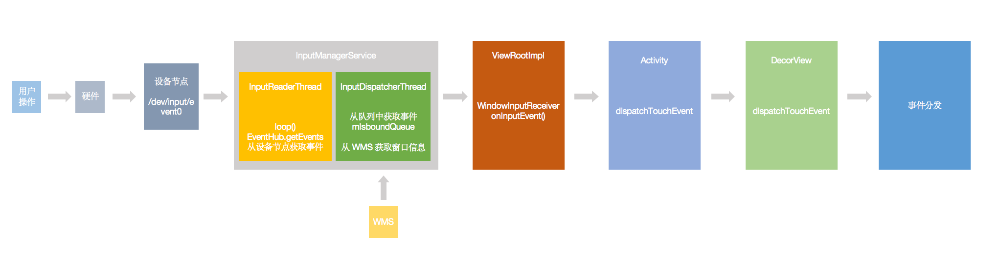

## 面试官带你学安卓 - 从安卓的事件分发说起
上篇文章我们站在面试官的角度学了 View 的绘制流程，这篇文章再来说说安卓的事件分发。   

### 一、题目层次
面试中提到安卓的事件分发，我们一般都能说到从 Activity -> Window -> DecorView -> ViewGroup -> View 的 dispatchTouchEvent 流程，这个是最基本的需要掌握的，由此能深入引出一些什么知识点呢？   
1. 事件是如何从屏幕点击最终到达 Activity 的？
2. CANCEL 事件什么时候会触发？
3. 如何解决滑动冲突？

### 二、题目详解
#### 2.1 安卓事件的分发
安卓的事件分发大概会经历 Activity -> PhoneWindow -> DecorView -> ViewGroup -> View 的 dispatchTouchEvent。   
其中 dispatchTouchEvent 用下面的一段伪代码就可以说明了，过程就不具体分析了，大家应该也都比较清晰。   
``` java
// 伪代码
public boolean dispatchTouchEvent() {
    boolean res = false;

    // 是否不允许拦截事件
    // 如果设置了 FLAG_DISALLOW_INTERCEPT，不会拦截事件，所以在 child 里可以通过 requestDisallowInterceptTouchEvent 控制父 View 是否来拦截事件
    final boolean disallowIntercept = (mGroupFlags & FLAG_DISALLOW_INTERCEPT) != 0;

    if (!disallowIntercept && onInterceptTouchEvent()) { // View 不调用这里，直接执行下面的 touchlistener 判断
        if (touchlistener && touchlistener.onTouch()) {
            return true;
        }
        res = onTouchEvent(); // 里面会处理点击事件 -> performClick() -> clicklistener.onClick()
    } else if (DOWN) { // 如果是 DOWN 事件，则遍历子 View 进行事件分发
        // 循环子 View 处理事件
        for (childs) {
            res = child.dispatchTouchEvent();
        }
    } else {
        // 事件分发给 target 去处理，这里的 target 就是上一步处理 DOWN 事件的 View
        target.child.dispatchTouchEvent();
    }
    return res;
}
```

#### 2.2 事件是如何到达 Activity 的
既然上面的事件分发是从 Activity 开始的，那事件是怎么到达 Activity 的呢？

总体流程大概是这样的：用户点击设备, linux 内核接受中断, 中断加工成输入事件数据写入对应的设备节点中, InputReader 会监控 /dev/input/ 下的所有设备节点, 当某个节点有数据可以读时，通过 EventHub 将原始事件取出来并翻译加工成输入事件，交给 InputDispatcher，InputDispatcher 根据 WMS 提供的窗口信息把事件交给合适的窗口,窗口 ViewRootImpl 派发事件

大体流程图如下：   


其中主要有几个阶段：
1. 硬件中断
2. InputManagerService 做的事情
3. InputReaderThread 做的事情
4. InputDispatcherThread 做的事情
5. WindowInputEventReceiver 做的事情

##### 2.2.1 硬件中断
硬件中断这里就简单介绍一些，操作系统对硬件事件的接收是通过中断来进行的。    
内核启动的时候会在中断描述符表中对中断类型以及对应的处理方法的地址进行注册。    
当有中断的时候，就会调用对应的处理方法，把对应的事件写入到设备节点里。   

##### 2.2.2 InputManagerService 做的事情
InputManagerService 是用来处理 Input 事件的，Java 侧的 InputManagerService 就是 C++ 代码的一个封装，以及提供了一些 callback 用来传递事件到 Java 层。   
我们看一下 native 侧的 InputManagerService 初始化代码。   
``` cpp
NativeInputManager::NativeInputManager(jobject contextObj,
        jobject serviceObj, const sp<Looper>& looper) :
        mLooper(looper), mInteractive(true) {
    // ...
    sp<EventHub> eventHub = new EventHub();
    mInputManager = new InputManager(eventHub, this, this);
}
```
主要做的两件事：
1. 初始化 EventHub
``` cpp
EventHub::EventHub(void) {
            // ...
    mINotifyFd = inotify_init();
    int result = inotify_add_watch(mINotifyFd, DEVICE_PATH, IN_DELETE | IN_CREATE);
    result = epoll_ctl(mEpollFd, EPOLL_CTL_ADD, mINotifyFd, &eventItem);
    result = epoll_ctl(mEpollFd, EPOLL_CTL_ADD, mWakeReadPipeFd, &eventItem);
}
```
EventHub 的作用是用来监控设备节点是否有更新。   
2. 初始化 InputManager
``` cpp
void InputManager::initialize() {
    mReaderThread = new InputReaderThread(mReader);
    mDispatcherThread = new InputDispatcherThread(mDispatcher);
}
```
InputManager 里初始化了 InputReaderThread 和 InputDispatcherThread 两个线程，一个用来读取事件，一个用来派发事件。  

##### 2.2.3 InputReaderThread 做的事情
``` cpp
bool InputReaderThread::threadLoop() {
    mReader->loopOnce();
    return true;
}

void InputReader::loopOnce() {
    // 从 EventHub 获取事件
    size_t count = mEventHub->getEvents(timeoutMillis, mEventBuffer, EVENT_BUFFER_SIZE);
    // 处理事件
    processEventsLocked(mEventBuffer, count);
    // 事件发送给 InputDispatcher 去做分发
    mQueuedListener->flush();
}
```
这里代码比较多，做一些省略。   
InputReaderThread 里做了三件事情：
1. 从 EventHub 获取事件
2. 处理事件，这里事件有不同的类型，会做不同的处理和封装
3. 把事件发送给 InputDispatcher   

##### 2.2.4 InputDispatcherThread 做的事情
``` cpp
bool InputDispatcherThread::threadLoop() {
    mDispatcher->dispatchOnce(); // 内部调用 dispatchOnceInnerLocked
    return true;
}

void InputDispatcher::dispatchOnceInnerLocked(nsecs_t* nextWakeupTime) {
    // 从队列中取出一个事件
    mPendingEvent = mInboundQueue.dequeueAtHead();
    // 根据不同的事件类型，进行不同的操作
    switch (mPendingEvent->type) {
    case EventEntry::TYPE_CONFIGURATION_CHANGED: {
        // ...
    case EventEntry::TYPE_DEVICE_RESET: {
        // ...
    case EventEntry::TYPE_KEY: {
        // ...
    case EventEntry::TYPE_MOTION: {
        // 派发事件
        done = dispatchMotionLocked(currentTime, typedEntry,
                &dropReason, nextWakeupTime);
        break;
    }
}
```
上面通过 dispatchMotionLocked 方法派发事件，具体的函数调用过程省略如下：
``` cpp
dispatchMotionLocked -> dispatchEventLocked -> prepareDispatchCycleLocked -> enqueueDispatchEntriesLocked -> startDispatchCycleLocked -> publishMotionEvent -> InputChannel.sendMessage
```
其中会找到当前合适的 Window，然后调用 InputChannel 去发送事件。   

这里的 InputChannel 对应的是 ViewRootImpl 里的 InputChannel。   
至于中间的怎么做的关联，这里就先不做分析，整个代码比较长，而且对于流程的掌握影响不大。    


##### 2.2.5 WindowInputEventReceiver 接受事件并进行分发
在 ViewRootImpl 里有一个 WindowInputEventReceiver 用来接受事件并进行分发。   
InputChannel 发送的事件最终都是通过 WindowInputEventReceiver 进行接受。   
WindowInputEventReceiver 是在 ViewRootImpl.setView 里面初始化的，setView 的调用是在 ActivityThread.handleResumeActivity -> WindowManagerGlobal.addView。   

``` java
    public void setView(View view, WindowManager.LayoutParams attrs, View panelParentView) {
        // ...
        if (mInputChannel != null) {
            if (mInputQueueCallback != null) {
                mInputQueue = new InputQueue();
                mInputQueueCallback.onInputQueueCreated(mInputQueue);
            }
            mInputEventReceiver = new WindowInputEventReceiver(mInputChannel,
                    Looper.myLooper());
        }
    }
```

``` java
public abstract class InputEventReceiver {
    // native 侧代码调用这个方法，把事件派发过来
    private void dispatchInputEvent(int seq, InputEvent event, int displayId) {
        mSeqMap.put(event.getSequenceNumber(), seq);
        onInputEvent(event, displayId);
    }
}

final class WindowInputEventReceiver extends InputEventReceiver {
    @Override
    public void onInputEvent(InputEvent event, int displayId) {
        // 事件接受
        enqueueInputEvent(event, this, 0, true);
    }
    // ...
}

void enqueueInputEvent(InputEvent event,
        InputEventReceiver receiver, int flags, boolean processImmediately) {
    // 是否要立即处理事件
    if (processImmediately) {
        doProcessInputEvents();
    } else {
        scheduleProcessInputEvents();
    }
}

void doProcessInputEvents() {
    // ...
    while (mPendingInputEventHead != null) {
        deliverInputEvent(q);
    }
    // ...
}

private void deliverInputEvent(QueuedInputEvent q) {
    // ...
    InputStage stage;
    if (q.shouldSendToSynthesizer()) {
        stage = mSyntheticInputStage;
    } else {
        stage = q.shouldSkipIme() ? mFirstPostImeInputStage : mFirstInputStage;
    }

    // 分发事件
    stage.deliver(q);
}
```
从上面的代码流程中，事件最终走到 InputStage.deliver 里。   
``` java
abstract class InputStage {
    public final void deliver(QueuedInputEvent q) {
        if ((q.mFlags & QueuedInputEvent.FLAG_FINISHED) != 0) {
            forward(q);
        } else if (shouldDropInputEvent(q)) {
            finish(q, false);
        } else {
            apply(q, onProcess(q));
        }
    }
}
```
在 deliver 里，最终调用 onProcess，实现是在 ViewPostImeInputStage。   
``` java
final class ViewPostImeInputStage extends InputStage {
    @Override
    protected int onProcess(QueuedInputEvent q) {
        if (q.mEvent instanceof KeyEvent) {
            return processKeyEvent(q);
        } else {
            final int source = q.mEvent.getSource();
            if ((source & InputDevice.SOURCE_CLASS_POINTER) != 0) {
                return processPointerEvent(q);
            } else if ((source & InputDevice.SOURCE_CLASS_TRACKBALL) != 0) {
                return processTrackballEvent(q);
            } else {
                return processGenericMotionEvent(q);
            }
        }
    }

    private int processPointerEvent(QueuedInputEvent q) {
        // 这里 mView 是 DecorView，调用到 DecorView.dispatchPointerEvent
        boolean handled = mView.dispatchPointerEvent(event);
        // ...
        return handled ? FINISH_HANDLED : FORWARD;
    }
}

// View.java
public final boolean dispatchPointerEvent(MotionEvent event) {
    if (event.isTouchEvent()) {
        return dispatchTouchEvent(event);
    } else {
        return dispatchGenericMotionEvent(event);
    }
}

// DecorView.java
public boolean dispatchTouchEvent(MotionEvent ev) {
    // 这里的 Callback 就是 Activity，是在 Activity.attach 里调用 mWindow.setCallback(this); 设置的
    final Window.Callback cb = mWindow.getCallback();
    return cb != null && !mWindow.isDestroyed() && mFeatureId < 0
            ? cb.dispatchTouchEvent(ev) : super.dispatchTouchEvent(ev);
}
```
通过上面一系列流程，最终就调用到 Activity.dispatchTouchEvent 里，也就是开始的流程了。   

通过上面的分析，我们基本上知道了事件从用户点击屏幕到 View 处理的过程了，就是下面这张图。   


#### 2.3 CANCEL 事件什么时候会触发
这个如果仔细看 dispatchTouchEvent 的代码的话，可以看到一些时机：
1. View 收到 ACTION_DOWN 事件以后，上一个事件还没有结束（可能因为 APP 的切换、ANR 等导致系统扔掉了后续的事件），这个时候会先执行一次 ACTION_CANCEL
``` java
// ViewGroup.dispatchTouchEvent()
public boolean dispatchTouchEvent(MotionEvent ev) {
    if (actionMasked == MotionEvent.ACTION_DOWN) {
        // Throw away all previous state when starting a new touch gesture.
        // The framework may have dropped the up or cancel event for the previous gesture
        // due to an app switch, ANR, or some other state change.
        cancelAndClearTouchTargets(ev);
        resetTouchState();
    }
}
```
2. 子 View 之前拦截了事件，但是后面父 View 重新拦截了事件，这个时候会给子 View 发送 ACTION_CANCEL 事件
``` java
// ViewGroup.dispatchTouchEvent()
public boolean dispatchTouchEvent(MotionEvent ev) {
    if (mFirstTouchTarget == null) {
    } else {
        // 有子 View 获取了事件
        TouchTarget target = mFirstTouchTarget;
        while (target != null) {
            final TouchTarget next = target.next;
            final boolean cancelChild = resetCancelNextUpFlag(target.child)
                    || intercepted;
            // 父 View 此时如果拦截了事件，cancelChild 是 true
            if (dispatchTransformedTouchEvent(ev, cancelChild,
                    target.child, target.pointerIdBits)) {
                handled = true;
            }
        }
    }
}

private boolean dispatchTransformedTouchEvent(MotionEvent event, boolean cancel,
        View child, int desiredPointerIdBits) {
    final int oldAction = event.getAction();
    // 如果 cancel 是 true，则发送 ACTION_CANCEL 事件
    if (cancel || oldAction == MotionEvent.ACTION_CANCEL) {
        event.setAction(MotionEvent.ACTION_CANCEL);
        if (child == null) {
            handled = super.dispatchTouchEvent(event);
        } else {
            handled = child.dispatchTouchEvent(event);
        }
        event.setAction(oldAction);
        return handled;
    }
}
```

#### 2.4 如何解决滑动冲突
这个也是老生常谈的一个问题了，主要就是两个方法：
1. 通过重写父类的 onInterceptTouchEvent 来拦截滑动事件   
2. 通过在子类中调用 parent.requestDisallowInterceptTouchEvent 来通知父类是否要拦截事件，requestDisallowInterceptTouchEvent 会设置 FLAG_DISALLOW_INTERCEPT 标志，这个在最开始的伪代码那里做过介绍   

### 三、总结
上面就是从 View 事件分发引申出的一些问题，简单的解答如下：    
1. View 事件分发
``` java
// 伪代码
public boolean dispatchTouchEvent() {
    boolean res = false;

    // 是否不允许拦截事件
    // 如果设置了 FLAG_DISALLOW_INTERCEPT，不会拦截事件，所以在 child 里可以通过 requestDisallowInterceptTouchEvent 控制父 View 是否来拦截事件
    final boolean disallowIntercept = (mGroupFlags & FLAG_DISALLOW_INTERCEPT) != 0;

    if (!disallowIntercept && onInterceptTouchEvent()) { // View 不调用这里，直接执行下面的 touchlistener 判断
        if (touchlistener && touchlistener.onTouch()) {
            return true;
        }
        res = onTouchEvent(); // 里面会处理点击事件 -> performClick() -> clicklistener.onClick()
    } else if (DOWN) { // 如果是 DOWN 事件，则遍历子 View 进行事件分发
        // 循环子 View 处理事件
        for (childs) {
            res = child.dispatchTouchEvent();
        }
    } else {
        // 事件分发给 target 去处理，这里的 target 就是上一步处理 DOWN 事件的 View
        target.child.dispatchTouchEvent();
    }
    return res;
}
```

2. 事件是如何从屏幕点击最终到达 Activity 的？


3. CANCEL 事件什么时候会触发？
* View 收到 ACTION_DOWN 事件以后，上一个事件还没有结束（可能因为 APP 的切换、ANR 等导致系统扔掉了后续的事件），这个时候会先执行一次 ACTION_CANCEL
* 子 View 之前拦截了事件，但是后面父 View 重新拦截了事件，这个时候会给子 View 发送 ACTION_CANCEL 事件

4. 如何解决滑动冲突？
* 通过重写父类的 onInterceptTouchEvent 来拦截滑动事件   
* 通过在子类中调用 parent.requestDisallowInterceptTouchEvent 来通知父类是否要拦截事件   