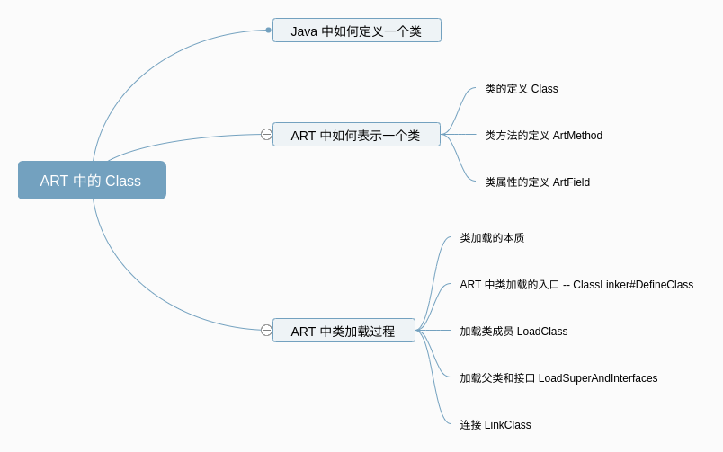
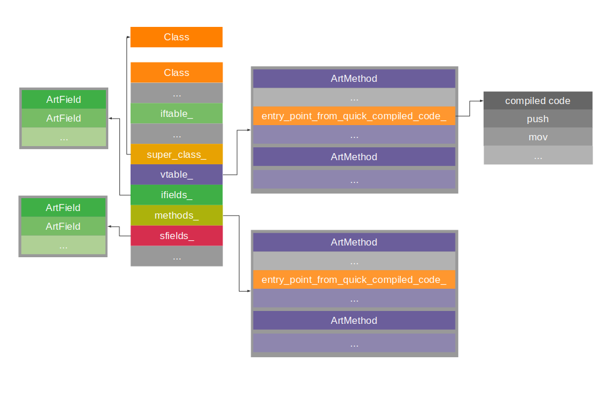

### 脱了马甲我也认识你: 聊聊 Android 中类的真实形态

【**这是 ZY 第 19 篇原创技术文章**】   

我们在平时开发过程中，一定定义过无数个千奇百怪的类，但是大家有想过，一个 Java 文件中的 Class，在虚拟机中的真实形态是什么么？   

这篇文章就带大家探讨一下在 Android ART 里，类的**真实形态**，以及**类加载的过程**。   

> 本文基于 [ART-8.0.0_r1](https://android.googlesource.com/platform/art/+/refs/tags/android-8.0.0_r1) 分支代码进行分析

### 预备知识
1. 了解 Java 基本开发
2. 了解 ClassLoader 基本使用

### 看完本文可以达到什么程度
1. 了解 Android ART 中类的存在形式
2. 了解 Android ART 中类加载的过程

### 阅读前准备工作
1. 下载 [ART 源码](https://android.googlesource.com/platform/art/) 作为参照

### 文章概览


### 一、在 Java 中如何定义一个类
对于如何在 Java 代码中定义一个类，我们一定非常熟悉了，代码如下：   
``` java
class MInterface {
    void imethod() {
    }
}

class Parent {
}

class Child extends Parent implements MInterface {
}
```

### 二、ART 中如何表示一个 Java 类
那么对于一个 Java 类，在 ART 中是如何表示的呢？   
在 ART 中，也定义了一个 Class 类，用来表示 Java 世界中的类。   
当然，这个类是 c++ 定义的，毕竟 ART 就是 c++ 实现的。　　　

下面这张图展示了 ART 中类的重要部分。  


下面我们就看看这个 Class 的具体定义：
#### 2.1 类的定义
``` java
// C++ mirror of java.lang.Class
class MANAGED Class FINAL : public Object {
 private:
  // 指向定义 Class 的 ClassLoader，如果为 null，说明是 bootstrap system loader
  HeapReference<ClassLoader> class_loader_;
  // 对于数组类型有用，保存了数组的原始类型，比如 对于 String[]，这里指向的是 String
  // 对非数组类型，值为 null
  HeapReference<Class> component_type_;
  // 指向 DexCache，如果是运行时生成的 Class，值为 null
  HeapReference<DexCache> dex_cache_;
  HeapReference<ClassExt> ext_data_;
  // interface table，接口方法表，IfTable 中保存了接口类指针和方法表指针
  HeapReference<IfTable> iftable_;
  // Descriptor for the class such as "java.lang.Class" or "[C". Lazily initialized by ComputeName
  // 类描述符 eg: java.lang.Class 或者 [C
  HeapReference<String> name_;
  // 父类，如果是 java.lang.Object 值为 null
  HeapReference<Class> super_class_;
  // 虚方法表，"invoke-virtual" 指令会用到，用来保存父类虚方法以及自身虚方法
  HeapReference<PointerArray> vtable_;
  // 保存类属性，只保存自身属性
  uint64_t ifields_;
  // 指向 ArtMethod 数组，保存了所有的方法，包括私有方法，静态方法，final 方法，虚方法和继承的方法
  uint64_t methods_;
  // 保存静态属性
  uint64_t sfields_;
  // 访问修饰符
  uint32_t access_flags_;
  uint32_t class_flags_;
  // 类实例大小，GC 时使用
  uint32_t class_size_;
  // 线程 id，类加载时加锁使用
  pid_t clinit_thread_id_;
  // ClassDex 在 DEX 文件中的 index
  int32_t dex_class_def_idx_;
  // DEX 文件中的类型 id
  int32_t dex_type_idx_;
  // 实例属性数量
  uint32_t num_reference_instance_fields_;
  // 静态变量数量
  uint32_t num_reference_static_fields_;
  // 对象大小，GC 时使用
  uint32_t object_size_;
  uint32_t object_size_alloc_fast_path_;
  uint32_t primitive_type_;
  // ifields 的偏移量
  uint32_t reference_instance_offsets_;
  // 类初始化状态
  Status status_;
  // methods_ 中第一个从接口中复制的虚方法的偏移
  uint16_t copied_methods_offset_;
  // methods_ 中第一个自身定义的虚方法的偏移
  uint16_t virtual_methods_offset_;
  // java.lang.Class
  static GcRoot<Class> java_lang_Class_;
};
```
上面的类就是 Java 类在 ART 中的真实形态，各个属性在上面做了注释。   
这里对几个比较重要的属性再做一下解释。   

和 Java 类方法有关的两个属性是 `iftable_，vtable_` 和 `methods_`。      
其中 `iftable_` 保存的是接口中的方法，`vtable_` 保存的是虚方法，`methods_` 保存的是所有方法。  
什么是虚方法呢？虚方法其实是 C++ 中的概念，在 C++ 中，被 `virtual` 关键字修饰的方法就是虚方法。   
而在 Java 中，我们可以理解为所有子类复写的方法都是虚方法。   

和 Java 类属性有关的两个属性是 `ifields_` 和 `sfields_`。分别保存的是类的实例属性和静态属性。  

从上面的我们可以看到，Java 类的属性就都保存在 ART 中定义的 Class 里了。   
其中方法最终会指向 ArtMethod 实例上，属性，最终会指向 ArtField 实例上。   

#### 2.2 类方法的定义
在 ART 中，一个 Java 的类方法是用 ArtMethod 实例来表示的。   
ArtMethod 结构如下：   
``` java
class ArtMethod FINAL {
 protected:
  // 定义此方法的类
  GcRoot<mirror::Class> declaring_class_;
  // 访问修饰符
  std::atomic<std::uint32_t> access_flags_;
  // 方法 code 在 dex 中的偏移
  uint32_t dex_code_item_offset_;
  // 方法在 dex 中的 index
  uint32_t dex_method_index_;
  // 方法 index，对于虚方法，指的是 vtable 中的 index，对于接口方法，指的是 ifTable 中的 index
  uint16_t method_index_;
  // 方法的热度计数，Jit 会根据此变量决定是否将方法进行编译
  uint16_t hotness_count_;
  struct PtrSizedFields {
    ArtMethod** dex_cache_resolved_methods_;
    void* data_;
    // 方法的入口
    void* entry_point_from_quick_compiled_code_;
  } ptr_sized_fields_;
}
```

#### 2.3 类属性的定义
在 ART 中，一个 Java 类属性是用 ArtField 实例来表示的。   
ArtField 结构如下：   
``` java
class ArtField FINAL {
 private:
  // 定义此属性的类
  GcRoot<mirror::Class> declaring_class_;
  // 访问修饰符
  uint32_t access_flags_ = 0;
  // 变量在 dex 中的 id
  uint32_t field_dex_idx_ = 0;
  // 此变量在类或者类实例中的偏移
  uint32_t offset_ = 0;
}
```

### 三、ART 中加载类的过程
#### 3.1 类加载的本质
在 Java 中定义好一个类之后，还需要通过 ClassLoader 进行加载。   
我们经常会说到类加载，但是类加载的本质是什么呢？    
在我们上面了解了一个 Java 类在 ART 中的真实形态以后，我们就比较容易理解类加载的本质了。   
我们都知道，Java 文件编译完成的产物是 .class 文件，在 Android 中是 .dex 文件，类加载的本质就是解析 .class / .dex 文件，并根据对应的信息生成 ArtField，ArtMethod，最后生成 Class 实例。   
再简单点来说，类加载的本质就是根据 .dex 文件内容创建 Class 实例。

#### 3.2 ART 中类加载的入口 -- ClassLinker#DefineClass
在 Android 中，常见的两个 ClassLoader 就是 PathClassLoader 和 DexClassLoader，都是继承了 BaseDexClassLoader，我们就从 `BaseDexClassLoader#findClass` 开始看一下整个加载的流程。
``` java
// BaseDexClassLoader#findClass
protected Class<?> findClass(String name) throws ClassNotFoundException {
    List<Throwable> suppressedExceptions = new ArrayList<Throwable>();
    Class c = pathList.findClass(name, suppressedExceptions);
    // ...
    return c;
}
// DexPathList#findClass
public Class<?> findClass(String name, List<Throwable> suppressed) {
    for (Element element : dexElements) {
        Class<?> clazz = element.findClass(name, definingContext, suppressed);
        if (clazz != null) {
            return clazz;
        }
    }
    // ...
    return null;
}
// Element#findCLass
public Class<?> findClass(String name, ClassLoader definingContext,
        List<Throwable> suppressed) {
    return dexFile != null ? dexFile.loadClassBinaryName(name, definingContext, suppressed)
            : null;
}
```

从上面的代码来看，`BaseDexClassLoader#findClass` 一路调用，调用到 `DexFile#loadClassBinaryName`，我们再继续往下看。
``` java
// DexFile
public Class loadClassBinaryName(String name, ClassLoader loader, List<Throwable> suppressed) {
    return defineClass(name, loader, mCookie, this, suppressed);
}

private static Class defineClass(String name, ClassLoader loader, Object cookie,
                                 DexFile dexFile, List<Throwable> suppressed) {
    Class result = null;
    try {
        result = defineClassNative(name, loader, cookie, dexFile);
    } catch (NoClassDefFoundError e) {
        if (suppressed != null) {
            suppressed.add(e);
        }
    } catch (ClassNotFoundException e) {
        if (suppressed != null) {
            suppressed.add(e);
        }
    }
    return result;
}
```
在 DexFile 里，最终调用到 `defineClassNative` 方法去加载 Class，对应到 JNI 中的方法是 `DexFile_defineClassNative`，位于 runtime/native/dalvik_system_DexFile.cc 文件中。   
``` c++
static jclass DexFile_defineClassNative(JNIEnv* env,
                                        jclass,
                                        jstring javaName,
                                        jobject javaLoader,
                                        jobject cookie,
                                        jobject dexFile) {
  // 调用
  for (auto& dex_file : dex_files) {
      ObjPtr<mirror::Class> result = class_linker->DefineClass(soa.Self(),
                                                               descriptor.c_str(),
                                                               hash,
                                                               class_loader,
                                                               *dex_file,
                                                               *dex_class_def);
  }
}
```
而在 `defineClassNative` 中，又是调用 `ClassLinker#DefineClass` 去加载类的。   
所以我们可以说，`ClassLinker#DefineClass` 就是 ART 中类加载的入口。   
入口已经出现，我们就进去探索一番，看看类加载的时候，是如何创建 Class 实例的～    

DefineClass 本身代码比较多，我们这里把代码简化一下，看其主要流程。   
``` java
mirror::Class* ClassLinker::DefineClass(Thread* self,
                                        const char* descriptor,
                                        size_t hash,
                                        Handle<mirror::ClassLoader> class_loader,
                                        const DexFile& dex_file,
                                        const DexFile::ClassDef& dex_class_def) {
  auto klass = hs.NewHandle<mirror::Class>(nullptr);

  // 一些常用的，并且类大小可以确定的，会提前构造好对应的 Class，所以这里直接使用
  if (UNLIKELY(!init_done_)) {
    // finish up init of hand crafted class_roots_
    if (strcmp(descriptor, "Ljava/lang/Object;") == 0) {
      klass.Assign(GetClassRoot(kJavaLangObject));
    } else if (strcmp(descriptor, "Ljava/lang/Class;") == 0) {
      klass.Assign(GetClassRoot(kJavaLangClass));
    } else if (strcmp(descriptor, "Ljava/lang/String;") == 0) {
      klass.Assign(GetClassRoot(kJavaLangString));
    } else if (strcmp(descriptor, "Ljava/lang/ref/Reference;") == 0) {
      klass.Assign(GetClassRoot(kJavaLangRefReference));
    } else if (strcmp(descriptor, "Ljava/lang/DexCache;") == 0) {
      klass.Assign(GetClassRoot(kJavaLangDexCache));
    } else if (strcmp(descriptor, "Ldalvik/system/ClassExt;") == 0) {
      klass.Assign(GetClassRoot(kDalvikSystemClassExt));
    }
  }

  if (klass == nullptr) {
    // 创建其他类实例
    klass.Assign(AllocClass(self, SizeOfClassWithoutEmbeddedTables(dex_file, dex_class_def)));
  }
  // 设置对应的 DEX 缓存
  klass->SetDexCache(dex_cache);
  // 设置 Class 的一些属性，包括 ClassLoader，访问修饰符，Class 在 DEX 中对应的 index 等等
  SetupClass(*new_dex_file, *new_class_def, klass, class_loader.Get());

  // 把 Class 插入 ClassLoader 的 class_table 中做一个缓存
  ObjPtr<mirror::Class> existing = InsertClass(descriptor, klass.Get(), hash);
  // 加载类属性
  LoadClass(self, *new_dex_file, *new_class_def, klass);
  // 加载父类
  if (!LoadSuperAndInterfaces(klass, *new_dex_file)) {
      // 加载失败的处理
  }

  if (!LinkClass(self, descriptor, klass, interfaces, &h_new_class)) {
      // 连接失败的处理
  }
  // ...
  return h_new_class.Get();
}
```
从上面 DefineClass 的代码里我们可以看到，加载分为几个步骤：   
1. 创建类实例
2. 设置 Class 访问修饰符，ClassLoader 等一些属性
3. 加载类成员 LoadClass
4. 加载父类和接口 LoadSuperAndInterfaces
5. 连接 LinkClass

下面我们主要看下后面加载类成员，加载父类，连接这三个步骤。  

#### 3.3 加载类成员 LoadClass
加载类成员这一过程，主要有下面几个步骤：
1. 加载静态变量
2. 加载实例变量
3. 加载方法，分为虚方法和非虚方法
由于这里代码比较长，我们分段来看。

##### 3.3.1 加载静态变量
``` java
// class_linker.cc
void ClassLinker::LoadClassMembers(Thread* self,
                                   const DexFile& dex_file,
                                   const uint8_t* class_data,
                                   Handle<mirror::Class> klass) {
  {
    // Load static fields.
    // 获取 DEX 文件中的变量迭代器
    ClassDataItemIterator it(dex_file, class_data);
    LengthPrefixedArray<ArtField>* sfields = AllocArtFieldArray(self,
                                                                allocator,
                                                                it.NumStaticFields());
    // ...
    // 遍历静态变量
    for (; it.HasNextStaticField(); it.Next()) {
      // ...
      LoadField(it, klass, &sfields->At(num_sfields));
    }

    // ...
    klass->SetSFieldsPtr(sfields);
  }
}

// 加载变量，设置变量 Class 以及访问修饰符
void ClassLinker::LoadField(const ClassDataItemIterator& it,
                            Handle<mirror::Class> klass,
                            ArtField* dst) {
  const uint32_t field_idx = it.GetMemberIndex();
  dst->SetDexFieldIndex(field_idx);
  dst->SetDeclaringClass(klass.Get());
  dst->SetAccessFlags(it.GetFieldAccessFlags());
}
```
加载静态变量时，取出 DEX 文件中对应的 Class 数据，遍历其中的静态变量，设置给 `Class#sfield_` 变量。  

##### 3.3.2 加载实例变量
加载实例变量和加载静态变量是类似的，这里不做过多的解读了。   
``` java
void ClassLinker::LoadClassMembers(Thread* self,
                                   const DexFile& dex_file,
                                   const uint8_t* class_data,
                                   Handle<mirror::Class> klass) {
  {
    // Load instance fields.
    LengthPrefixedArray<ArtField>* ifields = AllocArtFieldArray(self,
                                                                allocator,
                                                                it.NumInstanceFields());
    for (; it.HasNextInstanceField(); it.Next()) {
        LoadField(it, klass, &ifields->At(num_ifields));
    }
    // ...
    klass->SetIFieldsPtr(ifields);
  }
}
```

##### 3.3.3 加载方法
``` java
void ClassLinker::LoadClassMembers(Thread* self,
                                   const DexFile& dex_file,
                                   const uint8_t* class_data,
                                   Handle<mirror::Class> klass) {
  {
    for (size_t i = 0; it.HasNextDirectMethod(); i++, it.Next()) {
      ArtMethod* method = klass->GetDirectMethodUnchecked(i, image_pointer_size_);
      LoadMethod(dex_file, it, klass, method);
      LinkCode(this, method, oat_class_ptr, class_def_method_index);
      // ...
    }
    for (size_t i = 0; it.HasNextVirtualMethod(); i++, it.Next()) {
      ArtMethod* method = klass->GetVirtualMethodUnchecked(i, image_pointer_size_);
      LoadMethod(dex_file, it, klass, method);
      LinkCode(this, method, oat_class_ptr, class_def_method_index);
      // ...
    }
  }
}
```
加载方法时分为两个步骤，LoadMethod 和 LinkCode。   
``` java
void ClassLinker::LoadMethod(const DexFile& dex_file,
                             const ClassDataItemIterator& it,
                             Handle<mirror::Class> klass,
                             ArtMethod* dst) {
  // ...
  dst->SetDexMethodIndex(dex_method_idx);
  dst->SetDeclaringClass(klass.Get());
  dst->SetCodeItemOffset(it.GetMethodCodeItemOffset());

  dst->SetDexCacheResolvedMethods(klass->GetDexCache()->GetResolvedMethods(), image_pointer_size_);

  uint32_t access_flags = it.GetMethodAccessFlags();
  // ...
  dst->SetAccessFlags(access_flags);
}
```
LoadMethod 主要是给 ArtMethod 设置访问修饰符等属性。

LinkCode 这一步骤，可以理解为是给 ArtMethod 设置方法入口，即从其他方法如何跳转到此方法进行执行。这里也分为了几种情况：
1. 如果此方法已经通过 OAT 编译成了本地机器指令，那么这里会将入口设置为跳转到本地机器指令执行
2. 如果是静态方法，设置跳板方法，此时不会具体指定方法如何执行，后面会在 `ClassLinker::InitializeClass` 里被 `ClassLinker::FixupStaticTrampolines` 替换掉
3. 如果是 Native 方法，入口设置为跳转到 JNI 动态连接的方法中
4. 如果是解释模式，入口设置为跳转到解释器中
``` java
static void LinkCode(ClassLinker* class_linker,
                     ArtMethod* method,
                     const OatFile::OatClass* oat_class,
                     uint32_t class_def_method_index) REQUIRES_SHARED(Locks::mutator_lock_) {
  if (oat_class != nullptr) {
    // 判断方法是否已经被 OAT 
    const OatFile::OatMethod oat_method = oat_class->GetOatMethod(class_def_method_index);
    oat_method.LinkMethod(method);
  }

  // Install entry point from interpreter.
  const void* quick_code = method->GetEntryPointFromQuickCompiledCode();
  bool enter_interpreter = class_linker->ShouldUseInterpreterEntrypoint(method, quick_code);

  if (method->IsStatic() && !method->IsConstructor()) {
    // 对于静态方法，后面会在 ClassLinker::InitializeClass 里被 ClassLinker::FixupStaticTrampolines 替换掉
    method->SetEntryPointFromQuickCompiledCode(GetQuickResolutionStub());
  } else if (quick_code == nullptr && method->IsNative()) {
    // Native 方法跳转到 JNI
    method->SetEntryPointFromQuickCompiledCode(GetQuickGenericJniStub());
  } else if (enter_interpreter) {
    // 解释模式，跳转到解释器
    method->SetEntryPointFromQuickCompiledCode(GetQuickToInterpreterBridge());
  }
  // ...
}
```
这就是解析方法的主要过程，关于方法的调用，其实还比较复杂，如果大家感兴趣，后面可以再专门说说。   

#### 3.4 加载父类和接口 LoadSuperAndInterfaces
自身类成员加载完成后，就去加载父类。加载父类调用的是 `LoadSuperAndInterfaces`，主要代码如下：   
``` java
bool ClassLinker::LoadSuperAndInterfaces(Handle<mirror::Class> klass, const DexFile& dex_file) {
    // 加载父类
    ObjPtr<mirror::Class> super_class = ResolveType(dex_file, super_class_idx, klass.Get());
    // 检查父类可见性
    if (!klass->CanAccess(super_class)) {
        // ...
    }
    // 设置父类
    klass->SetSuperClass(super_class);
    // 加载接口
    const DexFile::TypeList* interfaces = dex_file.GetInterfacesList(class_def);
    for (size_t i = 0; i < interfaces->Size(); i++) {
      ObjPtr<mirror::Class> interface = ResolveType(dex_file, idx, klass.Get());
      // ...
      // 检查接口可见性
      if (!klass->CanAccess(interface)) {
      }
    }
    // 此时说明类已经加载完毕了
    mirror::Class::SetStatus(klass, mirror::Class::kStatusLoaded, nullptr);
}
```
加载父类和接口都是通过 ResolveType 来的，ResolveType 中又是调用了 `ClassLinker#FindClass` -> `ClassLinker#DefineClass` 来的，于是加载父类的流程又回到了我们本小结开头。   
就这样递归加载下去，直到父类全部加载完成，也就标识着类自身也加载完成了。   

#### 3.5 连接 LinkClass
之后就是 LinkClass，这里步骤比较清晰，我们先看一下主要代码：
``` java
bool ClassLinker::LinkClass(Thread* self,
                            const char* descriptor,
                            Handle<mirror::Class> klass,
                            Handle<mirror::ObjectArray<mirror::Class>> interfaces,
                            MutableHandle<mirror::Class>* h_new_class_out) {
  if (!LinkSuperClass(klass)) {
    return false;
  }
  // ...
  if (!LinkMethods(self, klass, interfaces, &new_conflict, imt_data)) {
    return false;
  }
  if (!LinkInstanceFields(self, klass)) {
    return false;
  }
  size_t class_size;
  if (!LinkStaticFields(self, klass, &class_size)) {
    return false;
  }
  // ...
  return true;
}
```
从主要代码中可以看到，主要有四个步骤：
1. LinkSuperClass
2. LinkMethods
3. LinkInstanceFields
4. LinkStaticFields

##### 3.5.1 LinkSuperClass
这里主要是对父类权限做了一下检查，包括是否是 final，是否对子类可见（父类为 public 或者同包名），以及继承父类一些属性（包括是否有 finalize　方法，ClassFlags 等等）。
``` java
bool ClassLinker::LinkSuperClass(Handle<mirror::Class> klass) {
  ObjPtr<mirror::Class> super = klass->GetSuperClass();
  // 
  // Verify
  if (super->IsFinal() || super->IsInterface()) {
  }
  if (!klass->CanAccess(super)) {
  }
  if (super->IsFinalizable()) {
    klass->SetFinalizable();
  }
  if (super->IsClassLoaderClass()) {
    klass->SetClassLoaderClass();
  }
  uint32_t reference_flags = (super->GetClassFlags() & mirror::kClassFlagReference);
  klass->SetClassFlags(klass->GetClassFlags() | reference_flags);
  return true;
}
```

##### 3.5.1 LinkMethods
LinkMethods 主要做的事情是填充 vtable 和 itable。主要通过 `SetupInterfaceLookupTable，LinkVirtualMethods，LinkInterfaceMethods` 三个方法来进行的：
``` java
bool ClassLinker::LinkMethods(Thread* self,
                              Handle<mirror::Class> klass,
                              Handle<mirror::ObjectArray<mirror::Class>> interfaces,
                              bool* out_new_conflict,
                              ArtMethod** out_imt) {
  // ...
  return SetupInterfaceLookupTable(self, klass, interfaces)
          && LinkVirtualMethods(self, klass, /*out*/ &default_translations)
          && LinkInterfaceMethods(self, klass, default_translations, out_new_conflict, out_imt);
}
```
**SetupInterfaceLookupTable** 用来填充 `iftable_`，就是上面说到保存接口的地方。`iftable_` 对应的是 IfTable 类。IfTable 类结构如下：
``` java
class MANAGED IfTable FINAL : public ObjectArray<Object> {
  enum {
    // Points to the interface class.
    kInterface   = 0,
    // Method pointers into the vtable, allow fast map from interface method index to concrete
    // instance method.
    kMethodArray = 1,
    kMax         = 2,
  };
}
```
其中 `kInterface` 指向 Interface 的 Class 对象，`kMethodArray` 指向的是 vtable，通过此变量可以方便的找到接口方法的实现。   

LinkVirtualMethods 和 LinkInterfaceMethods 会填充 vtable_，这里具体的代码很长，我们暂且不分析（这里具体流程对于理解本文主旨其实影响不大），有两个重要的过程是：
1. 首先会拷贝父类的 vtable 到当前类的 vtable  
2. 如果类中覆盖了父类的抽象方法，就在 vtable 中替换掉父类的方法    

通过上面两个过程，我们可以知道，vtable 中保存的就是真正方法的实现，也就是 Java 中多态的实现原理。

##### 3.5.2 LinkInstanceFields & LinkStaticFields
这里的两个方法最终都调用了 LinkFields　方法里做了两件事情：
1. 为了对齐内存，对 fields 进行排序
2. 计算 Class 大小

其中 fields 排序规则如下：    
引用类型 -> long (64-bit) -> double (64-bit) -> int (32-bit) -> float (32-bit) -> char (16-bit) -> short (16-bit) -> boolean (8-bit) -> byte (8-bit)

### 总结
通过上面的分析，我们知道了一个 Java 类在 Android ART 中的真实形态，也对 ART 中类加载的过程做了一些简单的分析。    
其实在写这篇文章的时候，里面有一些知识点也会有些疑问，如果大家有任何想法，欢迎讨论~   
最后用文章开始的图总结一下，回顾一下 ART 中类的全貌。   


### 参考资料
https://www.zhihu.com/question/48135628   
https://blog.csdn.net/guoguodaern/article/details/60878829   

### 关于我
**ZYLAB** 专注高质量原创，把代码写成诗    

欢迎关注下面账号，获取更新：   
[微信搜索公众号: ZYLAB](./images/ZYLAB.jpg)   
[Github](https://github.com/5A59)    
[知乎](https://www.zhihu.com/people/5a59/activities)      
[掘金](https://juejin.im/user/58d9d015ac502e0058df1f96)   
