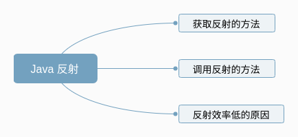
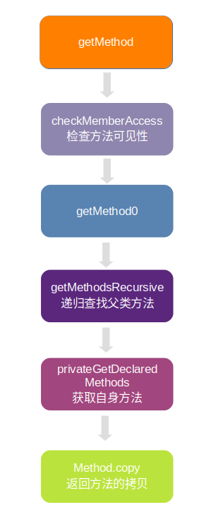
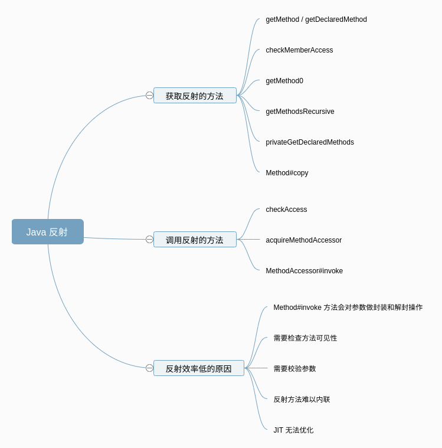

### 面试官问：大家都说 Java 反射效率低，你知道原因在哪里么

【**这是 ZY 第 17 篇原创技术文章**】   

### 预备知识
1. 了解 Java 反射基本用法

### 看完本文可以达到什么程度
1. 了解 Java 反射原理及 Java 反射效率低的原因

### 文章概览


我们在 Java 开发中，难免会接触到反射，而在一些框架中，反射的运用更是常见。我相信，每次提到反射，大家的第一反应一定是反射效率低，尽量少使用。   
但是反射的效率到底低多少？反射效率低的原因在哪里？   
这篇文章就来探索一下这些问题。   
由于本机上安装的是 openjdk 12，所以这里就使用 openjdk 12 源码进行分析。   

我们先看结论，然后分析一下 Java 反射的原理，过程中大家可以根据结论，对源码做一些思考，然后再根据原理中的一些实现，看看 Java 反射效率低的原因。   

### 零、先放结论
Java 反射效率低主要原因是：
1. Method#invoke 方法会对参数做封装和解封操作
2. 需要检查方法可见性
3. 需要校验参数
4. 反射方法难以内联
5. JIT 无法优化

### 一、Java 反射原理--获取要反射的方法
#### 1.1 反射的使用
我们先来看看 Java 反射使用的一段代码：
``` java
public class RefTest {
    public static void main(String[] args) {
        try {
            Class clazz = Class.forName("com.zy.java.RefTest");
            Object refTest = clazz.newInstance();
            Method method = clazz.getDeclaredMethod("refMethod");
            method.invoke(refTest);
        } catch (Exception e) {
            e.printStackTrace();
        }
    }

    public void refMethod() {
    }
}
```
我们在调用反射时，首先会创建 Class 对象，然后获取其 Method 对象，调用 invoke 方法。   
获取反射方法时，有两个方法，`getMethod` 和 `getDeclaredMethod`，我们就从这两个方法开始，一步步看下反射的原理。  
接下来就进入代码分析，大家做好准备。   

#### 1.2 getMethod / getDeclaredMethod
这里我们先整体看一下 getMethod 和 getDeclaredMethod 的实现。   
``` java
class Class {
    @CallerSensitive
    public Method getMethod(String name, Class<?>... parameterTypes)
        throws NoSuchMethodException, SecurityException {
        Objects.requireNonNull(name);
        SecurityManager sm = System.getSecurityManager();
        if (sm != null) {
            // 1. 检查方法权限
            checkMemberAccess(sm, Member.PUBLIC, Reflection.getCallerClass(), true);
        }
        // 2. 获取方法
        Method method = getMethod0(name, parameterTypes);
        if (method == null) {
            throw new NoSuchMethodException(methodToString(name, parameterTypes));
        }
        // 3. 返回方法的拷贝
        return getReflectionFactory().copyMethod(method);
    }

    @CallerSensitive
    public Method getDeclaredMethod(String name, Class<?>... parameterTypes)
        throws NoSuchMethodException, SecurityException {
        Objects.requireNonNull(name);
        SecurityManager sm = System.getSecurityManager();
        if (sm != null) {
            // 1. 检查方法是权限
            checkMemberAccess(sm, Member.DECLARED, Reflection.getCallerClass(), true);
        }
        // 2. 获取方法
        Method method = searchMethods(privateGetDeclaredMethods(false), name, parameterTypes);
        if (method == null) {
            throw new NoSuchMethodException(methodToString(name, parameterTypes));
        }
        // 3. 返回方法的拷贝
        return getReflectionFactory().copyMethod(method);
    }
}
```
从上面的代码，我们可以看到，获取方法的流程分三步走：   
1. 检查方法权限
2. 获取方法 Method 对象
3. 返回方法的拷贝

这里主要有两个区别：   
1. getMethod 中 checkMemberAccess 传入的是 `Member.PUBLIC`，而 getDeclaredMethod 传入的是 `Member.DECLARED`
这两个值有什么区别呢？我们看下代码中的注释：
``` java
interface Member {
    /**
     * Identifies the set of all public members of a class or interface,
     * including inherited members.
     */
    public static final int PUBLIC = 0;

    /**
     * Identifies the set of declared members of a class or interface.
     * Inherited members are not included.
     */
    public static final int DECLARED = 1;
}
```
注释里清楚的解释了 PUBLIC 和 DECLARED 的不同，PUBLIC 会包括所有的 public 方法，包括父类的方法，而 DECLARED 会包括所有自己定义的方法，public，protected，private 都在此，但是不包括父类的方法。   
这也正是 getMethod 和 getDeclaredMethod 的区别。  
2. `getMethod` 中获取方法调用的是 `getMethod0`，而 `getDeclaredMethod` 获取方法调用的是 `privateGetDeclaredMethods`
关于这个区别，这里简单提及一下，后面具体分析代码。   
privateGetDeclaredMethods 是获取类自身定义的方法，参数是 boolean publicOnly，表示是否只获取公共方法。
``` java
private Method[] privateGetDeclaredMethods(boolean publicOnly) {
    //...
}
```
而 getMethod0 会递归查找父类的方法，其中会调用到 privateGetDeclaredMethods 方法。   

既然我们上面看了 getMethod 和 getDeclaredMethod 的区别，我们自然选择 getMethod 方法进行分析，这样可以走到整个流程。   

#### 1.3 getMethod 方法
getMethod 方法流程如下图：
  

``` java
class Class {
    public Method getMethod(String name, Class<?>... parameterTypes)
        throws NoSuchMethodException, SecurityException {
        Objects.requireNonNull(name);
        SecurityManager sm = System.getSecurityManager();
        if (sm != null) {
            // 1. 检查方法权限
            checkMemberAccess(sm, Member.PUBLIC, Reflection.getCallerClass(), true);
        }
        // 2. 获取方法 Method 对象
        Method method = getMethod0(name, parameterTypes);
        if (method == null) {
            throw new NoSuchMethodException(methodToString(name, parameterTypes));
        }
        // 3. 返回方法拷贝
        return getReflectionFactory().copyMethod(method);
    }
}
```
我们上面说到获取方法分三步走：
1. 检查方法权限
2. 获取方法 Method 对象
3. 返回方法的拷贝

我们先看看检查方法权限做了些什么事情。  
##### 1.3.1 checkMemberAccess
``` java
class Class {
    private void checkMemberAccess(SecurityManager sm, int which,
                                   Class<?> caller, boolean checkProxyInterfaces) {
        /* Default policy allows access to all {@link Member#PUBLIC} members,
         * as well as access to classes that have the same class loader as the caller.
         * In all other cases, it requires RuntimePermission("accessDeclaredMembers")
         * permission.
         */
        final ClassLoader ccl = ClassLoader.getClassLoader(caller);
        if (which != Member.PUBLIC) {
            final ClassLoader cl = getClassLoader0();
            if (ccl != cl) {
                sm.checkPermission(SecurityConstants.CHECK_MEMBER_ACCESS_PERMISSION);
            }
        }
        this.checkPackageAccess(sm, ccl, checkProxyInterfaces);
    }
}
```
在这里可以看到，对于非 Member.PUBLIC 的访问，会增加一项检测，`SecurityManager.checkPermission(SecurityConstants.CHECK_MEMBER_ACCESS_PERMISSION);` 这项检测需要运行时申请 `RuntimePermission("accessDeclaredMembers")`。   
这里就不继续往下看了，方法整体是在检查是否可以访问对象成员。   

接着看下是如何获取方法的 Method 对象。
##### 1.3.2 getMethod0
``` java
class Class {
    private Method getMethod0(String name, Class<?>[] parameterTypes) {
        PublicMethods.MethodList res = getMethodsRecursive(
            name,
            parameterTypes == null ? EMPTY_CLASS_ARRAY : parameterTypes,
            /* includeStatic */ true);
        return res == null ? null : res.getMostSpecific();
    }
}
```
这里是通过 getMethodsRecursive 获取到 MethodList 对象，然后通过 `MethodList#getMostSpecific` 方法筛选出对应的方法。
MethodList#getMOstSpecific 会筛选返回值类型最为*具体*的方法，至于为什么会有返回值的区别，后面会讲到。   
（这里的具体，指的是有两个方法，返回值分别是 Child 和 Parent，Child 继承自 Parent，这里会筛选出返回值为 Child 的方法）。  

接着看 getMethodsRecursive 方法，是如何获取方法的。

##### 1.3.3 getMethodsRecursive
``` java
class Class {
    private PublicMethods.MethodList getMethodsRecursive(String name,
                                                         Class<?>[] parameterTypes,
                                                         boolean includeStatic) {
        // 1. 获取自己的 public 方法
        Method[] methods = privateGetDeclaredMethods(/* publicOnly */ true);
        // 2. 筛选符合条件的方法，构造 MethodList 对象
        PublicMethods.MethodList res = PublicMethods.MethodList
            .filter(methods, name, parameterTypes, includeStatic);
        // 找到方法，直接返回
        if (res != null) {
            return res;
        }

        // 3. 没有找到方法，就获取其父类，递归调用 getMethodsRecursive 方法
        Class<?> sc = getSuperclass();
        if (sc != null) {
            res = sc.getMethodsRecursive(name, parameterTypes, includeStatic);
        }

        // 4. 获取接口中对应的方法
        for (Class<?> intf : getInterfaces(/* cloneArray */ false)) {
            res = PublicMethods.MethodList.merge(
                res, intf.getMethodsRecursive(name, parameterTypes,
                                              /* includeStatic */ false));
        }

        return res;
    }
}
```
这里获取方法有四个步骤：
1. 通过 `privateGetDeclaredMethods` 获取自己所有的 public 方法
2. 通过 `MethodList#filter` 查找 方法名，参数相同的方法，如果找到，直接返回
3. 如果自己没有实现对应的方法，就去父类中查找对应的方法
4. 查找接口中对应的方法

通过上面四个步骤，最终获取到的是一个 `MethodList` 对象，是一个链表结点，其 `next` 指向下一个结点。也就是说，这里获取到的 Method 会有多个。    
这里稍微解释一下，在我们平时编写 Java 代码时，同一个类是不能有方法名和方法参数都相同的方法的，而实际上，在 JVM 中，一个方法签名是和 返回值，方法名，方法参数 三者相关的。
也就是说，在 JVM 中，可以存在 方法名和方法参数都相同，但是返回值不同的方法。   
所以这里返回的是一个方法链表。   
所以上面最终返回方法时会通过 `MethodList#getMostSpecific` 进行返回值的筛选，筛选出返回值类型最具体的方法。    


这里我们先暂停回顾一下整体的调用链路：
```
getMethod -> getMethod0 -> getMethodsRecursive -> privateGetDeclaredMethods
```
通过函数调用，最终会调用到 `privateGetDeclaredMethods` 方法，也就是真正获取方法的地方。   

##### 1.3.4 privateGetDeclaredMethods
``` java
class Class {
    private Method[] privateGetDeclaredMethods(boolean publicOnly) {
        Method[] res;
        // 1. 通过缓存获取 Method[]
        ReflectionData<T> rd = reflectionData();
        if (rd != null) {
            res = publicOnly ? rd.declaredPublicMethods : rd.declaredMethods;
            if (res != null) return res;
        }
        // 2. 没有缓存，通过 JVM 获取
        res = Reflection.filterMethods(this, getDeclaredMethods0(publicOnly));
        if (rd != null) {
            if (publicOnly) {
                rd.declaredPublicMethods = res;
            } else {
                rd.declaredMethods = res;
            }
        }
        return res;
    }
}
```
在 privateGetDeclaredMethods 获取方法时，有两个步骤：
1. relectionData 通过缓存获取
2. 如果缓存没有命中的话，通过 getDeclaredMethods0 获取方法

先看看 relectionData 方法：
``` java
class Class {
    private ReflectionData<T> reflectionData() {
        SoftReference<ReflectionData<T>> reflectionData = this.reflectionData;
        int classRedefinedCount = this.classRedefinedCount;
        ReflectionData<T> rd;
        if (reflectionData != null &&
            (rd = reflectionData.get()) != null &&
            rd.redefinedCount == classRedefinedCount) {
            return rd;
        }
        // else no SoftReference or cleared SoftReference or stale ReflectionData
        // -> create and replace new instance
        return newReflectionData(reflectionData, classRedefinedCount);
    }
}
```
在 Class 中会维护一个 ReflectionData 的软引用，作为反射数据的缓存。   
ReflectionData 结构如下：
``` java
    private static class ReflectionData<T> {
        volatile Field[] declaredFields;
        volatile Field[] publicFields;
        volatile Method[] declaredMethods;
        volatile Method[] publicMethods;
        volatile Constructor<T>[] declaredConstructors;
        volatile Constructor<T>[] publicConstructors;
        // Intermediate results for getFields and getMethods
        volatile Field[] declaredPublicFields;
        volatile Method[] declaredPublicMethods;
        volatile Class<?>[] interfaces;

        // Cached names
        String simpleName;
        String canonicalName;
        static final String NULL_SENTINEL = new String();

        // Value of classRedefinedCount when we created this ReflectionData instance
        final int redefinedCount;
    }
```
可以看到，保存了 Class 中的属性和方法。
如果缓存为空，就会通过 getDeclaredMethods0 从 JVM 中查找方法。   
getDeclaredMethods0 是一个 native 方法，这里暂时先不看。   

通过上面几个步骤，就获取到 Method 数组。   

这就是 getMethod 方法的整个实现了。   
我们再回过头看一下 getDeclaredMethod 方法的实现，通过 privateGetDeclaredMethods 获取方法以后，会通过 searchMethods 对方法进行筛选。   
``` java
    public Method getDeclaredMethod(String name, Class<?>... parameterTypes)
        throws NoSuchMethodException, SecurityException {
        // ...
        Method method = searchMethods(privateGetDeclaredMethods(false), name, parameterTypes);
        // ...
    }
```
searchMethods 方法实现比较简单，就是对比方法名，参数，方法返回值。 
``` java
class Class {
    private static Method searchMethods(Method[] methods,
                                        String name,
                                        Class<?>[] parameterTypes)
    {
        ReflectionFactory fact = getReflectionFactory();
        Method res = null;
        for (Method m : methods) {
            // 比较方法名
            if (m.getName().equals(name)
                // 比较方法参数
                && arrayContentsEq(parameterTypes,
                                   fact.getExecutableSharedParameterTypes(m))
                // 比较返回值
                && (res == null
                    || (res.getReturnType() != m.getReturnType()
                        && res.getReturnType().isAssignableFrom(m.getReturnType()))))
                res = m;
        }
        return res;
    }
}
```

##### 1.3.5 Method#copy
在获取到对应方法以后，并不会直接返回，而是会通过 getReflectionFactory().copyMethod(method); 返回方法的一个拷贝。   
最终调用的是 Method#copy，我们来看看其实现。
``` java
class Method {
    Method copy() {
        // This routine enables sharing of MethodAccessor objects
        // among Method objects which refer to the same underlying
        // method in the VM. (All of this contortion is only necessary
        // because of the "accessibility" bit in AccessibleObject,
        // which implicitly requires that new java.lang.reflect
        // objects be fabricated for each reflective call on Class
        // objects.)
        if (this.root != null)
            throw new IllegalArgumentException("Can not copy a non-root Method");

        Method res = new Method(clazz, name, parameterTypes, returnType,
                                exceptionTypes, modifiers, slot, signature,
                                annotations, parameterAnnotations, annotationDefault);
        res.root = this;
        // Might as well eagerly propagate this if already present
        res.methodAccessor = methodAccessor;
        return res;
    }
}
```
会 new 一个 Method 实例并返回。   
这里有两点要注意：   
1. 设置 root = this
2. 会给 Method 设置 MethodAccessor，用于后面方法调用。也就是所有的 Method 的拷贝都会使用同一份 methodAccessor。   

通过上面的步骤，就获取到了需要反射的方法。   
我们再回顾一下之前的流程。   
  

### 二、Java 反射原理--调用反射方法
获取到方法以后，通过 `Method#invoke` 调用方法。   
``` java
class Method {
    public Object invoke(Object obj, Object... args)
        throws IllegalAccessException, IllegalArgumentException,
           InvocationTargetException
    {
        if (!override) {
            Class<?> caller = Reflection.getCallerClass();
            // 1. 检查权限
            checkAccess(caller, clazz,
                        Modifier.isStatic(modifiers) ? null : obj.getClass(),
                        modifiers);
        }
        // 2. 获取 MethodAccessor
        MethodAccessor ma = methodAccessor;             // read volatile
        if (ma == null) {
            // 创建 MethodAccessor
            ma = acquireMethodAccessor();
        }
        // 3. 调用 MethodAccessor.invoke
        return ma.invoke(obj, args);
    }
}
```
invoke 方法的实现，分为三步：
#### 2.1 检查是否有权限调用方法
这里对 override 变量进行判断，如果 override == true，就跳过检查
我们通常在 Method#invoke 之前，会调用 Method#setAccessible(true)，就是设置 override 值为 true。

#### 2.2 获取 MethodAccessor
在上面获取 Method 的时候我们讲到过，Method#copy 会给 Method 的 methodAccessor 赋值。所以这里的 methodAccessor 就是拷贝时使用的 MethodAccessor。   
如果 ma 为空，就去创建 MethodAccessor。   
``` java
class Method {
    private MethodAccessor acquireMethodAccessor() {
        // First check to see if one has been created yet, and take it
        // if so
        MethodAccessor tmp = null;
        if (root != null) tmp = root.getMethodAccessor();
        if (tmp != null) {
            methodAccessor = tmp;
        } else {
            // Otherwise fabricate one and propagate it up to the root
            tmp = reflectionFactory.newMethodAccessor(this);
            setMethodAccessor(tmp);
        }

        return tmp;
    }
}
```
这里会先查找 root 的 MethodAccessor，这里的 root 在上面 Method#copy 中设置过。   
如果还是没有找到，就去创建 MethodAccessor。   
``` java
class ReflectionFactory {
    public MethodAccessor newMethodAccessor(Method method) {
        // 其中会对 noInflation 进行赋值
        checkInitted();
        // ...
        if (noInflation && !ReflectUtil.isVMAnonymousClass(method.getDeclaringClass())) {
            // 生成的是 MethodAccessorImpl
            return new MethodAccessorGenerator().
                generateMethod(method.getDeclaringClass(),
                               method.getName(),
                               method.getParameterTypes(),
                               method.getReturnType(),
                               method.getExceptionTypes(),
                               method.getModifiers());
        } else {
            NativeMethodAccessorImpl acc =
                new NativeMethodAccessorImpl(method);
            DelegatingMethodAccessorImpl res =
                new DelegatingMethodAccessorImpl(acc);
            acc.setParent(res);
            return res;
        }
    }
}
```
这里可以看到，一共有三种 MethodAccessor。`MethodAccessorImpl`，`NativeMethodAccessorImpl`，`DelegatingMethodAccessorImpl`。    
采用哪种 MethodAccessor 根据 `noInflation` 进行判断，noInflation 默认值为 false，只有指定了 sun.reflect.noInflation 属性为 true，才会 采用 MethodAccessorImpl。   
所以默认会调用 NativeMethodAccessorImpl。  

**MethodAccessorImpl** 是通过动态生成字节码来进行方法调用的，是 Java 版本的 MethodAccessor，字节码生成比较复杂，这里不放代码了。大家感兴趣可以看[这里](http://www.docjar.com/html/api/sun/reflect/MethodAccessorGenerator.java.html)的 generate 方法。   

**DelegatingMethodAccessorImpl** 就是单纯的代理，真正的实现还是 NativeMethodAccessorImpl。  
``` java
class DelegatingMethodAccessorImpl extends MethodAccessorImpl {
    private MethodAccessorImpl delegate;

    DelegatingMethodAccessorImpl(MethodAccessorImpl delegate) {
        setDelegate(delegate);
    }

    public Object invoke(Object obj, Object[] args)
        throws IllegalArgumentException, InvocationTargetException
    {
        return delegate.invoke(obj, args);
    }

    void setDelegate(MethodAccessorImpl delegate) {
        this.delegate = delegate;
    }
}
```

**NativeMethodAccessorImpl** 是 Native 版本的 MethodAccessor 实现。
``` java
class NativeMethodAccessorImpl extends MethodAccessorImpl {
    public Object invoke(Object obj, Object[] args)
        throws IllegalArgumentException, InvocationTargetException
    {
        // We can't inflate methods belonging to vm-anonymous classes because
        // that kind of class can't be referred to by name, hence can't be
        // found from the generated bytecode.
        if (++numInvocations > ReflectionFactory.inflationThreshold()
                && !ReflectUtil.isVMAnonymousClass(method.getDeclaringClass())) {
            // Java 版本的 MethodAccessor
            MethodAccessorImpl acc = (MethodAccessorImpl)
                new MethodAccessorGenerator().
                    generateMethod(method.getDeclaringClass(),
                                   method.getName(),
                                   method.getParameterTypes(),
                                   method.getReturnType(),
                                   method.getExceptionTypes(),
                                   method.getModifiers());
            parent.setDelegate(acc);
        }

        // Native 版本调用
        return invoke0(method, obj, args);
    }

    private static native Object invoke0(Method m, Object obj, Object[] args);
}
```
在 NativeMethodAccessorImpl 的实现中，我们可以看到，有一个 numInvocations 阀值控制，numInvocations 表示调用次数。如果 numInvocations 大于 15（默认阀值是 15），那么就使用 Java 版本的 MethodAccessorImpl。   

为什么采用这个策略呢，可以 JDK 中的注释：
``` 
    // "Inflation" mechanism. Loading bytecodes to implement
    // Method.invoke() and Constructor.newInstance() currently costs
    // 3-4x more than an invocation via native code for the first
    // invocation (though subsequent invocations have been benchmarked
    // to be over 20x faster). Unfortunately this cost increases
    // startup time for certain applications that use reflection
    // intensively (but only once per class) to bootstrap themselves.
    // To avoid this penalty we reuse the existing JVM entry points
    // for the first few invocations of Methods and Constructors and
    // then switch to the bytecode-based implementations.
    //
    // Package-private to be accessible to NativeMethodAccessorImpl
    // and NativeConstructorAccessorImpl
    private static boolean noInflation        = false;
```
Java 版本的 MethodAccessorImpl 调用效率比 Native 版本要快 20 倍以上，但是 Java 版本加载时要比 Native 多消耗 3-4 倍资源，所以默认会调用 Native 版本，如果调用次数超过 15 次以后，就会选择运行效率更高的 Java 版本。     
那为什么 Native 版本运行效率会没有 Java 版本高呢？从 R 大博客来看，是因为 *这是HotSpot的优化方式带来的性能特性，同时也是许多虚拟机的共同点：跨越native边界会对优化有阻碍作用，它就像个黑箱一样让虚拟机难以分析也将其内联，于是运行时间长了之后反而是托管版本的代码更快些*。

#### 2.3 调用 MethodAccessor#invoke 实现方法的调用
在生成 MethodAccessor 以后，就调用其 invoke 方法进行最终的反射调用。  
这里我们对 Java 版本的 MethodAccessorImpl 做个简单的分析，Native 版本暂时不做分析。   
在前面我们提到过 MethodAccessorImpl 是通过 MethodAccessorGenerator#generate 生成动态字节码然后动态加载到 JVM 中的。    
其中生成 invoke 方法字节码的是 MethodAccessorGenerator#emitInvoke。      
我们看其中校验参数的一小段代码：   
``` java
        // Iterate through incoming actual parameters, ensuring that each
        // is compatible with the formal parameter type, and pushing the
        // actual on the operand stack (unboxing and widening if necessary).

        // num args of other invoke bytecodes
        for (int i = 0; i < parameterTypes.length; i++) {
            // ...
            if (isPrimitive(paramType)) {
                // Unboxing code.
                // Put parameter into temporary local variable
                // astore_3 | astore_2
                // ...

                // repeat for all possible widening conversions:
                //   aload_3 | aload_2
                //   instanceof <primitive boxing type>
                //   ifeq <next unboxing label>
                //   aload_3 | aload_2
                //   checkcast <primitive boxing type> // Note: this is "redundant",
                //                                     // but necessary for the verifier
                //   invokevirtual <unboxing method>
                //   <widening conversion bytecode, if necessary>
                //   goto <next parameter label>
                // <next unboxing label:> ...
                // last unboxing label:
                //   new <IllegalArgumentException>
                //   dup
                //   invokespecial <IllegalArgumentException ctor>
                //   athrow
            }
        }
```
通过上面的注释以及字节码，我们可以看到，生成的 invoke 方法，会对传入的参数做校验，其中会涉及到 unboxing 操作。   

到此，基本上 Java 方法反射的原理就介绍完了。

### 三、Java 反射效率低的原因
了解了反射的原理以后，我们来分析一下反射效率低的原因。     
#### 1. Method#invoke 方法会对参数做封装和解封操作
我们可以看到，invoke 方法的参数是 Object[] 类型，也就是说，如果方法参数是简单类型的话，需要在此转化成 Object 类型，例如 long ,在 javac compile 的时候 用了Long.valueOf() 转型，也就大量了生成了Long 的 Object, 同时 传入的参数是Object[]数值,那还需要额外封装object数组。    
而在上面 MethodAccessorGenerator#emitInvoke 方法里我们看到，生成的字节码时，会把参数数组拆解开来，把参数恢复到没有被 Object[] 包装前的样子，同时还要对参数做校验，这里就涉及到了解封操作。    
因此，在反射调用的时候，因为封装和解封，产生了额外的不必要的内存浪费，当调用次数达到一定量的时候，还会导致 GC。   

#### 2. 需要检查方法可见性
通过上面的源码分析，我们会发现，反射时每次调用都必须检查方法的可见性（在 Method.invoke 里）

#### 3. 需要校验参数
反射时也必须检查每个实际参数与形式参数的类型匹配性（在NativeMethodAccessorImpl.invoke0 里或者生成的 Java 版 MethodAccessor.invoke 里）；

#### 4. 反射方法难以内联
Method#invoke 就像是个独木桥一样，各处的反射调用都要挤过去，在调用点上收集到的类型信息就会很乱，影响内联程序的判断，使得 Method.invoke() 自身难以被内联到调用方。参见 https://www.iteye.com/blog/rednaxelafx-548536

#### 5. JIT 无法优化
在 [JavaDoc](https://docs.oracle.com/javase/tutorial/reflect/index.html) 中提到：
> Because reflection involves types that are dynamically resolved, certain Java virtual machine optimizations can not be performed. Consequently, reflective operations have slower performance than their non-reflective counterparts, and should be avoided in sections of code which are called frequently in performance-sensitive applications. 


因为反射涉及到动态加载的类型，所以无法进行优化。   

### 总结
上面就是对反射原理和反射效率低的一些分析。


### 参考资料
https://www.iteye.com/blog/rednaxelafx-548536

### About Me